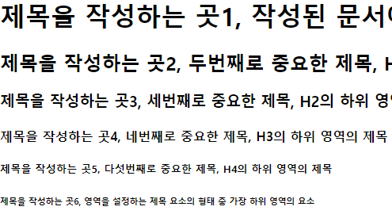
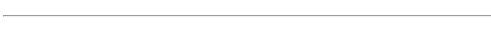
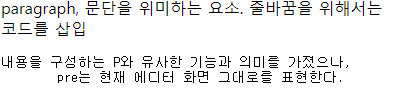
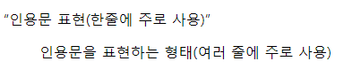
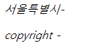
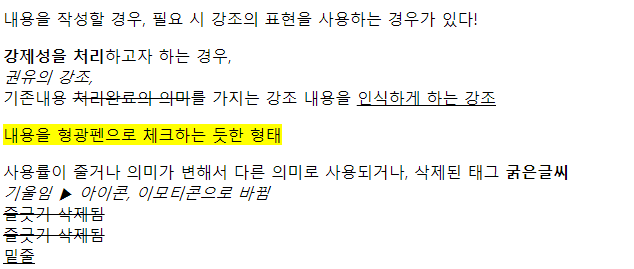

## 21.09.13

[색상 추천 사이트](http://htmlcolorcodes.com)

[운지법](http://typing.com/lesson)

[JS/JQ, bootstrap, php](http://typing.io/lessons)

[자동완성 사이트 에밋-사용하지 않는 것이 좋음](https://emmet.io/)

[자동완성 사이트 에밋, HTML 기본 태그](https://docs.emmet.io/cheat-sheet/)

[HTML 태그 정의 정리 사이트](http://tcpschool.com/html/html_text_comments)

[HTML태그의 형태를 확인할 수 있는 사이트](https://htmlreference.io/)


### 웹퍼블리싱 능력단위 시험

**시험내용**:레이아웃 구조 제작하기(메인기준, 고정형으로 삽입한 레이아웃)

- 1차 : 레이아웃 구조 제작하기(메인기준, 고정형으로 이미지 삽입한 레이아웃)
  - 1280px보다 큰 규격에 해당하는 경우 처리
- 2차 : 레이아웃 구조 제작하기(메인기준-고정형 레이아웃)
  - 1280px 고정 기준

**배점기준**:

**시험시간**:6시간


---

### MEMO

#### 오늘의 진도

- **VScode 설치** 세팅, 마우스휠, 탭인덱스, 테마(아이콘), 웹서버 설정
   - 설치, 다음에서 하단 모두 체크하기
   - 세팅>wheel검색>마우스휠줌
   - tab 검색 사이즈 2
   - word >Diff Editor: Word Wrap>on으로 수정
   - 익스텐션(앱)>Material Icon Theme,Live Server(자바,PHP는 별도의 프로그램이 필요하고, 그것처럼 사용하기 위한 앱),browsersync(라이브로 확인하기 위하여)

  - 다예픽 추천 앱 **indent-rainbow, rainbow Brackets,Prettier-code formatter,**auto CompeteTag,Auto close Tag(닫는태그 만들기)

- **HTML코드 관련** 웹 프로토콜 포함 + html구조/css개념


#### 과제

- [ ] 백업 파일 확인하기, 폰트 스타일 상단 문구 수정

```
<link rel="preconnect" href="https://fonts.googleapis.com">
<link rel="preconnect" href="https://fonts.gstatic.com" crossorigin>
<link href="https://fonts.googleapis.com/css2?family=Nanum+Myeongjo:wght@400;700;800&display=swap" rel="stylesheet">


font-family: 'Nanum Myeongjo', serif;
```

- [ ] 컬러 스타일 가이드 상단 문구 수정
- [ ] 폴더명 및 내PC(윈+E) 영어로 변경


```html
<!doctype html>
<!--test.html-->
<html>
  <head>
    <meta charset="UTF-8">
    <meta http-equiv="X-UA-Compatible" content="IE=edge">
    <meta name="viewport" content="width=divice-width, inital-scale=1.0">
    <title>test</title>
    <!--CSS/Design-->
    <style>
      /* design (CSS주석표시)*/
      body {background-color:#fda;}

    </style>
  </head>
  <body>
    <!--layout-->

  </body>
</html>
```


#### 피드백

- **로고 사용 규정 유무** - 로고가 없을 때 참고 사이트는 동종 업종일 필요는 없다.
- 컬러 스타일 가이드 상단 문구 수정
- 명암비 4.5↑을 기준으로 해야함. (3↑ 글씨 크게)
- 폰트 스타일 상단, 다운로드, 웹폰트 링크 연결시켜 놔야함.(사이즈 체크 시 사용할 모든 폰트 입력해야 함)


---


## 수업 진도(21.09.14)

#### web

**장애에 구애없이 모든 사람들이 손쉽게 정보를 공유할 수 있는 공간**

박스 내부에 다른 박스를 배치하여 필요한 기능과 역할을 분리

+Semantic Tag - 각 박스에 의미 부여


``` 
` 백틱
^ 캐럿
& 앤퍼센트, 엔드키, AnP, 그리고
| 원사인, or
\ 백슬러쉬
/ 슬러쉬
* 모든, Astarisk
$ 끝
(소괄호) 
_ 언더바
- 대쉬
<> 꺽쇠
: 정의
; 정의를 끝낼 때
```


[운지법](http://typing.com/lesson)

[JS/JQ, bootstrap, php](http://typing.io/lessons)


#### 이름 표기법

- camelCase 표기법  -띄어쓰기대신 중간에 대문자

- PascalCase표기법 - 첫문자도 대문자 (JS, C등에서 class, 생성자)

- snake_case표기법

- Hungarian표기법 - 접두어를 사용하는 표기법   ex. chName, fNumber,  headBox→hb 


**ID(camelCase)**

**class(snake_case)**


#### 경로

> /루트(설정최상위)      ./현재위치     ../현재 위치의 상단 폴더

`http://naver.com` ://는 인터넷 프로토콜, 약속


- **절대경로** (정확하고 변하지 않는 위치) `c:/program/..`

- **상대경로** (위치를 알려주어 찾아갈 수 있게 하는 것) `./../폴더명/파일명`


#### 색채


**RGBA(레드, 그린, 블루, 알파)** 알파는 투명도 0~100% or 0~1

**HEX** #FFFFFF #000000


**color code** [색상 추천 사이트](http://htmlcolorcodes.com)

color:red

color:#ff0000;

color:rgb(255,0,0);

color:hsl(0,100%,50%);


### vscode

#### 폴더를 열 때

- 폴더안에 들어가 오른쪽 마우스 클릭, code로 열기
- gitbath 열어서 **pwd**(pwd는 Print Working Directory 의 약어) <엔터> **cd (한칸 띄고 폴더를 끌어온다.)** <엔터>code . <엔터>


### HTML

**`<!-- -->`** ◀ 주석처리, 문서의 첫째줄에는 사용하지 않아야 함.

**ctrl+/  **◀ 눌러도 주석처리 가능!


#### 폴더, 파일 기준

- 웹 구현 시 지정된 기준폴더를 설정하여 최상단으로 인식
- 최초로 인식하는 파일은 지정된 위치기준 가장 상위 폴더에서 `index.html`를 인식시켜야 함
- 웹페이지를 구현하는 **<u>서버 먼저 동작 후</u>** 다음 차례 진행

**최상단 폴더를 기준으로 VScode 실행**

`    <meta      charset=   "UTF-8">`

태그/요소   속성/프로퍼티  속성값/벨류


#### head 태그

##### 해드 기본 태그

```html
  <head>
    <meta charset="UTF-8">
    <meta http-equiv="X-UA-Compatible" content="IE=edge">
    <meta name="viewport" content="width=divice-width, inital-scale=1.0">
    <title>test</title>
    <!--CSS/Design-->
    <style>
      /* design (CSS주석표시)*/
      body {background-color:#fda;}
    </style>
</head>
```

##### ▼ 반응형을 위한 헤드 내 메타태그

`    <meta name="viewport" content="width=divice-width, initial-scale=1.0">`


##### ▼ 비표준화 브라우저 용 메타태그

`    <meta http-equiv="X-UA-Compatible" content="IE=edge">`  

- UA-Compatible=표준화된 브라우저 형식

- X-UA-Compatible=표준이 아닌 것

- edge=익스플로러의 가장 마지막 버전


#### body 태그

<u>ctrl + [ or ]키를 누르면 문장 전체를 들여쓰기, 내어쓰기 할 수 있다.</u>


##### 이동 태그

```html
<a href="./main.html">메인 페이지로 이동</a>
```

▶ ./ 현재 폴더에서 시작한다는 뜻!


```
    <script>
      window.location = "./main.html";
      //스크립트에선 주석을 이렇게 표현
    </script>
```

html이지만, html이 아닌 스크립트언어이며,

window. 은 삭제가 가능 = 브라우저 내에서 이렇게 실행하겠다는 뜻이라 삭제가 가능

main으로 돌아오겠음 이라는 뜻


##### H태그, 제목 태그



```html
    <h1>작성된 문서에서 가장 중요한 제목! 한 번만 사용 가능</h1>
    <h2>두번째로 중요한 제목, H1의 하위 영역의 제목</h2>
    <h3>세번째로 중요한 제목, H2의 하위 영역의 제목</h3>
    <h4>네번째로 중요한 제목, H3의 하위 영역의 제목</h4>
    <h5>다섯번째로 중요한 제목, H4의 하위 영역의 제목</h5>
    <h6>영역을 설정하는 제목 요소의 형태 중 가장 하위 영역의 요소</h6>
```


##### 선긋기



```html
    <hr />
```


##### 문단(설명하는 요소)



```html
    <p>paragraph, 문단을 위미하는 요소. 줄바꿈을 위해서는<br /> 코드를 삽입, 설명을 하는 요소</p>

    <pre>
    내용을 구성하는 P와 유사한 기능과 의미를 가졌으나,
    pre는 현재 에디터 화면 그대로를 표현한다.
    </pre>
```

P태그 내에 DIV 태그를 담을 수는 없다.


##### 인용문 표현



```html
    <q>인용문 표현(한줄에 주로 사용)</q>
    <blockquote>인용문을 표현하는 형태(여러 줄에 주로 사용)</blockquote>
```


##### 주소 표현



```html
    <address>
      <p>서울특별시-</p>
      <p>copyright - </p>
    </address>
```


##### 묶음

```html
<div>
    블럭요소의 의미없는 묶음
</div>
<span>
    인라인요소의 의미없는 묶음
</span>
```


##### 강조 표시



```html
    <div>
      <p>내용을 작성할 경우, 필요 시 강조의 표현을 사용하는 경우가 있다!</p>
      <p><strong>강제성을 처리</strong>하고자 하는 경우, <br />
        <em>권유의 강조,</em> <br />
        기존내용 <del>처리완료의 의미</del>를 가지는 강조
        내용을 <ins>인식하게 하는 강조</ins></p>
        <mark>내용을 형광펜으로 체크하는 듯한 형태</mark>
        
        
        <p>
          사용률이 줄거나 의미가 변해서 다른 의미로 사용되거나, 삭제된 태그
          <b>굵은글씨</b><br />
          <i>기울임 ▶ 아이콘, 이모티콘으로 바뀜</i><br />
          <s>줄긋기 삭제됨</s><br />
          <strike>줄긋기 삭제됨</strike><br />
          <u>밑줄</u>
        </p>
    </div>
```


##### class 이름 짓기

```html
<head>
    <style>
        .sample {backround-color:red;}
    </style>
</head>

<span class="sample">
    인라인요소의 의미없는 묶음
</span>
```


##### 링크연결 및 이미지 연결

```html
    <div>
      <h3>링크의 의미와 이미지의 의미</h3>
      <a href="http://naver.com" target="_blank">네이버로 이동</a>
      
    </div>

<a></a> = 가능
```

target 속성값

- _self
- _blank
- _top
- _parent

a와 img 태그 모두 인라인 태그임으로, H3의 블럭태그와 분리시켜주는 것이 좋다.


### cli, 터미널

##### 새 파일 만들기 = touch

$ touch test.html tset2.html find.html


##### 새 폴더 만들기 = mkdir

$ mkdir css js

**-p는 중간 연결을 안 해도 되게 해준다.**

`$ mkmkdir  dss js/src/tset/box`  

▲ 이런 연결은 불가능 하다, 하나하나 만들어서 진행해야 함 그걸 안 하게 해주는 게   **<u>-p</u>** (-는 옵션이라는 뜻)  **$ mkdir -p css js/src/tset/box**


##### <u>삭제하기  rm -rf  </u>

(-rf는 디렉토리와 파일로 강제를 뜻함, <u>강제로 삭제하겠다.</u> -r은 파일, -f는 폴더 파일과 폴더 개별로 하나씩도 가능)

$ rm -rf find.html test.html test.html


##### 파일 현재 경로보기

<u>cli 내에서 경로보기</u>

aytjoeun@DESKTOP-BMCU7K8 MINGW64 /e/work/c_jeonga/smart_21/c_code (main)
<u>$ pwd</u>
/e/work/c_jeonga/smart_21/c_code    ◀ 결과


##### <u>폴더, 파일 열어주기</u>

aytjoeun@DESKTOP-BMCU7K8 MINGW64 /e/work/c_jeonga/smart_21/c_code (main)
**$ start .**


##### <u>위치 이동</u>

$ cd.. || cd 폴더명/폴더명

