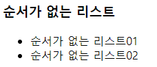
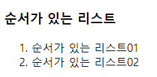
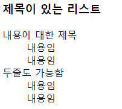
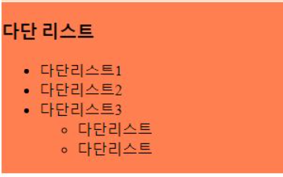

# 21.09.15

## MEMO

[타이포라 테마 다운받기](https://theme.typora.io/theme/Pie/)


### VScode 단축키

**여러 줄 동시에 작성** ctrl + alt + ↑ or ↓

**같은 문구 동시 선택** ctrl + D

**하위폴더를 지정할 때** (윈도우는 둘다 가능하지만, 맥은 /만 가능하기 때문에 /를 사용하는 것이 좋다.)

- / ▶ linux, unix(mac)

- \ ▶ window 방식 

VScode-여러줄 같은 문구 동시에 넣을 때 ctrl+shift+p ▶ emmit > wrap(단축키 지정하면 편함!) ▶ <> 신경쓰지 않고 적기

- a[href=http://naver.com class=box]
- 첫번째태그 > 두번째태그

**내용 숫자 늘리는 단축키** (플러그인 Increment Selection) li ctrl+alt+L

**같은 형제 단일 때, 중간에 내용을 추가하고 싶으면**

- 아래에 빈칸 추가 ctrl + Enter
- 위에 빈칸 추가 shfit +  ctrl + Enter

**한줄 복사** shift + alt + ↑ or ↓

**한 줄 잘라내기** shift + del


[깃대신에 사용하는 깃으로 만드는 홈페이지](https://vercel.com/199jeonga/basic)


### 따로 알아본 내용

[VScode 단축키](https://jhnyang.tistory.com/408)


## 오늘의 진도

- HTML
  - list(순서없, 순서있, 제목내용있)
  - id,class
- style
  - 선택자(모든, 타입, id, class,부모, 자식)
  - 사이즈, 색상처리
- cli
  - 파일 이동, 파일 복제
  - 목록보기
  - 화면정리/작성내용보기
  - 현재페이지위치, 컴퓨터 이름 파악


### 깃허브

#### 깃허브 레파지토리를 홈페이지로 만들기

레파지토리 > 세팅 > 페이지 생성 > 브런치:main으로 변경 > 세이브


### HTML

#### 리스트

내용은 무조건 [ li, dt, dd ]만 작성 가능하다. 태그 내부에 사용하는 것은 가능

p, div와 같은 태그는 불가능하다.


##### 순서가 없는 리스트 ul



```html
<h3>순서가 없는 리스트</h3>
<ul>
    <li>순서가 없는 리스트01</li>
    <li>순서가 없는 리스트02</li>
</ul>
```


##### 순서가 있는 리스트 ol



```html
<h3>순서가 있는 리스트</h3>
<ol>
    <li>순서가 있는 리스트01</li>
    <li>순서가 있는 리스트02</li>
</ol>
```


##### 제목(데이터)이 있는 리스트 dl,dt,dd



```html
<h3>제목이 있는 리스트</h3>
<dl>
    <dt>내용에 대한 제목</dt>
    <dd>내용임</dd>
    <dd>내용임</dd>
    <dt>두줄도 가능함</dt>
    <dd>내용임</dd>
    <dd>내용임</dd>
</dl>
```


##### 다단 리스트 ( 하위리스트)

권장 하단은 3단이나 그 이상도 가능하다.



```html
<h3>다단 리스트</h3>
<ul>
    <li>다단리스트1</li>
    <li>다단리스트2</li>
    <li>다단리스트3
        <ul>
            <li>다단리스트</li>
            <li>다단리스트</li>
        </ul>
    </li>
</ul>
```


#### CLASS, ID

```html
<div id="part">
    <h2></h2>
</div>

<div class="ex_part">    //<div class="ex_part ex_part3">
    <h3></h3>
    <ul>
        <li></li>
        <li></li>
    </ul>
</div>


<div id="part2" class="ex_part">
    <h2></h2>
</div>
```

**ID ** 중복 불가능

**class** 중복 가능, 한개의 태그 안에 class 두개의 속성을 사용하지는 못하며, 속성값만 입력해야 한다.

id와 class는 두개 다 사용이 가능하다.


### style

```html
<head>
	<style>
      div{width:500px; }
      .ex_part{background-color:#fdf;}
    </style>
</head>
<body>
    <div class="ex_part">
      <h2>기초 목차</h2>
      <ul>
        <li><a target="_blank" href="./a_01_basic.html">제목 및 내용</a></li>
        <li><a target="_blank" href="./a_01_basic_list.html">리스트</a></li>
      </ul>
    </div>
</body>
```


#### display 태그

- lnline-block
  - 기본으로 인라인 블럭 ▶ img, button, input, selet, textarea
- block
- inline

```css
.other{
    display:inline-block;
    display:none;
    background-color:cadetblue; 
    width:100px; height:200px;
}
```

같은 속성을 사용했을 때, 먼저 요청한 것은 사라진다. ~~(모두 그런 것은 아님)~~

dosplay:none을 사용하면 화면에는 보이지 않으나, 태그가 사라진 것은 아님.


#### 선택자

```css
        .ex_part ul li a{ color:blue; }  //X
        .ex_part ol li a{color:green;}   //X

태그는 작성한 순으로 적용되기 때문에 ul의 블루 적용으로 a 모두를 변화시키고, ol을 따로 지정함으로 식을 줄일 수 있다.

        .ex_part a{ color:blue; }
        .ex_part ol a{color:green;}

<div class="ex_part">
    <h2>글씨 색상 파란색으로 변경</h2>
    <ul>
        <li><a href="http://naver.com">네이버</a>로 이동</li>
        <li> 붉은색 글씨 사용
        <ol>
            <li>하위 추가 내용은 녹색</li>
            <li><a href="#">다음</a>으로 <span>이동</span></li>
        </ol>
        </li>
    </ul>
</div>
```

**부모의 속성을 그대로 따름 ▶ { 속성 :  inherit; }**


하나의 요소를 선택하여 CSS를 적용 ▶ 타입, 요소 선택자 ( ex. div, p, a, li etc. )

요소 요소를 선택하여 CSS를 적용 ▶ 자손 선택자               ( ex. div ul{ } )

요소>요소를 선택하여 CSS를 적용 ▶ 자식선택자               ( ex. div>ul{} )


선택자를 연달아 쓸 때 ▶ ㅁㅁ이자ㅁㅁ인 선택된다.

- ex) div.ex_part ▶ div이자 .ex_part 인 것이 선택된다.


### CLI


#### CLI명령어

##### 기본 단축키

**복사** ▶ ctrl+Ins

**붙여넣기** ▶  shift + Ins


##### PC 정보 확인하기

**cli에서 ip 확인하기** ▶ IPconfig

**컴퓨터 이름 파악하기** ▶ whoami


##### 파일 및 폴더 사용

**열기**  ▶ start .

**폴더 만들기** ▶ mkdir 폴더명

**화면 지우기**  ▶ clear

**현재위치 확인** ▶ pwd

**현재 디렉토리의 목록보기**  ▶ ls  

**목록의 숨김폴더까지 모두 보기** ▶  ls -a 


###### 이동

**CLI 현재 폴더 이동** ▶ cd

- **상단 위치** ▶ cd ..

- **최근 위치** ▶  cd -

- cd e:    // 드라이브이기 때문에 <u>:를 붙여줘야 한다.</u>
- cd 폴더명
- cd ~   // cli를 시작했던 최초로 돌아감


<u>단순한 이동 뿐만이 아닌, 파일 이름 변경까지 가능하다.</u>

**파일, 폴더의 이동** ▶ mv

**복사하여 이동** ▶ cp

- 상위 폴더로 이동 ▶ ./
- 이동


##### 기타

**여태 사용한 명령어 보기** ▶ history

- ! nn   // 히스토리 내 nn번째 명령어 실행

**두개의 명령여 연결** ▶ mkdir 폴더명 && touch 폴더명/파일명   //폴더 생성 후 파일만들기 


#### 파일 경로 이동

하위폴더를 지정할 때 (윈도우는 둘다 가능하지만, 맥은 /만 가능하기 때문에 <u>/를 사용하는 것이 좋다.</u>)

- / ▶ linux, unix(mac)

- \ ▶ window 독자적인 방식  <u>< 개발은 \, 사용은 /, \ 두개 다 사용 가능></u>

