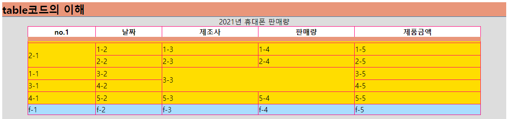
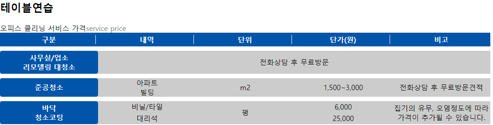
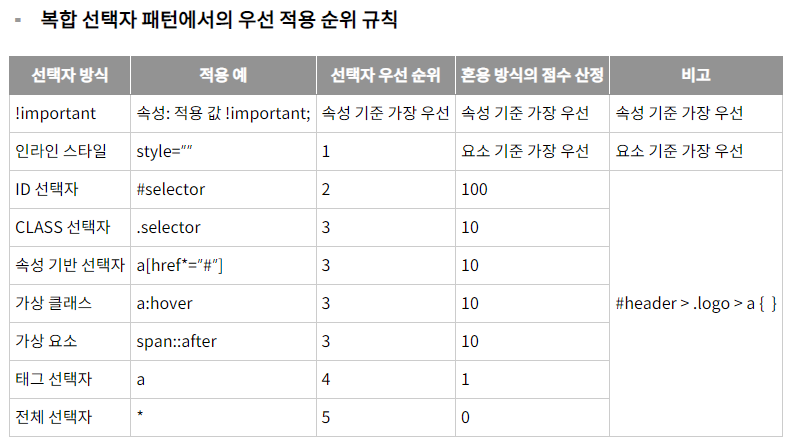

21.09.16

## MEMO

### 어제 복습

목록보기 (`ls, ls-a`)

위치이동 (`cd`)

현재페이지위치(`pwd`)

컴퓨터 이름 파악 (`whoami`)


### 태그 네이밍

`ID` camelCase

`class` under_score

`prefix` 접두어는 카테고리 분류에 따름

`sufix` 접미어는 레벨의 차이

- 네이밍 사용 싱특정 제품명, 사람 최대한 X


### 플러그인

`Increment Selection`ctrl + alt + i  ◀ 드래그한 숫자 내림차순, 오른차순으로 한 번에 변경시키기


## 과제

- [ ] clear: both;

- [ ] clear:pix;

---

## 오늘진도

- [ ] id와 class의 역할
- [ ] table - 게시판, 주식, 안내판, 경기표, 메뉴판 등 표를 나타낼 때
- [ ] 이미지 + 글작성 (float, clear)


### meta tag

```html
<meta http="X-UA-Compatible" content="IE=edge">
<meta name=viewport content="width=device-width, inital-scale=1.0">
```

- 표준이 아닌 브라우저는 IE=edge를 사용하겠다.

- 뷰포트의 가로값은 기계의 가로값으로 하겠다. 기본적인 크기는 1.0으로 하겠다.


### 리셋.css / margin:0; padding:0;

```html
h2, h3, p { margin:0; padding:0; }
```

모든 브라우저는 각 엘리먼트에 개별로 여백, 외곽선, 기타옵션 설정되어있다.

(`RESET.css`)-기본설정되어있는 css를 초기화 시키는 것


### ID와 CLASS 정의

```css
#id { }
.class { }
```

ID - 중복사용 불가능하다, `연결점 → 마이크로링크 연결`, 주요 핵심 또는 큰 범위의 틀이름

class - 여러개의 값O, 중복으로 사용 가능, 단순한 이름 의미


페이지이동을 하는 하이퍼링크▶페이지의주소

<u>페이지 내부에서 위치를 찾아가게 하는 마이크로 링크 ▶id속성값 연결</u>


### 코드 내  특수문자 사용 금지 `entity code 사용`

```html
&gt;   >
&amp;  &
&#8361; \ (원화표시)
```


​    li>a[href="./a_04_table.html"]{table 코드 이해`}` 

}를 치고 기다리면 하단에 뜨는 팝업을 클릭하면 변화된다.

▼

​    `<li><a href="./a_04_table.html">table 코드 이해</a></li>`


### 파비콘 이미지 등록하기

```html
link:favicon + Enter
<link rel="shortcut icon" href="../favicon.png" type="image/png">


▼ OS가 다른 곳에서도 보이게 하려고 사용함
link:touch + Enter
<link rel="apple-touch-icon" href="../favicon.png">
```

**href, type 수정**


### table

#### css

```css
table { width:90%; height:auto; min-height: 200px; margin: auto;
}
table, tr,td{ 
    border-spacing: 0; border-collapse: collapse;
    border-width:1px; border-style:solid; border-color:#f07; 
}
```

`border-spacing` 보더 사이 간격 (선이 굵어짐)

`border-collapse` 선과 선 사이 간격을 하나로 융합 (그걸 얇게 만듬)


#### html

```html
<table summary="21년 통신3사 기준 최고 판매량 확인 및 내년도 계획절충안">
    <caption>2021년 휴대폰 판매량</caption>
    <thead>
        <tr>  <th>no.1</th>  <th>날짜</th>  <th>제조사</th>  <th>판매량</th>  <th>제품금액</th>  </tr>
    </thead>
    <tbody>
        <tr>  <td>2-1</td>  <td>1-2</td>  <td>1-3</td>  <td>1-4</td>  <td>1-5</td>  </tr>
        <tr>  <td>5-1</td>  <td>2-2</td>  <td>2-3</td>  <td>2-4</td>  <td>2-5</td>  </tr>
        <tr>  <td>1-1</td>  <td>3-2</td>  <td>3-3</td>  <td>3-4</td>  <td>3-5</td>  </tr>
        <tr>  <td>3-1</td>  <td>4-2</td>  <td>4-3</td>  <td>4-4</td>  <td>4-5</td>  </tr>
        <tr>  <td>4-1</td>  <td>5-2</td>  <td>5-3</td>  <td>5-4</td>  <td>5-5</td>  </tr>
    </tbody>
    <tfoot>
        <tr>  <td>f-1</td>  <td>f-2</td>  <td>f-3</td>  <td>f-4</td>  <td>f-5</td>  </tr>
    </tfoot>
</table>
```

`summary` 접근성을 위해 적는 속성

`caption`  표의 설명 또는 제목

`thead/tbody/tfoot` 사용 순서는 바꿔도 된다. (ex. 결과가 중요할 때)

`tr` 가로 행

`td` 셀 하나, 데이터

`th`thead 내 데이터의 이름


#### td 합치기 (colspen/rowspen)

```html
<tbody>
    <tr>  <td colspan="5"></td>  </tr>
    <tr>  <td rowspan="2">2-1</td>  <td>1-2</td>  <td>1-3</td>  <td>1-4</td>  <td>1-5</td>  </tr>
    <tr>  <td>2-2</td>  <td>2-3</td>  <td>2-4</td>  <td>2-5</td>  </tr>
    <tr>  <td>1-1</td>  <td>3-2</td>  <td colspan="2" rowspan="2">3-3</td>  <td>3-5</td>  </tr>
    <tr>  <td>3-1</td>  <td>4-2</td>  <td>4-5</td>  </tr>
    <tr>  <td>4-1</td>  <td>5-2</td>  <td>5-3</td>  <td>5-4</td>  <td>5-5</td>  </tr>
</tbody>
```

`colspen` 좌우를 합친다.

`rowspen` 세로를 합친다. ( `tr`을 그대로 합친다로 생각하면 될듯! )


#### table 연습2

```css
<style>
table, tr, td, th, thead, tbody, tfoot {
    margin: 0; padding: 0; 
    border-spacing: 0; border-collapse:collapse;
    border-width:1px; border:0;
	}
th{ padding: 5px; }
th>span{display: block;
    border-right-width: 1px; border-right-style:solid; border-right-color: #fff;}
table { width:1100px; height:auto; background-color:#ccc; }
caption{ text-align: left; }
caption span{color:#777;}
.title { color:#fff; background-color: #05a; border-radius: 5px;}
.blank{ height:10px; background-color:#fff; }
th, td { width:20%; text-align: center; border-style: solid; border-color: #444;}
</style>
```

```html
<div class="part">
    <h2>테이블연습</h2>
    <table>
        <caption>오피스 클리닝 서비스 가격<span>service price</span></caption>
        <thead>
            <tr class="title">
                <th><span>구분</span></th>
                <th><span>내역</span></th>
                <th><span>단위</span></th>
                <th><span>단가(원)</span></th>
                <th>비고</th></tr>
        </thead>
        <tbody>
            <tr class="blank"><td colspan="5"></td></tr>
            <tr>
                <th class="title">사무실/업소 <br />리모델링 대청소</th>
                <td colspan="4">전화상담 후 무료방문</td>
            </tr>
            <tr class="blank"><td colspan="5"></td></tr>
            <tr>
                <th rowspan="2"class="title">준공청소</th>
                <td>아파트</td>
                <td rowspan="2">m2</td>
                <td rowspan="2">1,500~3,000</td>
                <td rowspan="2">전화상담 후 무료방문견적</td>
            </tr>
            
... ...
```


### 선택자 우선순위



