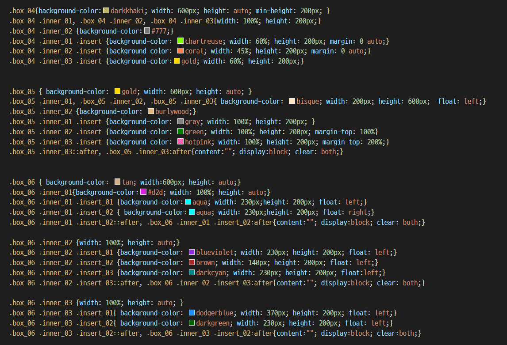
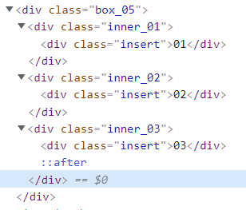

# 21.09.20

## 09.19 QnA

### margin : auto 0이 적용되지 않는 이유

`Q. 왜 margin : auto 0은 안 되지?`

```
A. 애초에 .box_05 .inner의 클리어가 제대로 적용되지 않아 .inner_02, .inner_03의 높이값이 지정되지 않았음. 따라서 마진 auto가 불가능함. 

또한, clear는 .box_05(.inner_04의 위치)에 들어갔기 때문에 높이값이 없음.
```

.box_05 .inner_02 .insert {background-color: green; width: 100%; height: 200px; margin-top: 100%} 

.box_05 .inner_03 .insert {background-color: hotpink; width: 100%; height: 200px; margin-top: 200%;}


### clear와 after::

`Q. box_06 .inner_01의 색이 적용되지 않는 이유`

```
clear를 잘못 넣음

after는 형제가 아닌, 자식으로 생성되기 때문에 자식의 맨 마지막 태그에 after를 넣는 것이 아닌 부모 태그에 넣어야 한다.

```



> ▲ 수정 전 코드 (하단 after 이해 Tip 확인)
>
> ▼ 수정 수 코드

```css
.box_05 { background-color: gold; width: 600px; height: auto; }
.box_05 .inner_01, .box_05 .inner_02, .box_05 .inner_03{ background-color: bisque; width: 200px; height: 600px;  float: left;} 
.box_05::after, .box_05:after{content:""; display:block; clear: both;}

.box_05 .inner_02 {background-color: burlywood;}
.box_05 .inner_01 .insert {background-color: gray; width: 100%; height: 200px; }
.box_05 .inner_02 .insert {background-color: green; width: 100%; height: 200px; margin-top: 100%;} 
.box_05 .inner_03 .insert {background-color: hotpink; width: 100%; height: 200px; margin-top: 200%;}


.box_06 { background-color: tan; width:600px; height: auto;}
.box_06 .inner_01{background-color:#d2d; width: 100%; height: auto;}
.box_06 .inner_01 .insert_01 {background-color:aqua; width: 230px;height: 200px; float: left;}
.box_06 .inner_01 .insert_02 { background-color:aqua; width: 230px;height: 200px; float: right;}
.box_06 .inner_01::after, .box_06 .inner_01:after{content:""; display:block; clear: both;}

.box_06 .inner_02 {width: 100%; height: auto;}
.box_06 .inner_02 .insert_01 {background-color: blueviolet; width: 230px; height: 200px; float: left;}
.box_06 .inner_02 .insert_02 {background-color: brown; width: 140px; height: 200px; float: left;}
.box_06 .inner_02 .insert_03 {background-color: darkcyan; width: 230px; height: 200px; float:left;}
.box_06 .inner_02::after, .box_06 .inner_02:after{content:""; display:block; clear: both;}

.box_06 .inner_03 {width: 100%; height: auto; }
.box_06 .inner_03 .insert_01{ background-color: dodgerblue; width: 370px; height: 200px; float: left;}
.box_06 .inner_03 .insert_02{ background-color: darkgreen; width: 230px; height: 200px; float: left;}
.box_06 .inner_03::after, .box_06 .inner_03:after{content:""; display:block; clear:both;}
```

#### 해결방법

```css
.box_05::after, .box_05:after{content:""; display:block; clear: both;}
```

float을 넣은 선택자는 .box_05 .inner_01, .box_05 .inner_02, .box_05 .inner_03 태그지만

after 태그를 넣은 선택자는  .inner 태그의 부모 태그인 .box_05이다.


after태그는{ **<u>content:"";</u>** display:block; clear: both; } content:""; 를 꼭 넣어야 한다.


#### after 이해 Tip

수정 전 css의 after 적용은 아래와 같다. 

**after는 형제가 아닌 자식요소에 추가된다.**

```css
.box_05 .inner_03 ::after{content:""; display:block; clear: both;}
```

