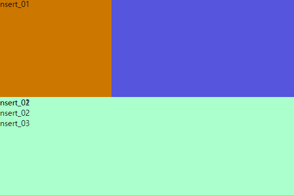
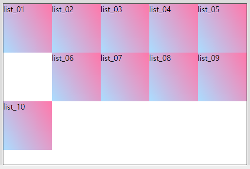

# MEMO


## VScode 폴더내 파일/폴더를 만들 때

VScode에서  폴더 내 폴더, 파일를 만들 때 `폴더명/파일명` 과 `폴더명\폴더명`이 있다.

슬래쉬와 역슬래쉬 구분.

cli로는 mkdir, touch


## VScode

### VS코드 단축 태그 작성 방법

` div.margin_$$*8{m_$$}`

```html
 div.margin_$$*8{m_$$}

▼

<div class="margin_01">m_01</div>
<div class="margin_02">m_02</div>
<div class="margin_03">m_03</div>
<div class="margin_04">m_04</div>
<div class="margin_05">m_05</div>
<div class="margin_06">m_06</div>
<div class="margin_07">m_07</div>
<div class="margin_08">m_08</div>
```


### 에밋을 사용할 때 엔터를 꺼내고 싶으면

tab혹은 **ctrl + spacebar**


### mbn 추천 양식 없애기

세팅 > mbn >  체크해제


### 찾기 및 변환

#### 찾기

- ctrl + D
- ctrl + F

변환

- ctrl + F


### html,css 기본 문서 단축키 지정(Snippets)

[1_VScode Snippets 사용방법 안내 사이트](https://code.visualstudio.com/docs/editor/userdefinedsnippets)

[2_자동으로 코드로 변환해주는 사이트](https://snippet-generator.app/?description=&tabtrigger=&snippet=%3C%21DOCTYPE+html%3E%0A%3C%21--t2.html--%3E%0A%3Chtml+lang%3D%22ko-KR%22+class%3D%22no-js%22%3E%0A%3Chead%3E%0A++%3Cmeta+charset%3D%22UTF-8%22%3E%0A++%3Cmeta+http-equiv%3D%22X-UA-Compatible%22+content%3D%22IE%3Dedge%22%3E%0A++%3Cmeta+name%3D%22viewport%22+content%3D%22width%3Ddevice-width%2C+initial-scale%3D1.0%22%3E%0A++%3Cscript+src%3D%22..%2Fjs%2Fcommen%2Fmodernizr-custom.js%22%3E%3C%2Fscript%3E%0A++%3Clink+rel%3D%22stylesheet%22+href%3D%22..%2Fcss%2Fsrc%2Ft2.css%22%3E%0A++%3Ctitle%3EDocument%3C%2Ftitle%3E%0A++%3Clink+rel%3D%22shortcut+icon%22+href%3D%22favicon.png%22+type%3D%22image%2Fpng%22%3E%0A++%3Clink+rel%3D%22apple-touch-icon%22+href%3D%22favicon.png%22%3E%0A%3C%2Fhead%3E%0A%3Cbody%3E%0A++%3C%21--layout--%3E%0A%3Cdiv+id%3D%22wrap%22%3E%0A%3C%2Fdiv%3E%0A++%3C%21--script--%3E%0A++%3Cscript%3E%3C%2Fscript%3E%0A%3C%2Fbody%3E%0A%3C%2Fhtml%3E&mode=vscode)


- `TM_FILENAME` 현재 문서의 파일 이름
- `TM_FILENAME_BASE` 확장자가 없는 현재 문서의 파일 이름
- `TM_DIRECTORY` 현재 문서의 디렉토리


```html
"<!DOCTYPE html>",
"<!--문서이름.html-->",
"<html lang=\"ko-KR\" class=\"no-js\">",
"<head>",
"  <meta charset=\"UTF-8\">",
"  <meta http-equiv=\"X-UA-Compatible\" content=\"IE=edge\">",
"  <meta name=\"viewport\" content=\"width=device-width, initial-scale=1.0\">",
"  <script src=\"../js/commen/modernizr-custom.js\"></script>",
"  <link rel=\"stylesheet\" href=\"../css/src/style.css\">",

"  <title>Document</title>",
"  <link rel=\"shortcut icon\" href=\"favicon.png\" type=\"image/png\">",
"  <link rel=\"apple-touch-icon\" href=\"favicon.png\">",
"</head>",
"<body>",
"  <!--layout-->",
"<div id=\"wrap\">",

"</div>"",

"  <!--script-->",
"  <script></script>",
"</body>",
"</html>",
```

**setting > use Snippets > html or CSS**

```json
{
	// Place your snippets for html here. Each snippet is defined under a snippet name and has a prefix, body and 
	// description. The prefix is what is used to trigger the snippet and the body will be expanded and inserted. Possible variables are:
	// $1, $2 for tab stops, $0 for the final cursor position, and ${1:label}, ${2:another} for placeholders. Placeholders with the 
	// same ids are connected.
	// Example:
 "Print to console": {
 	"prefix": "log",
 	"body": [
 		"console.log('$1');",
 		"$2"
 	],
 	"description": "Log output to console"
 }
}
```

 		"console.log('$1');",
 		"$2"

바디 내용을 삭제하고,  상단 html 문서(2번 사이트를 이용하면 편리함) 붙여넣기


## 선택자 우선순위

>  부모자식 > ID > class  > 요소

`class를 우선적으로 적용`하고 싶을 때 class앞에 부모를 적으면 부모자식보다 부모자식>class 가 우선순위가 된다.

부모>자식(부모 자식)을 적으면 우선순위가 된다.

```html
<div id="id">
    <div id="id2">
        
    </div>
    <div id="id2">

    </div>
</div>
```

```css
#id>div{width:200px;}

#id2{width:150px;}
```

이렇게 적용될 때 #id2는 적용되지 않는다. `#id>div` 부모자식이 우선순위이기 때문에


# 오늘 진도

## script를 사용한 html이동 (location)

```html
  <script>
    window.location = "./html/a_content.html";
  </script>
```

바로 a_content.html로 보내주는 스크립트


## *$ 단축키

```html
.inner_0$*3{inner_0$}
▼
<div class="box_01">
    <div class="inner_01">inner_01</div>
    <div class="inner_02">inner_02</div>
    <div class="inner_03">inner_03</div>
</div>
```

<u>.inner_0$                                 *3   {inner_0$}</u>

클래스.inner_0내림차순,     3개, 안의 내용


## float

```css
.box_02{width: 600px; height: 600px;
margin: 0 auto;
background-color: #afa;}

.box_02>div{
  width: 200px; height: 100%; float: left;}
```

.box_02의 경우클래스 자체에 `높이값이 지정되어 있기 때문에 clear :both;를 쓰지 않았다.`

- 높이값을 auto로 지정한 경우에는 clear를 진행해줘야 한다.


## box와 글씨의 개념



```css
.box_06 > div{width: 100%; height: 200px;}
.inner_01 .insert_01{width: 230px; height: 200px; background-color: #c70;}
.inner_01 .insert_02{width: 230px; height: 200px; background-color: #f57;}
```

박스는 `코드 상 하단으로 갈 수록 살짝 위`에 있다는 개념이기 때문에 insert_02의 박스가 이미지에서 보이지 않음.

- 글씨는 박스와 다른 개념으로 이미지 상으로 확인이 됨. 

- 그래도 드래그 되는 것은 민트색 박스의 **insert_0$!**


## clearfix

### hr /

- html에서 지정

```html
<div class="inner_01">
    <div class="insert_01">insert_01</div>
    <div class="insert_02">insert_02</div>
    <hr />
```

```css
.inner_01 .insert_01{width: 230px; height: 200px; background-color: #c70;
float: left;}
.inner_01 .insert_02{width: 230px; height: 200px; background-color: #f57;
float: right;}

.inner_01 hr{
  margin: 0; padding: 0; clear: both;
}
```


### ::after

- css에서 지정

내부 끝에 생성된다. `막내자식으로 생성!`

```css
.class or #id::after{
  content=""; display: block;  clear:both;
}
```

- 기본 사이즈 `width:100% height:0px;` 라고 생각하세욥!

- ::after, :after 둘다 사용해야 한다. (구형 브라우저를 위하여)


### background-image: linear-gradient

```css
  background-image: linear-gradient(45deg, #07a, #569); //각도 45도, 첫번째 색, 두번째 색 
```


### margin


#### 더블마진 효과

**첫번째 요소는 margin-top을 했을 때 보더의 유무에 따라 다른 효과가 나타난다.**

▲ 해결하는 다른 방법도 있는 듯 한데 아직 안 알려줌(padding같음)


`border : 있을 때` = 부모 내에서 첫번째 요소만 마진 탑 진행

`border : 0, none` = 부모를 데리고 마진 탑 진행 (부모요소가 첫번째라면 그 부모도 데리고 내려온다.)


#### margin 중복 적용

`일반 블럭 요소` 첫번째 요소의 margin-bottom과, 두번째 요소의 margin-top이 중첩됐을 때 둘 중에 더<u>큰 px가</u> 적용된다.

`float`을 적용 시켰을 때는 첫번째 요소의 margin-light와 두번째 요소의 margin-left는 <u>두 마진이 합쳐진 값</u>이 적용된다. ◀ 더블마진 효과가 적용되지 않는다.


#### margin 방향

```css
.m_01{margin: 50px;}                     //사방
.m_02{margin: 10px 30px;}                //상하 좌우
.m_03{margin: 10px 50px 30px;}           //상 좌우 하
.m_04{margin: 5px 20px 40px 70px;}       // 상 우 하 좌
```

`시계 방향으로 흐른다. `(한 번에 3,4개를 적는 것보단 5번처럼 사용!)

- .m_01 { margin:50px; }

- .m_02 { margin:10px 30px; }

- `.m_05 { margin:20px; margin-bottom:10px; }`

- .m_06 { margin:0 auto;}

- .m_07 { margin-top:-50px;}

- .m_08 { margin-left:10%; margin-top:10%; }


#### margin auto

```css
.m_06{margin: auto;}
```

좌우만 적용되며, 위아래 오토는 X

만약 `auto를 적용한 요소를 float 시키면 auto 마진값이 적용되지 않는다.`


#### margin-right: 10%

```css
.m_08{margin-right: 10%;}
```

` left, fight의 %는 부모값을 기준으로 한다.`

top, bottom에선 %를 거의 쓰지 않는다. ( 기준이 모호해 세로 마진은 사용하지 않는 것이 좋다.)


#### float과 margin



```css
.l_01{
 margin-bottom: 10px;
}
```

마진 바텀으로 인해 list_06은 list_01 아래에 들어갈 수 없게되었다.

float은 무조건 앞 요소의 뒤에만 갈 수 있기 때문에 10이 6 이전의 공간을 매꿀 수 없이 9 다음 위치에 들어가 있다.

- (가로값 500px, 세로값 auto의 틀 안에 있다!)


### padding

#### padding을 포함하여 컨텐트 사이즈를 조정하는 방법 두가지

```css
w,h:100px; 
padding:30px;


.p_base .p_09{
  width: 40px; height: 40px;
  padding: 30px;
} //가로값과 세로값을 직접 수정하는 것

.p_base .p_10{
  padding: 30px;
  box-sizing: content-box; // = box-sizing: border-box;
}
```

`box-sizing: content-box;` 디폴트 

` box-sizing: border-box;` 변환 (보더까지 박스 사이즈 안으로 생각함)


>  마진[   보더{   패딩(    사이즈) } ]

