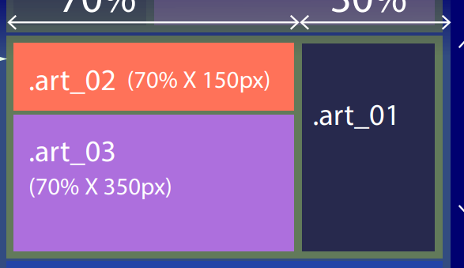

# MEMO

[[클릭] 다양한 css 기능 검색 사이트](https://css-tricks.com/)


플러그인 (북마크)

`북마크 단축키` **ctrl + art + k**  (ctrl + alt + p >bookmarks:toggle)


## 과제

5.6.7 < 전에 했던 pdf 확인

9.24 받은 pdf 


## 단축작성

```html
dl>(dt{title}+dd*3{dd_$$})*3

▼

<dl>
    <dt>title</dt>
    <dd>dd_01</dd>
    <dd>dd_02</dd>
    <dd>dd_03</dd>

    <dt>title</dt>
    <dd>dd_01</dd>
    <dd>dd_02</dd>
    <dd>dd_03</dd>

    <dt>title</dt>
    <dd>dd_01</dd>
    <dd>dd_02</dd>
    <dd>dd_03</dd>
</dl>
```

```html
#section.clearfix>.sect_$$*2{sect_$$} 

<div id="section" class="clearfix">
    <div class="sect_01">sect_01</div>
    <div class="sect_02">sect_02</div>
  </div><!--section-->
```


## reset.css

```css
/*reset. css*/
hr{ width: 100%; height: 0; border-bottom: 2px solid #333; }

body,
h1, h2,h3,h4,h5,h6,
p,pre,address,
ul,ol,li,dl,dt,dd{
  margin: 0; padding: 0; border:0;
  font-size: 16px;
}
a{text-decoration: none; color:inherit;}
ul,ol{list-style: none;}
button{bottom: 0; background-color:transparent; cursor: pointer;}
```


# 오늘진도

## border (p.294)

### border style과 content size

`3과 4가 박스의 기본 사이즈`


```css
.b_01{
  border : 10px solid #f07;
}
.b_02{
  border : 10px dottde #f70;
}
.b_03{
  border : 10px dashed #dff;
  box-sizing: border-box;
}
.b_04{
border:10pz dotted #f7a;
background-clip: content-box;
}
```

`background-clip`  박스 사이즈를 그대로 둔 채 보더의 사이즈를 변화시키는 속성

- 보더

- 패딩

- 컨텐트

- 인해릿 ( 부모가 가진 그대로)


### border 삼각형 표현


```css
.b_05{
  border:5px solid #fac;
  border-top:2px dashed #cc3;
  border-right: 3px solid #afc;
  border-right-width: 10px;
  border-bottom: 0;
}


.b_06{
  border-top:5px solid #fac;
  border-bottom:5px solid #fac;
}
.b_06 button{
  padding: 0;
  cursor: pointer;
  border: 20px solid #adc;
  border-left:30px solid #f33;
  border-top-width: transparent;
  border-bottom-width: transparent;
  border-right-width: 0;
}
.b_06 span{
  display: block;
  width: 0; height: 0; overflow: hidden;
}
```

#### 5번

스타일이 다른 보더가 만날 때는 사이즈를 반씩(45도) 가져가며,  바텀과 같이 보더가 없는 부분은 보더 스타일이 있는 부분이 100%를 가져간다.


#### 6번

삼각형의 사이즈를 조절하고 싶을 때

 `HTML은 삼각형을 만들 수 없기 때문에 보더로 만들어야 한다. `

- border: 20px solid #adc;
- border-left:30px solid #f33;


## button

```html
        <li class="b_06">
          <button type="button"><span>border_06</span></button>
        </li>
```

타입

- `submit`: 버튼이 서버로 양식 데이터를 제출합니다. 지정하지 않은 경우 기본값이며, 유효하지 않은 값일 때도 사용합니다.
- `reset`: `<input type="reset">`처럼, 모든 컨트롤을 초깃값으로 되돌립니다.
- `button`: 기본 행동이 없으며 클릭했을 때 아무것도 하지 않습니다. 클라이언트측 스크립트와 연결할 수 있습니다.
- 메뉴 - 신형 브라우저만 작동

```css
.b_06 button{
  cursor: pointer;
}
```

커서 [속성 확인하기](https://www.w3schools.com/cssref/playit.asp?filename=playcss_cursor&preval=default)

- 포인터
- 헬프
- etc.


## outline

margin, padding에 영향을 미치지 않으며, 부피를 가지고 있지 않다. 

구형 브라우저에서는 동작하지 않는다.

- 포커스를 가지는 경우에 주로 사용한다. (tab사용이 가능한 태그)
  - 버튼
  - a


## nth-chlid

<u>차례로 이어진 같은 요소</u>의 순서만을 가리킨다. 

```css
ul li:first-child {
}
ul li:nth-child(1){   //first-child == nth-chlid(1)
}
ul li:nth-child(2){
}
ul li:last-child{
}
ul li:nth-last-child(3){
}
```

> JS - 프로그램에서 만든 언어이기 때문에 첫번째가 0
>
> CSS - 디자인 관점에서 만든 언어이기 때문에 첫번째가 1


###  몇번째 n+1/n-1(짝수, 홀수)

```css
ul li:nth-child(2n-1){}
ul li:nth-child(3n+1){}
```

**ul li:nth-child(2n-1){}**  

- `짝수` (2n)  2번째 숫자마다
- `홀수` (2n-1) 2번째 숫자에서 1 뺀 수

**ul li:nth-child(3n+1){}**

- 3개의 아이들 중 1번째


### 몇번째부터 몇번째까지

```css
4번째부터 8번째까지
ul li:nth-child(n+4):nth-child(-n+8){ 
  background-image: linear-gradient(45deg, #fac, #adf);
}
```

- `부터` n+숫자

- `까지` -n+숫자 


```css
끝에서부터 3번째 까지
ul li:nth-last-child(-n+3){ 
}
```


## nth-of-type

태그의 몇번째를 나타낸다.

- 태그로만 작동하기 때문에 class는 적용되지 않는다.

```html
<div class="ex">
    <dl>
        <dt>title</dt>
        <dd>dd_01</dd>
        <dd>dd_02</dd>
        <dd>dd_03</dd>

        <dt>title</dt>
        <dd>dd_01</dd>
        <dd>dd_02</dd>
        <dd>dd_03</dd>

        <dt>title</dt>
        <dd>dd_01</dd>
        <dd>dd_02</dd>
        <dd>dd_03</dd>
    </dl>
</div>
```


### 선택자 + / ~

`a + b`  a 바로 옆에 있는 b

` a ~ b ` a 뒤에 오는 모든 형제인 b


## LAYOUT 실습

```css
@charset "UTF-8";
/* c_layout.css */

/*reset. css*/
body { 
margin: 0; padding: 0; border:0; font-family: sans-serif;
background-color: #000070;}
hr{ width: 100%; height: 0; border-bottom: 2px solid #333; }

/*common*/
.clearfix::after,.clearfix:after{clear: both;}


/*Design*/
#wrap{
  width: 600px; height: auto;
  background-color: #aaffaa;
  margin: auto;
```

- `/* #haeder---------------- */ ` || ` /*reset. css*/`와 같이 사이사이를 구분
- `margin:auto`, `width:100%(max-width: )`, `height:auto;` 를 사용하며 수정하여 진행
- *는 웬만하면 사용X
- 부모 자식의 관계를 생각하며, width, height를 auto, 100%로 설정하여 한 번 수정하면 자동으로 변경되도록 한다.
- **1/3 사이즈를 할 때 방법**
  - 위드값을 33.3%, 33.4%, 33.3%로 제작
  - 위드값을 33.333333%, 33.333334 (소숫점 여섯자리가 최대)로 제작 `추천`
  - width: calc(100% / 3) ;  ◀ 계산기를 사용한 방법  `/ 띄어쓰기 필수`

- 자식이 float한 상태에서 부모의 높이값이 지정되면 clearfix할 필요가 없다. `높이: auto면 필수`




```css
#content .art_01 {
  float:left; width: 70%; height: 150px; }
#content .art_02 {
  float:left; width: 70%; height: 350px; }
#content .art_03 {
  float:left; width: 30%; height: 550px; 
  margin-top:-150px;
}
```

- 상단 이미지의 float:right 문제 `순서가 뒤바뀜 (접근성 tab)`
  -  css로 수정도 가능(상단 css참고) 
  - div로 왼쪽, 오른쪽 구별해서 html태그 재설정

- `<a href="" title=""></a>` 
  - **href :** 연결할 주소
  - **target :** 창이 열리는 방법
  - **title :** a태그에 마우스 호버 시 도움말 설명 (요즘은 아리아, 그런데 신기술이라고 함)
- 네이게이션>ul>li 에서 li를 플롯라이트 하면 안 된다.


### head > nav css 속성 이유

```html
<div id="wrap">
  <div id="header">
      <h1><a href="#" title="웹기초 학습">웹기초</a></h1>
      <div class="navigation">
        <ul class="clearfix">
          <li><a href="#">li_01</a></li>
          <li><a href="#">li_02</a></li>
          <li><a href="#">li_03</a></li>
          <li><a href="#">li_04</a></li>
          <li><a href="#">li_05</a></li>
          <li><a href="#">li_06</a></li>
        </ul>
      </div>
  </div><!--header-->
```

``` css
#header{
  width: 100%; height: auto;
  background-color: #d55;}

h1{
  float:left;
  width: 120px; height: 100px;
  background-color: #fff;
}
.navigation{
  float:right;
  width: 400px; height: 100px;
  padding-top: 50px; box-sizing: border-box;
  background-color: #ff5;
}
.navigation>ul{
float: right;
width: auto; height: auto; background-color: #fff;
}
.navigation li{
float: left;
margin-left: 10px;
width: 40px; height: 50px; background-color: #35a; color: #fff;
}
.navigation li:first-child{ margin-left: 0;}
.navigation li a{
  display: block; width: 100%; height: 100%; background-color: #caf;
}

```

header(  h1+.nav(  ul  (  li  (a)  )))

`a`

- 클릭의 편리를 위하여 display:block, 사이즈 조절을 해주는 것이 좋다.
  - 100%로 한 이유는 li의 사이즈를 따르기 위하여

`li`

- **float: left;**  (접근성을 위해 float:right를 하면 안 된다.)
- 편리한 사용을 위하여 li 사이 간격을 띄우는 것이 좋다.
  - margin:left를 했을 때 li의 첫번째는 **margin:0**

`ul`

- 가로값과 세로값은 필요가 없더라도 지정해주는 편이 좋음
- 부모태그인 네비게이션의 사이즈가 400x100이기 때문에 ul의 사이즈도 400x100이기 때문에 li들을 오른쪽으로 밀기 위하여 `float:light`를 준다.

`.navigation`

- h1과 같은 라인에 두기 위하여 float을 진행해야 하며, 오른쪽에 두기 위해 `float:light`를 사용한다.
- 중복마진을 피하기 위해 패딩을 사용했으며, 패딩 공간으로 다른 컨텐츠들이 밀리지 않도록 ` box-sizing: border-box;` 사용

`.h1`

- 

`#header`

- 자식들의 사이즈가 있기 때문에 w100%, h:auto를 사용

