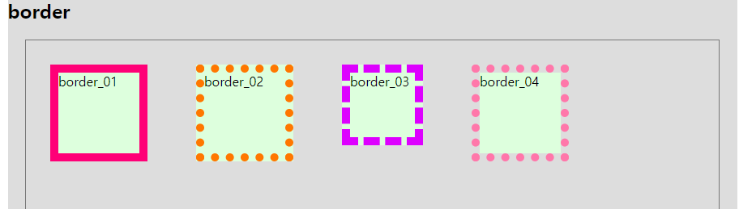
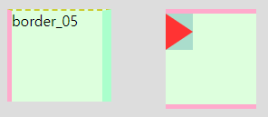

# MEMO

[[클릭] 다양한 css 기능 검색 사이트](https://css-tricks.com/)


## 단축작성

```hamlt
dl>(dt{title}+dd*3{dd_$$})*3

▼

<dl>
<dt>title</dt>
<dd>dd_01</dd>
<dd>dd_02</dd>
<dd>dd_03</dd>

<dt>title</dt>
<dd>dd_01</dd>
<dd>dd_02</dd>
<dd>dd_03</dd>

<dt>title</dt>
<dd>dd_01</dd>
<dd>dd_02</dd>
<dd>dd_03</dd>
</dl>
```


# 오늘진도

## border (p.294)

### border style-size

`3과 4가 박스의 기본 사이즈`



```css
.b_01{
  border : 10px solid #f07;
}
.b_02{
  border : 10px dottde #f70;
}
.b_03{
  border : 10px dashed #dff;
  box-sizing: border-box;
}
.b_04{
border:10pz dotted #f7a;
background-clip: content-box;
}
```

background-clip:

- 보더

- 패딩

- 컨텐트

- 인해릿 ( 부모가 가진 그대로)


### border 삼각형 표현



```css
.b_05{
  border:5px solid #fac;
  border-top:2px dashed #cc3;
  border-right: 3px solid #afc;
  border-right-width: 10px;
  border-bottom: 0;
}


.b_06{
  border-top:5px solid #fac;
  border-bottom:5px solid #fac;
}
.b_06 button{
  padding: 0;
  cursor: pointer;
  border: 20px solid #adc;
  border-left:30px solid #f33;
  border-top-width: transparent;
  border-bottom-width: transparent;
  border-right-width: 0;
}
.b_06 span{
  display: block;
  width: 0; height: 0; overflow: hidden;
}
```

#### 3번

스타일이 다른 보더가 만날 때는 사이즈를 반씩(45도) 가져가며,  바텀과 같이 보더가 없는 부분은 보더 스타일이 있는 부분이 100%를 가져간다.


#### 4번

삼각형의 사이즈를 조절하고 싶을 때 `HTML은 삼각형을 만들 수 없기 때문에 보더로 만들어야 한다. `

- border: 20px solid #adc;
- border-left:30px solid #f33;


## button

```html
        <li class="b_06">
          <button type="button"><span>border_06</span></button>
        </li>
```

타입

- 버튼
- 리셋
- 메뉴
- 써밋

```css
.b_06 button{
  cursor: pointer;
}
```

커서

- 포인터
- 헬프


## outline

margin, padding에 영향을 미치지 않으며, 부피를 가지고 있지 않다. 

구형 브라우저에서는 동작하지 않는다.

- 포커스를 가지는 경우에 주로 사용한다. (tab)
  - 버튼
  - a


## nth-chlid

차례로 이어진 같은 요소의 순서만을 가리킨다. 

```css
ul li:first-child {
}
ul li:nth-child(1){   //first-child == nth-chlid(1)
}
ul li:nth-child(2){
}
ul li:last-child{
}
ul li:nth-last-child(3){
}
```

> JS - 프로그램에서 만든 언어이기 때문에 첫번째가 0
>
> CSS - 디자인 관점에서 만든 언어이기 때문에 첫번째가 1


###  몇번째 n+1/n-1(짝수, 홀수)

```css
ul li:nth-child(2n-1){}
ul li:nth-child(3n+1){}
```

**ul li:nth-child(2n-1){}**  

- `짝수` (2n)  2번째 숫자마다
- `홀수` (2n-1) 2번째 숫자에서 1 뺀 수

**ul li:nth-child(3n+1){}**

- 3개의 아이들 중 1번째


### 몇번째부터 몇번째까지

```css
4번째부터 8번째까지
ul li:nth-child(n+4):nth-child(-n+8){ 
  background-image: linear-gradient(45deg, #fac, #adf);
}
```

- `부터` n+숫자

- `까지` -n+숫자 


```css
끝에서부터 3번째 까지
ul li:nth-last-child(-n+3){ 
}
```


## nth-of-type

```html
<div class="ex">
    <dl>
        <dt>title</dt>
        <dd>dd_01</dd>
        <dd>dd_02</dd>
        <dd>dd_03</dd>

        <dt>title</dt>
        <dd>dd_01</dd>
        <dd>dd_02</dd>
        <dd>dd_03</dd>

        <dt>title</dt>
        <dd>dd_01</dd>
        <dd>dd_02</dd>
        <dd>dd_03</dd>
    </dl>
</div>
```


태그로만 작동하기 때문에 class는 적용되지 않는다.


