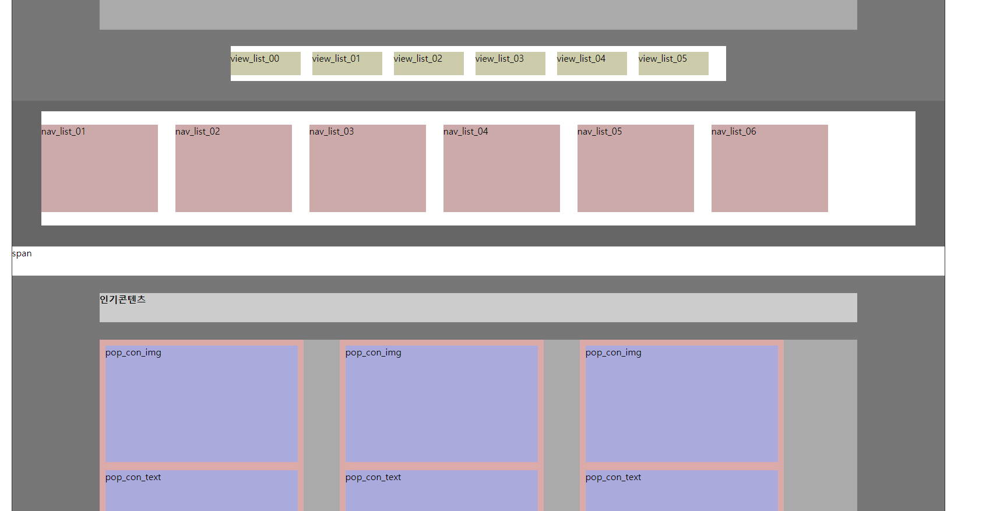

# MEMO

## to-do

- [x]  html.pdf 5.6.7번
- [x] 9.24금요일 받은 layout.pdf
  - [x] 1
  - [x] 2
  - [x] 3
- [ ] 피그마
  - [x] 피그마 타블렛 사이즈 메인화면 완성
  - [x] +1920
  - [x] 피그마 서브 페이지 모바일 완성
  - [ ] 피그마 서브 페이지 PC 완성
- [x] 학원 인강 2개 듣기
- [x] 백업하기

---

## 질문



``` html
<div id="localNavBox">
    <div class="local_nav_outer">
        <ul class="clearfix">
            <li>nav_list_01</li>
            <li>nav_list_02</li>
            <li>nav_list_03</li>
            <li>nav_list_04</li>
            <li>nav_list_05</li>
            <li>nav_list_06</li>
        </ul>
    </div>
</div><!-- // localNavBox-->
```

```css
#headBox{
width: 100%; height: 150px;
background-color: #888;
}
  h1{
  float: left;
  background-color: #fff;
  width: 250px; height: 80px;
  margin-top: 34px; margin-left: 50px;
  }
  .nav_01{
    float: left;
    background-color: #fff;
    width: 850px; height: 80px;
    margin-top: 34px; margin-left: 75px; margin-right: 75px;
  }
  .nav_01 ul{
    width: auto; height: auto;
  }
  .nav_01 li{
    float:left;
    width: 150px; height: 70px;
    background-color: #faa;
    margin-left: 20px;
    margin-top:5px;
  }
  .nav_01 li:first-child{
    margin-left:0;
  }
  .nav_02{
    float: left;
    background-color: #fff;
    width: 250px; height: 80px;
    margin-top: 34px; margin-right: 50px;
  }
```

nav_list를 예로 들 때

ul 자체를 (혹은 float한 요소들을) 부모 요소에서 가운데 정렬을 하고 싶은데

부모를 자식에 사이즈에 맞추면 부모의 크기가 없어서 그런지 마진 0 오토X

이런 거 하나하나 마진 값으로 조정해야 하는 건가?

