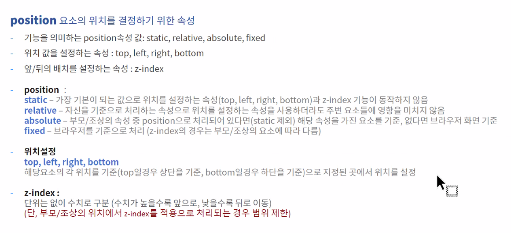

# memo

[css 알려주는 홈페이지](http://css-trick.com)

---

## 어제 진도

`header`

`nav`

`article` 내용, 본문

`section` 요약

`aside`

`footer` - 회사의 정보, 사이트의 기반이 되는 내용

`main` header와 footer를 제외한 내용을 묶어 놓음

`figure`,`figcaption` 상징, 심볼이 되는 것을 표현할 때


## memo

`vscode-random` 색 랜덤 지정 플러그인 (shift+ctrl+p 에서 랜덤 컬러 선택)

`html 5.2이후부터` 속성명과 속성이 같으면 안 써도 된다로 바뀜(ex. hidden="hidden")

```css
em,address,i{font-style: normal;}
abbr{text-decoration: none;}
```

- `기울기` ▶ normal  `밑줄` ▶ none

```css
/* reset.css */
html, body{font-family: sans-serif;}
h1,h2,h3,h4,h5,h6,
p,pre,blockquote,address,
ul,dl,li,ol,dt,dd,
hr,button,
header, article, nav, section, footer, aside, main, figure, figcaption, hgroup{
  margin: 0; padding: 0; border:0; font-size: 100%;
  box-sizing: border-box;
}
ul,ol{list-style: none;}
hr{ width: 100%; border:0; border-bottom: 1px solid #555;}
a{color:inherit; text-decoration: none;}
a:hover{text-decoration: underline;}
button{border: 0; background-color: transparent; cursor:pointer; border-radius: 0;}
em,address,i{font-style: normal;}
abbr{text-decoration: none;}
table, tr, td, th, thead, tbody, tfoot{
  border:1px solid #777; border-spacing: 0; border-collapse: collapse;
}
header, article, nav, section, footer, aside, main, figure, figcaption, hgroup{display: block;}


/* common.css */
.blind{width: 0; height: 0; overflow: hidden;}
.clearfix{width: 100%; height: auto;}
.clearfix:after, .clearfix::after{
  content:""; display: block; clear: both; width: 100%; height: 0;
}
#wrap{
  margin: auto; 
}

```

#### css 파일 불러오는 순서

1. 폰트, 아이콘 관련된 css
2. reset.css
3. common.css
4. design

💙 css파일 상단에 적는 `@charset "UTF-8"`은 html에 불러오는 최상단의 css 파일에만 적으면 된다. 

- font는 외부 파일이기 때문에 내가만든 파일인 `reset.css`에 적는다.


#### css import

```css
@charset "UTF-8";
@import url('https://fonts.googleapis.com/css2?family=Noto+Sans+KR:wght@100&display=swap');
/* main_v1.css */
```

- 폰트를 import 하는 방식은 추천하지 않는다. html에서 링크로 넣는 것을 추천


#### css변수지정

```css
#wrap{
  --color-gray1 : #c4c4c4 ;
}
```

- --color-gray1 : 전체가 변수명
- 신형 브라우저에서만 작동함
- var(컨트롤+스페이스바) 설정하면 편함, 나중에 투명하게 만들수도 있음


# 오늘 진도

## position

- 나중에 작성하면 같은 위치에 올려놨을 때 위에 위치한다

- 인라인, 인라인블럭은 블럭요소로 변경시킨 후 포지션을 줘야한다. (포커스 시 움직인다.)



### 성격, 성향을 나타내는 파트

- `static` : 포지션의 기본값, 그외 포지션 기능이 적용되지 않은 상태
- `relative` :  틀 (하지만 꼭 relative를 틀로 잡을 필요는 없다.)
  - relative를 지정해도 형제요소들의 위치가 변경되지 않는다.
  - 현재 위치에서 변경된다. (t,b,r,l 지정할 때)
  - 틀로 지정하려면 형제가 아닌 자식이 앱솔루트를 지정해야 한다.
- `absolute` : 틀을 기준으로 자리를 지정, 틀을 정하지 않는다면 화면 왼쪽하단이 기준이된다.
  - absolute를 지정하면 다음 형제요소들이 위치를 차지한다.
  - 사이즈는 적용하지만 패딩은 적용되지 않는다.  (마우스 오버시 요소 전체에 백그라운드 처리되며 새로운 정보들이 나올 때 이 기능을 사용한다. ex.카드 )
- `fixed` :  화면을 기준으로 자리를 고정 (해더, 스크롤 탑 버튼)
  - fixed를 지정하면 형제요소들이 위치를 차지한다.
- ~~sticy~~ : 포지션을 적용했다 안 했다하는 기능인듯?
  - 조건이 필요하기 때문에 당장 사용하지 않을 기능

### 위치를 나타내는 파트

 `최대한 사용을 줄이는 것이 좋다.`

- left
- right
- top
- bottom
- z-index (입체) :  단위X

### z-index

- z-index를 가진 부모와 자식 요소들이 있을 때, 자식의 수치보다는 부모의 수치로 각자의 z-index 위치가 정해진다.
  - `a 10> b 100`, `c 1>d 500`  부모 a의 숫자가 더 크기 때문에 d보다 b가 위에 있다.
  - 최상단 부모(큰 틀이 되는) 100단위를 사용하면 작업하기 용이


### fixed 가운데 위치

> width:500px; heught:300px;

```css
.fixed{top:calc(50% - 150px); left:calc(50%-250px);}
```

- 구형 브라우저 지원X

```css
.fixed{
    top:50%; left:50%;
    margin-top:-150px; margin-left:250px;}
```

- 가장 흔히 사용하는 방법

```css
.fixed{top:0; left:0; right:0; bottom:0;
   	   margin:auto;}
```

- top:0; left:0; right:0; bottom:0; //왼쪽 상단이 우선순위
- 사이즈가 고정되어 있을 때 사용해야 한다.
- 위치를 움직이고 싶을 때 원하는 수치의 2배를 입력한다. 100px→200px


### fixed 가운데로 지정한 후 위치 조정

```css
.btn{
    position:fixed; left:50%; top:50px; z-index:200;
    width:100px; height:100px; 
    margin-left:500px;
    background-color:#adf; border:3px solid #eee;
}
.btn button{
    background-color:#adf; border:0; cursor:pointer; margin:0;
}
```


## script

```js
let url="./html/main_v1.html"
	url="./html/main_v2.html"
window.location = url;
```

main_v1 → main_v2로 변경할 


## layout 풀이

### 가장 큰 틀의 html, css

```html
<div id="wrap">
    <header id="headBox">
        <div class="head_inner">
        </div>
    </header><!--#headBox-->
</div>
```

```css
#wrap{
  width: 1440px; height: auto; min-height: 500px;}


/*headBox=============================================*/
#headBox{
  width: 100%; height: 100px; 
  padding-top: 20px; padding-bottom: 10px;
  background-color: #c4c4c4;
}
.head_inner{
  width: 1100px; height: 100%;
  margin: auto;
  background-color: var(--color-sample1);
}
```

1. 가장 큰 부모인 #wrap은 사이즈를 지정한다. (margin:auto는 reset.css에서 지정함)
2. #headBox > .head_inner
3. #headBox는 반응형을 고려하여 크기를 %로 지정하며, 패딩의 가로 사이즈를 주지 않는다. 
4. .head_inner는 컨텐츠가 들어갈 곳이기 때문에 사이즈를 지정하고 div를 가운데로 정렬하기 위해 margin:auto;
   1. 만약 배경이 흰색이라면 배경이 늘어나는 것을 걱정할 필요가 없기 때문에 #Box의 역할을 할 필요없이 .inner를 배경이 있는 태그의 Box처럼 사용해도 된다.


### IR 기법

```html
<h2>
    <span class="blind">내용만 없애야 할 때</span>
</h2>
```

**image replace기법**

- 태그는 있고, 안의 내용은 숨기고 싶을 때 (이미지 외에도 다양하게 사용한다.)
- 블라인드 외 다른 방법을 찾아봐


### 텍스트 박스

글씨가 많이 들어가거나 박스의 값이 100%로 들어가면 디바이스 사이즈에 따라 글씨가 떨어질 수 있기 때문에 조금 여유있게 작업하는 것이 좋다.

