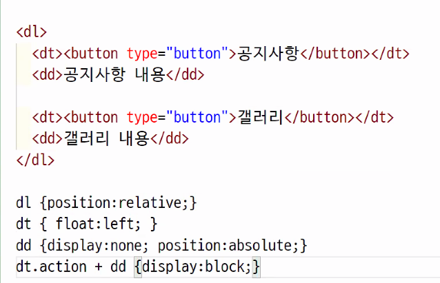

# memo

❓ BEM방식?

부모 > 부모--자식, 부모--자식--자식

- block element modifier
- `B` 블럭의 기능이나 목적 - 무엇?
- `E` 기능이나 목적에따라, 중첩도 가능
- `M` 상태, 모양


# 오늘진도

## position

- ❓ 높이값이 auto라서 마진? top? 이걸로 하면 화면이 꽉찬다고 움직일 수 없다고 함. 왜지?
  - height:auto가 꽉차는 것이 아닌 가운데 정렬을 하려고 height:auto인 상태에서 top:0; bottm:0; margin:auto;를 설정했을 때 top과 bottom의 잡아당기는 힘에 의해 높이가 화면에 꽉 차게 된다.


- 포지션이 들어가면 top, left 정리 후 top, margin, padding을 정리한 후 진행해야 한다.

```css
--width:500px;

margin-left:clac( var(--width) / -2 );
===
margin-left:-250px
```

- calc를 사용할 수도 있다!


### position 다양한 방법

부모의 높이값 100px, 자식의 높이값 70px일 때 

```css
div{ top:0; margin-top:15px;}


div{top:50; margin-top:35px;}  // 가운데 위치하게 만들기
```


### 형제  선택자를 사용한 포지션

```html
<ul>
    <li>
        <a href="#">1</a>
        <span>text 내용</span>
    </li>
    <li>
        <a href="#">2</a>
        <span>text 내용</span>
    </li>
</ul>
```

```css
.q_10 li {
  position: relative;
  width:30px; height: 30px;
  margin-bottom:20px;
}
.q_10 li:last-child {margin-bottom: 0;}

.q_10 a {
  display:block;
  width: 100%; height: 100%; 
  border-radius:100%;
  background-color: #fff;
}

.q_10 span {
  display: none; 
  position: absolute; 
  right:50px; top:-5px;
  width: 200px; height: 40px;
  box-sizing: border-box; padding:8px;
  color:#fff;
  background-color: #06c;
}
.q_10 a:hover + span { display: block;}
```

- .q_10 a:hover + span { display: block;} ← 형제 선택자를 잡는 방법
  - html태그를 형제로 잡았을 때 사이즈가 고정되어있는 상태가 아닌, 변동이 될 수도 있는 상황이라면 position으로 위치를 수정해줘야 한다.
- 부모에게 relative를 준 뒤 위치를 조절할 자식을 absolute를 준다.
  - 부모에게 relative를 줬으면 자식은 부모를 기준으로  정렬된다.
- top, left, bottom, right로 할 수 있으면 마진을 주지 않고, 포지션의 방향만으로 끝~!~!
- 방향은 같은 방향이 기준이다. top이면 body || relative의 상단을 기준으로 absolute의 상단을 움직인다.
- background-color와 border-radius는 부모가 아닌, 자식에게 줘야 한다.


#### 형제선택자

- `인접형제선택자`: 선택요소 바로 뒤에오는 요소
- `형제 선택자` : 선택요소 뒤에오는 조건에 맞는 요소

```html
<dl class="siblings">
    <dt>dt-title</dt>
    <dd>data</dd>
    <dd>data</dd>
    <dd>data</dd>
    <dd>data</dd>
</dl>
```

```css
.siblings{
    width:400px; height:800px;
    margin:auto;
    border:1px solid #666;
}
.siblings:hover dt{
    background-color:#ddd;
}
```

```css
.siblings:hover > dt + dd{
    background-color:#ddd;
}
```

- 인접형제선택자
  - dt바로 뒤에 오는 dd를 선택한다.

```css
.siblings:hover > dt ~ dd{
    background-color:#ddd;
}
```

- 형제선택자
  - dt 뒤에오는 모든 dd를 선택한다.
  - dt+dd가 여러개라면 선택한 dt뒤에 따라오는 dd만 된다. 만약 두번째 dt를 hover했다면 해당 dt 이후의 dd만 선택된다.


### 클래스를 지정한 nth-

```css
.name:nth-chlid(2){
    
}
```

- css가 작성됐을 때, 같은 .name 의 두번째 클래스가 아닌 전체 형제 중 두번째를 잡는다.
  - 만약 `div>.name*5` 의 상황일 때 nth-of-type로 작성해도 내용은 같다.


## 웹디자인 기능사 예제 문제 풀이

### 3등분 할 때 방법

- 33.333333%, 33.333334%
- 33.333333% 로 진행한 후 마지막 요소를 float:left;


### tab

#### 제목+제목 / 내용+내용

실무에서는 이것을 더 많이 쓴다고 함

```html
<section id="info_area">
    <h3 class="blind">공지사항 및 갤러리</h3>
    <div class="tab_title_area">
        <ul>
            <li class="action"><button type="button">공지사항</button></li>
            <li><button type="button">갤러리</button></li>
        </ul>
    </div>
    <div class="tab_content_area">
        <div class="tab_detail_01"></div>
        <div class="tab_detail_02"></div>
    </div>
</section>
```

```css
.tab_title_area{
  width: 100%; height: 30px;
  background-color: #eee;}
.tab_title_area ul{
  width: 100%; height: 100%;
  box-sizing: border-box;}
.tab_title_area li{
  float:left;}
.tab_content_area > div.action{
  display: block;}
.tab_detail_01{
  display: none;}
```


#### 제목+내용 / 제목+내용

근데 이쪽으로 바꾸자는 말이 나온다고 함



### focus

```css
#link_area button:focus{
  outline: 0;
  border-bottom: 3px solid #f06;
  box-shadow: 3px 3px 3px #333;
}
```

- box-shadow: x y blur color

### modal - autofocus

```html
<div class="modal">
<div class="modal_message">
<h4>modal title</h4>
<p>Lorem, ipsum dolor sit amet consectetur adipisicing elit. Quo blanditiis nisi pariatur placeat fugiat, incidunt nostrum eos saepe magni perferendis aliquid omnis quasi ipsum quas alias rem recusandae reiciendis maxime.</p>
<div class="close">
<button type="button" autofocus>닫기</button>
</div>
</div><!--madal_message-->
<div class="modal_bg"></div>
</div><!--modal-->
```

상단에 작성한 포커스가 먼저 잡히기 때문에 모달 내에 있는 닫기를 우선적으로 포커스 할 수 있도록 지정해줘야 한다.


```css
============================================================================== */
#awardBox{
  position: relative;
  width: 100%; height: auto;
  padding: 105px;
}
  .award_title{
    position:absolute; top: 0; left: 0;
    width: 100%; height: 170px;
    padding-top: 104px; box-sizing: border-box;
    background-color: #333;
  }
    /* .title_inner{} */
      .title_inner h2{
        float: left;
      }
      /* .title_tab_btn{} */
  .award_inner{
    margin-top: 80px;
  }
    /*.book_part{ }
    .lrmore_btn{} */
```

