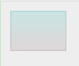
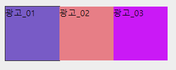
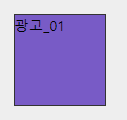

# TIL

## memo

마이크로 데이터가 뭐지? 표준됐댕


### 웹 기술 명세서

스타일 가이드와 비슷한 개념, 각 기업은 웹 기술 명세서가 있기 때문에 확인해보는 것이 좋다.


### git

`git status` :  현재 상태 확인

- git add 전 후로 색이 바뀜, 하나씩 올릴 땐 `git add 파일 복붙`

`git add . || *` 

- 수정, 추가, 삭제 모두 git add .

`git reset`

- add까지 쓴 git 삭제하기 (commit까지 쓰면 삭제X)

`git commit -m ""` 

- `-m` : 요약이라는 뜻
- `: qa!`git commit만 치고 에디터 들어가게 됐을 때 나가는 방법

`git push` 


ctrl+Insert 복사, shift+Insert 붙여넣기


### , 익스텐션 기법

```css
.navigation, .navigation ul,.navigation li{
  width: 100%; height: auto;
}
```

- `,` 를 표현해 한 번에 작성하는 것을 익스텐션 기법이라고 한다.

## common.css

```css
/* common.css */
.blind_wrap a>span,
.blind_wrap button>span,
.blind{
  display: block; position: absolute; z-index: -1;
  width: 0; height: 0; overflow: hidden;}

```

- 이 부분이 이해가 안 됨, 왜 a, button 안에 span이 들어가지????

```css
.blind_wrap a{
  display: block; width: 100%; height: 100%;
}
```

- 이미지를 넣기 위한 조건
- span의 부모인 a를 위해 작성
- a는 사용자의 편의를 위해 dp:b 하는 경우가 많기 때문에

# 오늘진도

## html

### 강조의 표현

- `strong`강요성(무조건 적인, 위협)을 띈 강조 - danger
- `em` 권유성을 띈 강조 
- `ins` 추가로 첨부된 내용
- `del` 기존 내용에서 삭제된 것
- `mark` 인식을 위한 강조, 형광펜으로 체크하는 방식

### address

- address 내 h태그 사용 불가
- address는 여러 문단들이 사용됐기 때문에 P로 분리 시킨 후, 제목과 내용이 나뉜 태그는 따로 코드를 작성해준다.


#### dl을 사용한 address
<details>
<summary>click, 코드 자세히보기</summary>

```css
<address>
    <p>사이트 명</p>
    <p>사이트 주소</p>
    <dl>
        <dt>연락처 : </dt><dd>010-0000-0000</dd>, 
        <dt>팩스 : </dt><dd>010-0000-0000</dd>, 
        <dt>이메일 : </dt><dd>010-0000-0000@gmail.com</dd>, 
    </dl>
    <p>사업자 번호, 통신판매번호</p>
    <span class="blind">copyright</span> &copy; web tutorial.
</address>
```

</details>


#### 강조코드를 사용한 address

<details>
<summary>click, 코드 자세히보기</summary>

```css
<address>
<p>사이트 명</p>
<p>사이트 주소</p>
<p>
<em>연락처 : </em><p>010-0000-0000</p>, 
<em>팩스 : </em><p>010-0000-0000</p>, 
<em>이메일 : </em><p>010-0000-0000@gmail.com</p>, 
</p>
    <p>사업자 번호, 통신판매번호</p>
    <span class="blind">copyright</span> &copy; web tutorial.
</address>
```
</details>


#### copyright

```html
<address><span class="blind">copyright</span> &copy; web tutorial.</address>
```


## css

### float을 사용하지 않고, 화면 나누기

float을 사용하지 않은 블럭요소들은 위에서 아래로 떨어진다. 

이것을 이용해 float을 사용하지 않고 margin-left;로 왼쪽 공간만큼 밀어 화면을 만드는 방법이 있다.


### 메뉴 호버 시 dd 나타나기

#### height:0 → 높이값 지정

+단편성을 가진 animation 기법

<details>
    <summary>click, 코드 자세히보기</summary>

```css
.navigation dd{
width: 100%; height: auto;
height: 0; overflow-y:hidden; transition: height 300ms linear;
}
.navigation dl:hover > dd {height: 100px;} 
```

- 참고만 하는 정도로, 다른 코드는 이렇게 만들기 어려움!
  - 포커스줄 때 dd까지 주기 때문에 이것도 해결해야 함.


</details>


#### display:none;

display:block, none을 활용한 방법

<details>
    <summary>click, 코드 자세히보기</summary>

```css
.navigation dd{
display:none;
width: 100%; height: auto;
height: 0; 
}
.navigation dl:hover > dd {display:block;} 
```

- 참고만 하는 정도로, 다른 코드는 이렇게 만들기 어려움!
  - 포커스줄 때 dd까지 주기 때문에 이것도 해결해야 함.


</details>

### clip:rect();
- 하나의 위치를 잡기 위해 위에서(Y), 왼쪽에서(X), 밑에서(Y, X)의 공백을 만들어서 이 사이즈만큼 보기에 만드는 것



```css
.clip_t{
  position: absolute;
  clip:rect(18px, 122px, 90px, 18px);
  width: 200px; height: 200px;
  box-sizing: border-box; padding: 20px;
  background-image: repeating-linear-gradient(#add, #faa);
}
.clip_t > .insert{
  width: 100px; height: 70px;
  background-color: rgba(255,255,255,0.3);
}
```

- clip: rect();(상단, 오른쪽, 하단, 왼쪽)
- 마스크 기능을 사용할 때, 구형 브라우저는 clip 기능만 가능하기 때문에 사용.
- 포지션 필수!


### viewBox

```html
<div class="view_area">
    <div class="view_warpper">
        <div class="view_content view_00">광고_01</div>
        <div class="view_content view_01">광고_02</div>
        <div class="view_content view_02">광고_03</div>
    </div>
</div>
```

- `view_area`영역의 위치를 잡기 위한 틀, 
-  `view_warpper`광고 영역 나열 시 범위를 잡는 틀 
- `view_content`광고 내용






```css
.view_area{
  overflow: hidden;
  width: 100px; height: 100px;
  border:1px solid #333;
}
.view_warpper{
  width: 300%; height: 100%; background-color: #aad;
}
.view_warpper > div{
  float: left; 
  width: 100px; height: 100px;
}
```

- overflow:hidden; 은 화면에 표현할 사이즈를 가진 부모에게 적용 시킨다.
- 배너를 묶은 `view_warpper`은 표현할 배너의 갯수에 따라 `$00%`로 나타낸다.
- 배너 하나의 이름인`.view_warpper > div` 는 `view_area` 사이즈로 지정되야 한다. 사이즈를 모른다면 부모에게서 사이즈를 가져와야 한다. (calc, nn.nnnnnn% etc.)
  - 부모 사이즈는 `$100%`로 확장됐기 때문에 100%를 쓰면 확대된다.
  - float를 사용했기 때문에 auto를 사용하면 자식의 사이즈만큼 줄어든다.


가로 사이즈를 구하는 다양한 방법, 슬라이드 이동 개념


<details>
<summary>click, 코드 자세히보기</summary>

#### 부모의 %를 표현한 방법

```css
.view_content{
  float: left;
  height: 100%; width: 33.333333%
}
```


#### calc를 이용한 방법

```css
.view_warpper > div{
  float: left; 
  width: calc(100% / 3); height: 100px;}
```


#### 슬라이드 이동 개념

```css
.view_warpper{
  width: 300%; height: 100%; background-color: #aad;
  margin-left:100%;
}
```

- 슬라이드개념으로 배너를 움직일 때, 배너들의 묶음인 `view_warpper`를 100% 단위로 margin을 통해 이동시킨다. 


</details>


