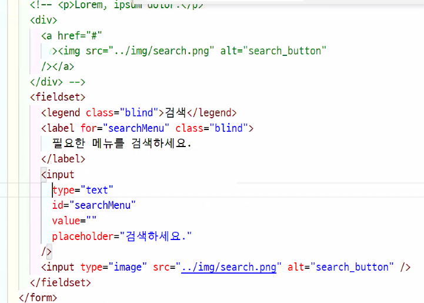

# memo

- [ ] 검사 전 주말동안 수정해 보기!


# 오늘 진도

## 과제 후 코드정리

- 동일한 클래스명 있는지 확인
- js 순서 확인, link 아래인
- [x] img 사용할 때 사이ㅈ즈 (가로세로 중 하나씩 100%, auto)

```html
<h1>
    <a href="#">
    	<span class="blind">메가커피</span>
        
    </a>
</h1>
```

- [x] 버튼을 클릭하면, 버튼 박스가 나오는 형식이라면 버튼 박스는 버튼과 함께 묶어서 버튼 아래에 적어야 함
- [x] indicator 내 `<span class="blind">`를 통해 인디케이더 요소 하나하나의 내용을 숨겨준다.
- [x] 인디케이터의 위치는 광고를 다 보고 누르는 게 아닌 먼저 눌러야 하기 때문에 인디케이터 `<,>` 버튼이 코드보다 위에 들어가야 한다. 
- [x] <, > 를 float을 사용해 정리했다면 버튼의 부모 요소는 높이값을 0으로 줘야 함
  - 하지만 이렇게 하면 배경과 버튼 모두  a 태그가 잡히기 때문에 버튼에게 패딩, box-sizing:content-box(상황따라 다름)을 줘 커서포인터가 풀렸다가 잡혔다가 하게 만들어야함
- [x] `&nbsp;` → `<br />` / `<class="">` / `<p>` 줄바꿈이나 문단 태그를 사용하거나 클래스를 주어 마진 라이트 한다.
  - 특수기호를 사용할 경우, 스페이스, 스페이스 이런 식으로 읽을 수도 있으며 하나씩 계속 저렇게 적어야 하기 때문에 비합리적임

- [x] role="menu"   >   role="menuitem" 롤에 메뉴를 사용했다면 하위메뉴에 메뉴아이템을 작성해줘야 함
- [x] address>p+p+p+p 푸터에 회사에 대한 정보는 address 안에 적어줘야 함! 카피라이트는 선택사항
- [x] absulte와 float을 함께 적어야 할 때 : positon 스태틱 사용할 때 풀렸다 접힐 때의 과정이 반복되는데 둘다 필요하니까!
- a태그는 {dp:b; w100p; h100p;}가 기본 요소이므로 공통클래스를 줘 사용하자 
- [x] float을 왼쪽 정렬만 생각하는 게 아니라, 자식의 값을 따라서 부모의 크기를 조절한다고 생각할 때에도 float을 사용하는 것이 좋음.  (상민님header nav 부분)
  - 이때 크고 작고가 너무 변하는 게 싫으면 max- 를 걸고 사용해
- [x] `tabindex=""`강제로 포커스 처리를 가능하게 만든다! (-1은 강제로 불가능하게 만들기`JS에서 주로 사용하는 기능임`)
  -  0,1,-1의 속성값을 가짐 / 단위X / 이외에 나머지 숫자도 가능하지만 사용자제
  - a, button, unput, select, textarea etc. form 요소에 사용가능!
  - 
- [x] 각 영역별로 의미있는 구조로 전환하는 것이 좋음 (div → ul, dl, p, button etc.)
- [x] 버튼, 내용, 인디케이터는 유사요소끼리, 사용성 면에서 쓰기 쉽게 그룹처리 및 순서 배치
- [x] H는 해당하는 구역, 영역의 이름이기 때문에 영역별로 사용하는 것이 좋음. 제목이 있다면 제목을 따라 내용이 들어와야 함
- `<button type="submit">` 전송의 뜻
- [x] 이미지는 div로 감싸주거나 figure 태그로 감싸서 사용해야함. 피규어가 조금 더 시멘틱함
- [x] 플롯으로 생성되는 블럭의 기능은 완벽하지 않고, 사이즈만을 만들어주기 때문에 직접적으로 디스플레이 블럭을 만들어주는 것이 좋다.
- [x] footer > address
- [x] 피뷰어는 내용이 있어야 하며, class/id 필수
- [x] 글자는 대문자 XXXXXXXXX 
- [x] a 태그 등 포커스를 가지는 요소에는 포지션 을 주면 안 된다.
  - 인라인 성격을 ㄸ띄는 요소에는 주지 않는 게 좋다(는 쌤 생각)
- [x] position:relative를 사용할 경우 top, left 필수 선택요소 X / fixed, absolute는 필수



인풋, 입력

벨류 - 저장하는 속성

플레이스홀더 - 검색하세요 (검색창 내 문구)

인풋 타입 ="이미지" src="이미지주소"

슬아님, 수민님


## button

버튼을 만들 때 순서 잘 기억,

버튼과<> 버튼들의 순서를 잘 고려해서

마우스 올렸을 때의 설명(이건 alt? title?), 포커스, 호버 시 고려


viewBox 코드 확인(수민님)


일단 best_length 를 클래스로 잡고 나중에 저기 숫자가 바뀌게 js에서 수정한다고 함!


## 언어

웹 문서 시작 전에 인식되게하여 처리하는 것이 좋다. (e.g 어도비, 애플 등)


## 인디케이터

채윤님, viewBox, 인디케이터 연결하는 방법 코드 확인

인디케이터에 a링크 주소를 #뷰박스광고이미지  이런식으로 지정해 불러오기 함


## 마우스 호버 시 나타나기

마우스 호버 시 글씨가 나타나게 하는 거

채윤님 사회공헌 박스 코드 확인하기

li>a

a에 백그라운드 컬러를 주거나

li에 오버플로우 히든을 주면 색이 도형을 넘어와 색칠하는 것을 잡아줄 수 있음


## 메뉴 사이 간격-인라인 블럭

은비님 베스트 아이템 코드 확인

박스 사이즈가 같은 게 아닌,  글씨 간격이 같게 만드는 것방법 

인라인 블럭은 글자의 개념이라 중간중간 가볍게, 큰 박스는 사용하지 않는 것이 좋음. 

인라인 블럭을 사용한 이유는 좌우 간격 맞추기 용이, float을 사용하지 않아도 됨.

인라인 블럭은 미세한 기보ㅓㄴ 간격이 있기 때문에 패딩보단 마진이 원하는 느낌을 더 낼 수 있다.(이것도 완벽하진 ㄴ않아서 수치를 보면서 수정해야 함)


## 푸터 요소 정렬

연우님 코드 확인

adress 에 패딩? 마진? R 줘서 ㄱ글자가 늘어났을 때 유동적으로 대응하게 하려고 코드 수정함


---

## 다시 한 번 정리

- 블럭 요소에서 a 요소의 영역을 확인 (a의 위치를, 순서를 어디에 둬야 할 건지)
  - 상자(이미지), 제목, 내용(설명, 가격, 자세히, 링크) 다만, 링크 내 링크위치는 옳지 않다
- img는 현시점에서 중요하지 않음(프로토타입에서!!!!)
- 대문자 금지, css에서 text-transporm
- 


---

## transform

### 조건

- block 요소
- 자신의 크기 값을 알아야 한다.

```css
p{transform: }
```

### 속성

- `translate( )` 자신의 크기를 기준으로 이동
- `trasnslesX(' ')`, `trasnslesY(' ')` X축, Y축 이동
- `trasnsles(' ')`X축, Y축 이동
- Z축이동도 가능,( 3D 입력하라는데 못 봄)


## inline-block

float을 사용했을 때, 가운데 정렬하기 어렵다면 크기를 가지는 텍스트로 변환한 후(`display:block`) → `text-align:center`


:sparkles: **<u>10.08 TIL 정리 바로가기</u> **:sparkles:
	<a href="./TIL_21-10-09_10.md#til_1008">click, TIL 10.08 정리</a>

