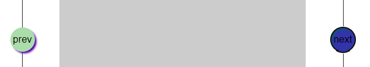
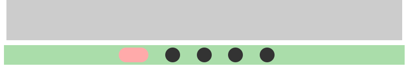

# TIL

리액트, 뷰, 스탠실 `비슷`

스벨트 `리액트반대` 구형브라우저 아예 지원X 

웹 프레임워크, 라이브러리


## position

### fixed

`position:fixed`를 적용하면 브라우저 기준으로 변한다. (auto:자식값을 기준, 100%:부모값을 기준) 하지만 Left, Top위치를 정해주지 않으면 기본으로 부모위치를 기준으로 `Left:0` / `Top:0`의 위치값을 가진다.

- fixed를 사용하면 (absoiute도 마찬가지) 동생 요소들이 자리를 떠난 fixed가 적용된 요소의 자리를 차지하므로 그들의 부모 요소, 혹은 동생요소에게 padding:top을 적용한다.


### siticy

`position:sticy; top:0;`를 사용하면 스크롤 시 일반 요소들처럼 움직이다 지정한 위치(top:0)에 도달하면 fixed로 변해 해당 위치에 고정된다.

- JS로 사용가능한 기능, 아직은 불완전하기 때문에 Js로 하는 것을 추천


### relative

position에 관련된 위치 속성들을 사용하면 현재 위치 기준으로 움직인다.


### absolute

position이 들어간 부모, 조상들을 기준으로 하기 때문에, 해당 자손 요소가 아닌 사이즈가 잡힌 `div>a` / `div>a` div에게 position을 줘야 함.

- 기준이 되는 position에게 padding이 적용되어 있더라도 padding을 고려하지 않음. 대신에 border에는 영향을 받는다.
  - 해결방안 : 기준이 되는 relative의 자식요소들을 묶는 div를 한 번 더 묶어서 처리 / absolute에게 직접적으로 패딩을 고려한 위치값 적용
- 부모, 조상에게 기준이 되는 position이 없으면 브라우저 기준으로 사이즈가 적용된다. (부모 기준 X)


## footerNav

```html
<div class="nav_list">
    <ul>
        <li><a href="#">제휴문의</a></li>
        <li><span class="bar"></span><a href="#">이용약관</a></li>
        <li><span class="bar"></span><a href="#">개인정보처리방침</a></li>
        <li><span class="bar"></span><a href="#">공지사항</a></li>
    </ul>
</div>
```

```css
.nav_list{
  width: 600px; height: 100px;
  margin-top: 100px;
  border: 1px solid #171717;
  background-color: #fff;
}
.nav_list ul{
  width: 100%; height: 30px;
}
.nav_list li{
  float: left;
  width:auto; height: auto;
  margin-right: 10px;
  background-color: #add;
}
.nav_list li:last-child{margin-right: 0;}
.bar{} ----------------------------------------------// 이걸 바꿔보겠음
.nav_list a{
  width: 100px; height: 50px;
  padding: 3px 5px;
  background-color: #dda;
}
```

- a는 현재 인라인요소이기 때문에 `사이즈를 가질 수 없다.` 코드에 적어놓은 사이즈는 없어도 무방함.


### li에 자식을 추가하는 방법

#### span을 사용한 방법

```css
.bar{
  float: left;
  margin-left: -5px; margin-top: 10px;
  width: 1px;height: 10px; background-color: #777;
} 
```

#### before을 사용한 방법

```css
.nav_list li:before, .nav_list li::before{
  content:""; float: left ;
  width: 1px;height: 10px;
  margin-left: -5px; margin-top: 10px;
  background-color: #777;
}
.nav_list li:nth-child(1):before, .nav_list li:nth-child(1)::before{
  display: none;
}
```

- span에게 float을 사용하면 dp:b를 줄 필요가 없음!
- 내용없이 사용하는 span은 좋지 못하기 때문에 before를 사용했다. (`1`after를 사용해도 된다. `2` before, after는 자식으로 들어간다.)
- after를 사용할 경우 html 태그 내 span을 사용하지 않아도 된다.
- before를 사용할 경우 `:nth-child(1) || first-chlid`를 사용하면 된다.


### position을 이용한 방법

가장 권장하는 방법! 추천 추천 ^^b (Breadcrumb 방식과 동일)

```css
.nav_list li{
  position: relative;
  float: left;
  width:auto; height: auto;
  margin-right: 10px;
  background-color: #add;
}

.nav_list li:after, .nav_list li::after{
  content:""; 
  display: block; position: absolute; top: 0px;bottom: 0; right: -5px;
  width: 0; height: 10px;
  margin: auto;
  border-right:1px solid #000;
}
.nav_list li:last-child:after, .nav_list li:last-child::after{display: none;}
```

- li의 자식 요소에게 float:right; 를 사용하면 후에 a에게 dispaly:block;을 주면 틀어진다. 
  - `이유` :  a가 inline요소였을 때를 기준으로 제작되었기 때문에 a가 block가 되면 틀어진다.
  - `해결방안` : position
- `width:0`|| `width:1px` (0을 준 이유는 border를 적용시키기 때문)
  - border는 left, right로 줘야한다. border로 주면 상하좌우 다 먹기 때문


### border를 이용한 방법

```css
.nav_list li{
  height: 10px;
  padding-right: 10px;
  border-right: 1px solid #f99;
}
.nav_list li:last-child{border:0; padding-right: 0;}
```

- `li가 아닌 a에 border를 적용할 때 생기는 문제` border까지 클릭하는 범위 안에 들어간다.
- li 옆 사이즈의 사이즈를 줄이고 싶으면 `height`값을 줄이면 된다.


### Breadcrumb


- 이 기법의 이름은 브래드크럼으로, footer의 nav에 사용하는 방법과 동일하다.
- 이미지가 아닌 보더를 사용해 45도로 돌렸다.


## tabindex

포커스를 줄 수 없는 요소에게 `강제로 주는` ||  `있는 요소를 강제로 삭제`하는 || `우선순위를 주는` 요소

- 접근성을 더 수월하게 진행할 수 있게하는 요소
- 이 기능은 js에서 제어를 한다. ( 내가 필요할 때 사용하기 위해)

### tabindex 속성

`-1` 본래 가지고 있는 focus 기능을 제거

`0` focus 기능을 강제 부여 (순서대로 찾아감, 없는 속성에게 부여해줌)

`1` focus 기능에 우선순위를 강제 부여 (가장 먼저 주고 싶어서)


- 언어설정에서 선택하면 바로가기로 연결되면 접근성에 어긋난다. (의외...) 
  - `원칙` : 클릭하면 이동하기 버튼이 생기고, 이 버튼을 클릭했을 때 이동이 되어야 한다.


## viexBox

```html
<div class="slide">
    <h2>slide position</h2>
    <div class="slide_wrapper">
        <div class="btn">
            <button class="next">next</button>
            <button class="prev">prev</button>
        </div>
        <div class="indicator">
            <ul>
                <li><a href="#"><span class="blind">01</span></a></li>
                <li><a href="#"><span class="blind">02</span></a></li>
                <li><a href="#"><span class="blind">03</span></a></li>
                <li><a href="#"><span class="blind">04</span></a></li>
                <li><a href="#"><span class="blind">05</span></a></li>
            </ul>
        </div><!--indicator-->
        <div class="slide_content">
            <div class="slide_con_wrap">
                <div id="slide_01"><a href="#">slide_01</a></div>
                <div id="slide_02"><a href="#">slide_02</a></div>
                <div id="slide_03"><a href="#">slide_03</a></div>
                <div id="slide_04"><a href="#">slide_04</a></div>
                <div id="slide_05"><a href="#">slide_05</a></div>
            </div>
        </div><!--slide_content-->
    </div><!--slide_wrapper-->
</div>
```

- 순서는 `버튼` → `인디케이터` → `main_visual`

### transform

```css
.btn{
  position: absolute; top: 50%; left: 50%;
  width: 120%; height: 0; 
  margin: auto;
  background-color: #aaa;
  transform: translateX(-50%);
}
```

**transform은 값을 모른 채로도 가운데로 오게 지정할 수 있다. (IE6~8는 안 됨)**

- `  transform: translateY(-50%);` === `margin-top:-20px;`


### silde+btn

```css
.slide_wrapper{
  position:relative;
  width: 800px; height: 500px;
  margin: auto;
  background-color: #ccc;
}

.btn{
  position: absolute; top: 50%; left: 50%;
  width: 120%; height: 0; 
  margin: auto;
  background-color: #aaa;
  transform: translateX(-50%);
}
.btn button{
  width: 40px; height: 40px; border-radius: 100%;
  background-color: #ada;
  transform: translateY(-50%);
}
.prev{float: left;}
.next{float: right;}
```

- .btn의 `height: 0`을 줘야 배경 img 클릭 시 거슬리지 않는다.
- .btn 버튼이 뷰박스의 사이즈를 벗어나게 하는 방법
  - width값을 100% 이상( width: 120%;  )으로 지정한 후 평소와 같이 진행한다. 


왜 굳이 트랜스폼을 따로 잡은 거지??


#### box-shadow



```css
.btn button:hover{box-shadow: 3px 3px 3px #50a;}
.btn button:focus{box-shadow: 3px 3px 3px #157 inset; background-color: #33a;}
```

- prev는 hover, next는 focus
- box-shadow inset 는 그림자가 안으로 들어오는 형태이다. (사용하면 사이즈가 커지기 때문에 box-sizing:border-box 진행해야 함)


#### dispaly:inline-block

```css
.indicator ul{
  width: 100%; height: 100%; text-align: center;
}
.indicator li{
  display: inline-block;
  width: 30px; height: 30px;
  margin-right: 30px;
}
```

dispaly:block; 대신 inline:block을 사용했을 때, `text-align: center;` 을 진행하면 , ul 전체가 가운데 정렬된다.


#### indicator 버튼



```css
.indicator a{
  display: block;
  width: 100%; height: 100%;
  border-radius: 50px;
  background-color: #333;
}
.indicator li.action{width: 60px;}
.indicator li.action > a{background-color: #faa;}
```

- `border-radius: 50px;` 를 %로 표시하지 않고, `px`로 해야 위와 같이 표시된다. (%로 진행하면 찌그러진 타원이 됨)


### positoin slide

이미지가 한 곳에 겹쳐진 형태(페이드인, 페이드 아웃 형식..?)

```css
.slide_content{width: 100%; height: 100%; overflow:hidden;}

.position_slide .slide_con_wrap>div{
  display: none;
  position:absolute; top: 0;left: 0;
  width: 100%; height: 100%;
}
.position_slide .slide_con_wrap>div.action{display: block; z-index:10;}
```

- 화면에 보여야 하는 .action 에게 z-index를 추가했다.
- js에서 클래스를 잡아 진행해야 하기 때문에 `:nth-` 와 같이 순서에 따라 지정되는 이름이 바뀌는 선택자는 사용할 수 없다. 직접적으로 class 명을 지정해 사용해야 한다.
- z-index:10;는 현재로선 별 차이가 없음
  -  다른 요소들이 들어간다면 방해할 수 있기 때문에 하는 것 같음!


### horizontal slide

수평 슬라이드 형태(수직 형태는 float여부와, 가로 $00% 가 아닌 세로 $00% 로 진행하면 됨)

```css
.slide_content{width: 100%; height: 100%; overflow:hidden;}

.horizontal_slide .slide_con_wrap{
  --len:5;
  width: 500%; width: calc( 100% * var(--len) ); height: 100%;
}
.horizontal_slide .slide_con_wrap>div{
  float:left;
  width: 20%; width:calc( 100% / var(--len) ); height: 100%;
}
```

- 구형 브라우저를 위해 `width: 500%` && `width: calc( 100% * var(--len) );` 를 함께 적용시켰다.


#### slide_content에 overflow:hidden; 준 이유

- position slide && horizontal slide 를 함께 사용하는 경우가 있기 때문에 (지금은 아님) slide_content에 overflow:hidden을 진행했다.


## js

### JS 학습 전 해야할 일

1. 만들고자 하는 것 선정(간단한 것이라도)
2. 형태의 기능 고민
3. 형태 구성 (구현이 안 되거나 어려운 건 주석처리)
4. 형태에 따른 기능의 목적과 방향성 (뭐를 어떻게 해서 어떻게하게 할 거야?)
5. 만들려는 형태의 원하는 순서를 파악 → 설명 작성
6. 다시 순서대로 나열

`설명(내가 하고자 하는 역할 나열)` → `선택자(변수)` → `함수(기능의 묶음)` → `기능(선기능)` → `이벤트처리` : 알고리즘

### css 학습 전 해야할 일

1. 큰틀
2. 중간 레이아웃 (margin,padding,border)
3. font / 링크...
4. hover/focus
5. 이미지
6. 이외에 html/css를 js에서 구현해야하는 기능에 파악 (action, 숨어있던기능을 나타나게)
7. animation/효과


### 기본용어

```js
var t ='test입니다.';
console.log( );
```

`js` : js에서는 var (변수명) = 변수내용 → `변수명` 그대로 입력 (e.g  `var(i) = .nav` → `i` )

`css`: --변수명:변수내용; → `var(--변수명)` 으로 입력 (e.g `--i;` → `var(--i);`)

`' '` 문자로 인식, js용어가 아니라면 모두 작은따옴표 안에 입력 (선택자도 마찬가지)


```js
var next = document.querySelector('.next');
```

`document.querySelector('.next');` 선택자를 잡음.

`.querySelectorAll`을 입력하지 않았기 때문에 .next 중 **첫번째만 인식**


```js
var slideCon = document.querySelector('.slide_con_wrap');
var slideDiv = slideCon.querySelectorAll('div');

//var div = document.querySelector('slide_con_wrap').querySelectorAll('div');
```

`slideCon.querySelectorAll('div');` 는 자손의 의미를 가진다.


### viewBox> next button 뜻 풀이

```js
var next = document.querySelector('.next');
var slideCon = document.querySelector('.slide_con_wrap');
var slideDiv = slideCon.querySelectorAll('div');
// var div = document.querySelector('slide_con_wrap').querySelectorAll('div');
var i = 0;
```

`var div = document.querySelector('slide_con_wrap').querySelectorAll('div');`는 `var slideDiv = slideCon.querySelectorAll('div');` 로 줄일 수 있다.

`document.` 는 도큐먼트를 기준으로 `.slide_con_wrap`를 선택한다는 뜻이며, `slideCon`는 먼저 선언한 변수 slideCon를 기준으로 `div`를 선택한다는 뜻이다.


```js
next.addEventListener('click', function(e){
  e.preventDefault();
  i += 1;
  if(i >= 5){
    i = 0;
  }
  for(var j=0; j<5; j+=1){
    slideDiv[j].classList.remove('action');
  }
  slideDiv[i].classList.add('action');
});
```

**next 버튼을 클릭하면 다음 순번의 메인비주얼 이미지가 나타난다. (: 5가 되면, 0으로 바꿔라) **

.next에 이벤트발생! click 했더니 e가 발생했다.


`next.addEventListener('click', function(e){` 다음버튼을 클릭한다면 기능을 수행해~~

- function의 뜻은 기능 수행

`  e.preventDefault();` next에 들어있는 기본 기능을 수행하지 않도록 해~

`    i += 1;` 주어진 변수 i에 1을 더해라

`  if(i >= 5){` i값이 5보다 크거나 같으면 수행 (i=0으로 만들어=리셋의 개념)

`  for(var j=0; j<5; j+=1){` 0부터 4까지 반복 수행해라. (5번 수행해라)

- j=0; j가 5보다 작을 때까지, j에 +1을 진행해라

`    slideDiv[j].classList.remove('action');` div의 j번째에 들어있는 class 이름 'action'을 제거해라 (모든 아이들을 제거하라는 뜻이라는디?)

`  slideDiv[i].classList.add('action');` div의 i번째에 class이름 action을 추가해!

- classList는 클래스 이름이라는 뜻인가봄 


## jQuery

### jQ 연결

```html
  <script src="http://code.jquery.com/jquery.js"></script>
  <script src="../js/c_03_slide_banner_from_JQ.js"></script>
```

### jquery 선택자 호출

```js
var nt = $('.next');
var slideWrap = $('.slide_con_wrap');
var div = slideWrap.children('div');
var i = 0;
```

`$('.선택자')` 선택자 호출 방법


### jquery 뜻풀이

**버튼을 클릭할 때마다 div의 i번째 내용이 나타나게 한다.**

```js
nt.click(function(){
  i += 1;
  if(i >= 5){ i = 0;}

  div.hide();
  div.eq(i).show();
})
})(jQuery);
```

`nt.on('click')` :  최근에 바뀐 기능 (:heavy_plus_sign: 이벤트를 on에 담자)

`nt.click(function(){ ` : 원래 사용하던 기능


` i += 1;` : 1씩 더하기

` if(i >= 5){ i = 0;}` : i가 5보다 크거나 같으면 i를 0으로 다시 설정

`  div.hide();` : div는 모두 숨겨라

`  div.eq(i).show();` : div 중 i번째만 나타나


#### jQuery를 위에 작성한 js와 같은 뜻으로

```js
  div.eq(i).siblings().removeClass('action');
  div.eq(i).addClass('action');
```

`siblings.removeClass();` : div 중 i번째를 제외한 다른 형제는 모두 숨겨라

- siblings = 형제, 인근에 있는 아이들 이라는 뜻
- removeClass = class를 지워라
