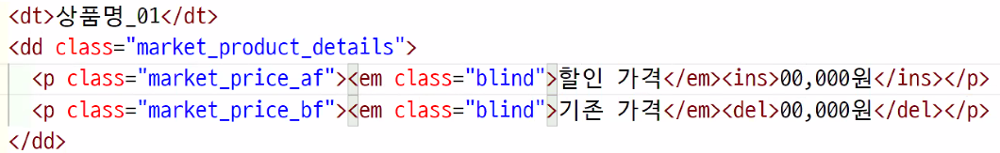

# TIL

- [ ] 버플로우 키워드와 전역값 확인해보기!


- footer를 a로 묶었다면 h2의 이름은 사이트명으로 해야 함(더더욱이라는 걸 보니 원래 그래야 하는 듯)
- 변수 및 rem 등 신형 브라우저를 위한 코드와 px, #fff 등 구형 브라우저를 위한 코드를 따로 css로 작성한다.
  - 구형브라우저는 시멘틱 태그가 적용되지 않음(:시멘틱 태그에 id를 달아줘야 함)
- 버튼은 inline 이기 때문에 포지션을 적용했을 때 포커스가 튀기 때문에 버튼에 포지션을 넣는 게 좋지 않다. 그래서 블럭요소로 묶은 후 사용해~~
- 검색은 gnb X,  검색에 관련된 내용은 검색 버튼과 함께 작성해야 함
- GNB, UNB 라는 이름보단 일반 사용자들이 알 수 있게 수정
- 애플의 자간이 윈도우의 자간보다 작기 때문에  글자가 떨어질 수 있다.  사이즈는 살짝 여유있게 작업해야 한다.
- 인라인 블럭을 활용한 nav (현아, 오늘의 집)
- view인디케이터에 span=blind로 넣어 광고에 대한 설명을 넣어서 진행
  - viewBox내 버튼들을 position 주는 이유는 view_area, con에 내용이 들어간다면 겹쳐지기 때문에!
- 전체에 가로값이 변형되더라도, 내부의 크기가 틀어지지 않도록 div>inner_div를 잡아주는 것이 좋다!
  - 전체는 max-width / min-width 활용하자~.~
  - entity 코드 활용
- overflow-x:auto;(=scroll ) 넘친다면 스크롤 바가 생긴다! 스크롤은 무조건 생긴다!
- overflow:visible; 이거 왜 쓰지.?
  - 히든을 걸었다가 풀 때


- 오버플로우 키워드와 전역값 확인해보기!
- 규완님 광고영역 보기. 
  - width:clac(100% - 120px ) 이거 뭐야.. 
- 제목과 내용이 있다면 ul>li*2 보단 dl로 만들기 
- 이미지와 텍스트 배치 순서가 교차되어도 코드는 그대로
  - float:left, right 의 순서만 바뀔 뿐
    - 만약 순서가 바뀌는게 반복되어 나타난다면 nth-of-type(2n) 이런식으로 사용할 수 있음.
- X 모양 div 이미지 대신 회색 바탕에 사이즈를 표시해주는 lorem
  - placeholder.com
- 폰트어썸 css 불러온 후 js등록해야 동작한다고 함.
- view_indicator>a href="#" data-href=".name">
  - data-href=".name" 사용자 설정이라는 뜻. 당장 갈 수 있는 주소는 없는데(#) 그 주소는 data-href가 아지고 있어. 라는 뜻
  - 이렇게 적으면 js에서 적용됨
- hover, focus는 따로 구분지어서 css 적용 시켜줘야 함.
  - `transform:scale(1.1)` : 확대됨


- img를 사용할 땐 figure~~



정가,  세일가 이런 거 표시해주는 게 좋음.

- `<ins>세일가 </ins>` <ins>세일가 </ins>`<del>정가 </del>`<del>정가 </del>
- 그다음 ins는 text-decoration:none; 걸면 될 듯


- dl>dt+dd 이런식으로 작성하기 싫어서 span으로 처리하겠다고 하면 저ㅏㄱ어도 제목은 em, 강조를 시켜ㅑ줘야 한다.


- 영선언니 nav>button>span*3+span.blind 코드 확인하기
  - float과 마찬가지로 position을 주면 자동으로 블럭이된다.
  - .line에 건 transition은 animation 효과
  - .menu 2번째 호버는 z축을 기준으로 변하는 느낌으로 표현됨. (저거 X로 바꿔보자)
  - 원래 이건 .action 걸어서 사용하는 편이라고 함. 원래 js에서 동작하게 하는 듯!

---

- index.html 로케이션 앞에 띄어쓰기 하면 안 됨
- nav 아이콘 자체를 float:right; (아이콘 내 버튼만 float처리했음)
- btn>button은 동일하니까 ...>div 이런식으로 한 번에 적어도 됨
- gnbBox
  - 버튼과 함께 묶으면 JS에서 편함.
  - 아니라면 다른 아이디로 넘어가게 명령어를 추가해야 함
- viewBox
  - 플렉스는 구형브라우저에서 8부터는 안 됨. (9이후부터는 적용되야 한다..가 보통..?)
    - 현재 사용하신 홈페이지는 구형 브라우저는 지원되지 않습니다. 최신 브라우저를 사용해주세요 이런 거 추가해달라ㅏ고 하심
  - 인디케이터 사이즈가 너무 작으니 크기 키우기.
    - 크면 안 예쁠 것 같으니까 다른 디자인으로 바꾸자^^
- 추천도서
  - 탭과 con 따로 분리해서, 탭에 따라 con이10개씩은 있어야 함. 그래서 탭을 한 번 더 묶었다. 
    - 원래는 con이 1100개는 있어야 함.
    - 이거 나중에 sql에서 처리해야 한다고 함. 데이터를 불러와서.. 이걸 제이슨으로 변환된 걸 사용한다고 함!
  - 오버플로우 히든 X값 수정하라는 것.. 앗 빼야하는 거였음
  - width:100vw;
    - `vw`현재 브라우저 가로값에 대한 비율, 부모값이 아닌 브러우저를 기준으로 하는 값
      - 스크롤바 크기까지 포함한 크기
    - 바디는 전체크기임. 바디에 overflow-x:hidden; overflow-y:visicle;
      - x라고해서 x만 영향을 받는 게 아님, y도 영향을 받음 그래서 y도 처리해줌
      - 비져블, x오토 : 기본적으로 비져블이지만 x는 넘치면 스크롤 넣음
      - .. 못적음
  - 독파
    - 호버에 p사용한 거 의미있는 태그로 변경
    - 자세히보기 버튼을 버튼이 아닌 전체로 인식시키게


- [ ] 광고 인디케이터 사이즈 조정(인식이 어려우니)
  - [ ] 인디케이터 디자인 바꾸자
  - [ ] 호버와 포커스도 바꿔
- [ ] 엠디픽과 신간의 기능이 같으니 인식의 용이성을 위하여 디자인을 통일시켜
- [ ] vw단위, overflow기능 파악.. 아니 이걸 어찌......


- [ ] 서치박스 디자인 하는 방법
- [ ] 반응형에서 작동을 할 때, 왼쪽에 붙게 하고 싶은 거인뎅.. 근데 각 h2는 같은 위치에 있으면 좋겠는데..(디자인 다시해야 할듯)
- [ ] a태그를 사용하면 title 써주면 좋다! 구형 브라우저는 내용을 못 읽어!!!!!


---


동일하게 작업되는 것들은 이렇게~~


img 태그를 사용하지 말라는 이유: css에서 처리하기 때문

```css
a{
    background-img:url("../img.png");
    background-repeat:no-repeat;
    background-position:50% 50%;
    background-size:80%
}
```

검색

- 어디에 보내? 보낼 곳을 지정하는 게 폼
- 스크린리더기에서 안 들려, 레이블이 읽어줌(플레이스홀더는 장식임)


ol 앞에 디자인 넣어서 계속 바꾸는 거

- 원석님 비포 보면 됨
  - 이거 좀 쩌는디
- 

