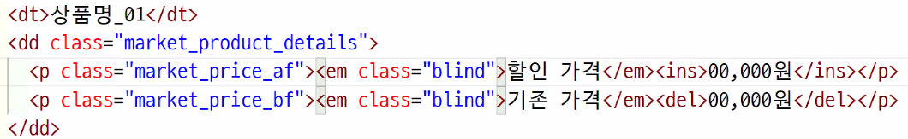
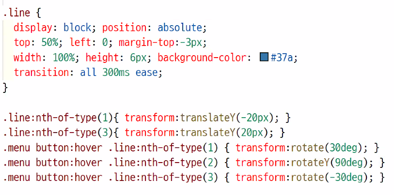

# TIL 정리

:sparkles: e.g lorem

[click, 프로토타입 제작을 위한 기본틀](https://placeholder.com/)

사용 방법 : `https://via.placeholder.com/1080x700`


> 현재 사용하신 홈페이지는 구형 브라우저는 지원되지 않습니다. 최신 브라우저를 사용해주세요. 문구 추가

- [ ] searchBox / gnbBox의  html 코드 위치를 버튼과 함께 나열
- [ ] h2의 이름을 gnb, unb라는 이름보단 사용자의 편의를 위한 이름으로 변경
- [ ] 추천도서 마지막 스크롤은 more view면 좋겠다. 추가하자(이거 굳이? 그냥 소메뉴 말고 gnb로 바로가기)
- [ ] p로 구성된 (book_content:hover, bookclub) 부분 더 의미있게 제작하기. 
- [ ] 자세히 보기 버튼만이 아닌 전체 영역을 a로 변환
- [ ] index.html>script 로케이션 앞에 띄어쓰기 하면 안 됨
- [ ] navIcon에 포지션을 빼고, 플럿 처리로 진행
- [ ] btn>button은 동일하니까 nav>div 이런식으로 한 번에 적기
- [ ] 추천도서 - 탭과 content영역을 한 번에 묶어야 함. (탭 하나에 콘텐츠 10개 있는 형식이라. 이게 번거로우니 따로 진행했지만, 탭을 한 번 더 묶어줘야 함)
- [ ] body에 overflow:hidden 주기 (width:3000px 이런 값을 가지면 가로로 스크롤이 생기기 때문에 전체사이즈인 body를 기준으로 히든을 줌)
- [ ] a태그에 title 적어주기(다는 어려우니 중요한 태그들만이라도!)
- [ ] 서치박스 디자인 방법(마진, 패딩, 보더 없애기 리셋에서)


만약 가운데에서 가게 하는 거라면(왼쪽이 없는 디자인) 포지션 없이, 원래대로 진행하면 됨


---

## tip

- 맥 ios의 띄어쓰기 간격이 윈도우보다 작기 때문에 맥으로 제작한 홈페이지를 윈도우에서 볼 때 글자가 간격에 맞지 않아 밑으로 떨어질 수 있으니 너무 딱 맞지 않게, 살짝 여유있게 작업을 하는 것이 좋음.
- footer>h2의 이름은 사이트 이름으로 진행하는 것이 좋음.
  - 만약 footer h2를 a로 묶었다면 꼭, 사이트 이름으로 진행해야 함
-  신형 브라우저용 css와 구형 브라우저용 css는 따로 파일을 만들어 제작하는 것이 좋다.
- indicator에 `<span class="blind">` 를 넣어 설명을 추가해주는 것이 좋다.
- 레이아웃을 잡을 때 inner_div에게 max-width; min-widthl; 를 주면 반응형
- 특수문자는 entity 코드를 사용
- 제목과 내용 형식으로 이뤄져 있다면 p, ul 보다는 dl로 작성해야 한다.
- hover / focus는 다르게 적용시켜야 함.
- position은 float과 마찬가지로 적용하면 자동으로 블럭이 된다.


### overflow

overflow는 X와 Y를 따로 제작할 수 있다. 순서는 `overflow-x` → `overflow-y` 로 작성한다.


`overflow: visible;` overflow의 기본값

- :heavy_plus_sign: X와 Y의 값 중 하나에 visible을 사용할 때 자동으로 visible이 `auto`처럼 동작한다. (넘치면 자동으로 스크롤이 생긴다.)

`overflow: hidden;` 넘치는 부분은 안 보이게 처리, 코드를 사용해 스크롤 할 수 있다.

`overflow: clip;` 넘치는 부분을 자른다, 코드를 사용한 스크롤이 불가능하다.

`overflow: scroll;` 한쪽만 scroll을 부여해도 X와 Y모두 스크롤이 생성된다. 이를 제거하고 싶으면 나머지 한 쪽에 visible을 적용시킨다.

`overflow: auto;` 필요 시 스크롤이 생성되는 기능

`overflow: hidden visible;`  X, Y를 한 번에 입력할 때의 방법 (X는 히든, Y는 visible을 적용했다. 따라서 Y는 auto의 기능이 진행되고 있다.)


`overflow:initial` 기본값으로 설정된다.

`overflow:inherit`부모의 값이 설정된다. (:부모의 overflow를 그대로 물려 받는다.)

```css
.example::-webkit-scrollbar {
    display: none;
}

/* Hide scrollbar for IE, Edge and Firefox */
.example {
  -ms-overflow-style: none;  /* IE and Edge */
  scrollbar-width: none;  /* Firefox */
}
```

#### vw

현재 브라우저 가로값에 대한 비율, 부모값이 아닌 브러우저를 기준으로 하는 값

- 스크롤바 크기까지 포함한 크기


---

## 참고 코드

### 인라인 블럭을 활용한 nav (text-aline:center;)

현아


### viewBox button

```css
#viewBox{position: relative; width: 100%; height: 800px; background-color: #dfdfdf;
    overflow: hidden;} 
.btn {
    position: absolute; top:360px; left:0; right:0; z-index: 100;
    width: 92%; width:calc(100% - 120px); height: 0; margin:auto; background-color: #333; 
}
.btn button {
    width: 40px; height: 40px; background-color: #fff;
}
.btn .next {float:right;}
.btn .prev {float:left;}      
```

- viewBox>.btn 은 포지션으로 제작한다.
- `width: 90%; width:calc(100% - 80px);` 구형 브라우저에서도 작동시키기 위해 두번 작성했다.
- button의 묶음인 .btn의 높이값은 0이다.
- .next && .prev는 .btn button 이다. 같은 속성을 두번 적지 않도록 공통 선택자를 잡아 작성했다.


### 반복되는 img+text의 레이아웃

```html
<div class="content">
    <div cxlass="img"></div>
    <div cxlass="text"></div>
</div>
<div class="content">
    <div cxlass="img"></div>
    <div cxlass="text"></div>
</div>
<div class="content">
    <div cxlass="img"></div>
    <div cxlass="text"></div>
</div>
<div class="content">
    <div cxlass="img"></div>
    <div cxlass="text"></div>
</div>
```

```css
.content{width:500px; height:400px;}

.img:nth-of-type(2n-1){ float:left; width:250px; height:400px;}
.text:nth-of-type(2n-1){ float:right; width:250px; height:400px;}
.img:nth-of-type(2n){ float:right; width:250px; height:400px;}
.text:nth-of-type(2n){float:left; width:250px; height:400px;}
```

- 반복되는 레이아웃에서 왼쪽 오른쪽 요소들의 위치만 바뀐다면 html의 순서를 바꾸는 것이 아닌 css에서 float을 이용해 처리하도록 한다.


### #가 아닌 . 로 링크연결을 할 때

```html
<div view_indicator><a href="#" data-href=".name"></a></div>
```

- data-href=".name" 사용자 설정이라는 뜻. 
- 당장 갈 수 있는 주소는 없는데(:#) 그 주소는 data-href가 아지고 있어. 라는 뜻
  - 이렇게 적으면 js에서 적용됨


### figure




### menu icon 애니메이션 효과 넣기

```html
<nav>
    <button>
        <span class="blind">메뉴</span>
        <span></span>
        <span></span>
        <span></span>
    </button>
</nav>
```



- .line에 건 transition은 animation 효과
- .menu 2번째 호버는 z축을 기준으로 변하는 느낌으로 표현됨. (저거 X로 바꿔보자)
- 원래 이건 .action 걸어서 사용하는 편이라고 함. 원래 js에서 동작하게 하는 듯!


### backgound img

```css
 a{    
     background-img:url("../img.png");    
     background-repeat:no-repeat;    
     background-position:50% 50%;    
     background-size:80%}
```


추가해야 할 부분 (+원석님 랭킹:before 부분)
