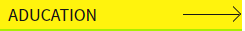

# TIL

10.26

`ui 아키텍처 설계` 

서브페이지 - 프로토타입(피그마), 스케치(펜) 

-  최소 5개, 최대 10개 - 이미지로 제출

`ui 테스트`

프로토 타입 짠 걸 코딩으로 작업,

- 최소 1개 (메인 페이지 별도)


11.15

만든 서브페이지 모두 반응형으로 디자인 및 코딩

---

```html
<div class="dokpa_con">
    <div class="action">
        <a href="#">
            <p class="sub">서브 내용</p>
            <em class="title">책 제목</em>
            <hr>
            <p class="date">21.10.13-20.11.13</p>
        </a>
    </div>
</div>
<div class="dokpa_con"><a href="#">content</a></div>
```

서치 버튼이 안 먹음..

search_wrapper 사이즈가 안 잡힘.. 검색때문..?


---

## position이 아닌 margin으로 끌어올리기

```css
#wrap{
  width: 980px; height: 850px;
  padding-top: 30px;
}
#headBox{
  float: left;
}
#viewBox{
  float:right;
}
#sideBox{
  margin-top: -30px;
}
```

손윗형제요소들이 float을 사용했을 때, 부모에게 padding을 주고, 형제들의 float진행으로 인해 위로 올라간 요소에세 `margin:-` 값을 줘 끌어올리는 방식으로 포지션 없이 진행할 수 있다.

### 단점

이 작업의 경우 #asideBox의 자식 요소들이 따라 이동하지 않는 단점이 존재한다. 단순한 위치 이동의 경우에는 가능하나 이동 도중 다른 요소들이 존재한다면 요소들에 가로막혀 #asideBox의 자식은 이동이 불가능 하다.

```css
#wrap{
  position:relative;
  width: 980px; height: 850px;
  width: 61.25rem; height: 53.125rem;
}
#headBox{
  float: left;
}
#viewBox{
  float:right;
}
#sideBox{
  position:absolute; top:0; left:0;
  width: 100%; height: 30px;
  background-color: var(--color-gray3);
}
```

포지션은 위와 같이 진행된다.


## text

text의 color은 a 태그에서 컨트롤 해야 한다. 만약 원활한 조작을 위해 부모에게 color 속성을 적용할 생각이라면, a 태그에게는 `color:inherit`을 적용시킨 후 부모, 조상에게 적용한다.


## background-img

```css
div{background-image: url("../../img/gcass/logo.png");}
```

url 내의 내용은 단순 경로이기 때문에 "" 안에 경로를 담으면 경로상 생기는(띄어쓰기, 대문자, 특수문자 etc) 에러를 조금은 예방할 수 있다.


## border를 이용한 > 표시



```css
.unb li:last-child span{
  display: block; position:absolute; right: 0; top: 50%; z-index: 10;
  width: 56px; height: 1px;
  background-color: #171717;
  background-color: var(--color-black);
}
.unb li:last-child span:after{
  content: ""; display: block; position: absolute; top: 0; right: 0;
  width: 10px; height: 10px;
  border:1px solid var(--color-black);
  border-bottom: 0; border-left: 0;
  transform-origin: 50% 10%;
  transform: rotate(45deg) translateY(-50%);
}
```

```css
  /* transform 기준 위치 설정 */
  transform-origin: 50% 10%;
  transform: rotate(45deg) translateY(-50%);
```

-  translateY(-50%) rotate(45deg); 순서로 하면 편하다고함 한 번 해봐

```css
.unb li:last-child span:after{
  content: ""; display: block; position: absolute; top: 0; right: 0;
  width: 10px; height: 10px;
  border:1px solid var(--color-black);
  border-bottom: 0; border-left: 0;
  transform: translateY(-50%) rotate(45deg);
}
```

- 순서를 바꾸니 transform-origin을 사용하지 않고도 작업이 가능함.


## nth-chlid, nth-of-type 차이

```html
<h2></h2>
<ul></ul> (<--선택할 요소)
<ul></ul>
<p></p>
```

ul:nth-(  ) =?

` nth-chlid ` = 2, 무조건 연속되어진 요소

`nth-of-type`= 1,  형제 요소 중, 동일한 태그명끼리의 순번
