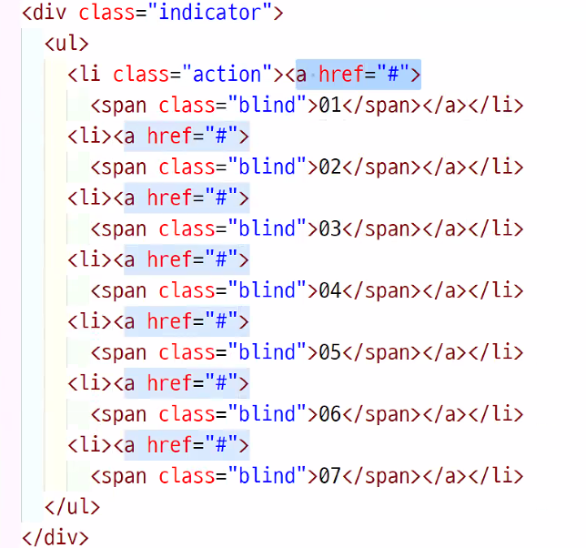
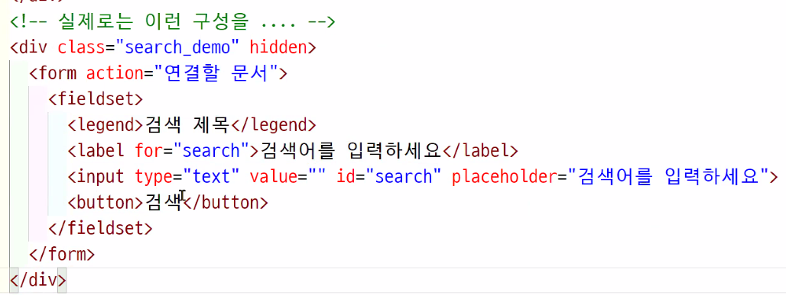

# TIL

## Q

- content가 더 있다는 느낌으로 가로 사이즈를 넘어도 div가 있게 하고 싶은데 그러면 내려온다.  overflow:hidden도 아닌 것 같은데 어떡하지
  - 개별 list의 부모 width 값을 늘리고, 그 부모에게 overflow:hidden 처리를 한다.
- full 사이즈 이미지, 배경 색 안에 버튼을 포함해 고정된 사이즈의 자료가 있는데 이걸 포지션을 사용해서 작업했는데, 이럼 안 되나요... ^-^...
  - 최대한 margin, padding처리
- 화면을 반으로 나눠서 왼쪽은 fixed, 오른 쪽은 스크롤 기능을 이용 하려고 했던 섹션에서 포지션 absoute를 왼쪽만 줘도 되는 건가요? 일단 지금은 안 틀어졌는데 나중에 문제 생길까봐^-6...


### 의미론적 코드 사용:position

 포커스의 우선순위를 고려해  html을 작성한 후 position을 이용하여 css에서 위치를 변경한다.

- 버튼 작업 시 다음 버튼을 가장 먼저 작성해야 한다.
- header 만들 때, 포커스를 잡을 때 h1이 가장 먼저 잡혀야 함. gnb 상단에 unb가 들어간다면 position을 사용해서 unb를 위로 올려야 함

| 정석                            | 야매                          |
| ------------------------------- | ----------------------------- |
| (next, prev), book_list, (more) | (next, prev, more), book_list |


## memo

### html

#### 용도별 태그

`hgroup` : h1~h6의 h태그가 한 번에 있을 때 div가 아닌 hgroup으로 묶어준다.

문구 앞에 들어가는 아이콘은 before처리, bookclub 앞 체크박스에 사용하면 될 듯

`a` 페이지 이동 시

`button` 현재 화면에서 무언가를 띄울 때


#### 코드 내 북마크

북마크를 레벨 별로 정리하는 것이 좋음
- /* #header =======================================================*/
- /* header_inner-----------------------------------------------------------------------------*/
- /* header_inner*/


#### 문구가 들어가는 html 태그

h2~h4,p 와 같이 문구가 들어가는 부분은 가로값을 지정하지 않고, div{width:100%} 사용한 후 a,p{text-aline:center} 처리한다. 


### css

#### 투두리스트

`/**`

`* ?` 내용을 설명

`!` 내용을 설명

`* TODO:`내용을 설명

`*/`


#### 문구를 대문자로 작성할 때

스크린리더기에서 읽을 때 대문자는 제대로 읽지 못하기 때문에 소문자로 작성한 뒤 css에서 대문자로 변경해야 한다.

```css
h{text-transfrom:uppercase; word-spacing:3px;}
```

- `text-transfrom:uppercase` 대문자로 변경
- `word-spacing` 단어 사이의 간격


#### span태그 활용

텍스트 중 색이나 디자인을 다르게 표현하고 싶을 때 <span>으로 묶는다.

- bookclub 체크 리스트의 문자들 이렇게 쓰면 될 듯! (+before도)

---

### position 사용 유무

margin, padding : 가장 우선적으로 사용하는 방법`브라우저 기준:fixed`, `작업요소 기준 :absoute` 

무언가의 위에 배치된다면 : position

- 요소끼리 중첩된다면 서로 가릴 수 있기 때문에 position을 사용해주는 것이 좋음


### viewBox

viewBox에 a 태그를 잡고 그 안에 좌우 이동 버튼이 있을 때

- 좌우 버튼과 배경의 a 태그 구분이 어렵기 때문에 사용하지 않는 것이 좋음. → viewBox 내 자세히 보기버튼을 통해 이동을 추천


#### button/indicator

- html에서 다음버튼 먼저 작성

- 버튼의 부모 태그wrap>button 으로 사용한다면 wrap{`height:0;`} button{`w:40; h40;`} 한 후 button위치 조정 
  - 포지션으로 잡으면 wrap으로 다시 한 번 안 잡아도 될 듯!
- on, action 등의 클래스를 잡아서 css 디자인 변경을 해준다.


### img, overflow:hidden

```css
wrap{overflow:hidden;}
div{width:900px; height:auto;}
```

- 이미지는 가로, 세로 중 하나만 작성하고 나머지 하나는 auto로 처리한다.
- overflow:hidden;  은 부모에게 적용시킨다.
- src, alt 속성 필수로 작성


### blind_wrap a > span



```css
.blind_wrap a{
    display:block; width:100%; height:100%;
}
.blind_wrap a > span{
    display:block;
    width:0; height:0; overflow:hidden;
}
```

- blind 클래스로 숨겨야 할 태그가 많다면, 태그마다 class="blind"를 주는 것보다는 span의 부모에게 blind_wrap이라는 클래스를 만들어 한 번에 적는 것이 낫다.


### h1 : title, alt

```html
<h1>
    <a href="./main.html" title="회사명">
    	
    </a>
</h1>
```

- 구형브라우저는 alt를 제대로 읽지 못하기 때문에 title을 적는 것이 좋다.


### form



- 이해 못함 나중에 찾아보면 좋을 듯🙄 e.g 구성과 의미


### abbr

```html
<a><abbr title="chief executive officer">CEO</abbr>소개</a>
```

- 축약어는 설명을 위한 abbr 태그를 사용해 풀어주는 것이 좋다.


## 웹디자인 기능사 풀이

### c-4 (좌측 샌드위치 gnb)

왜 ul,li를 넣은 거지? `ul>li>di>dt+dd`

- 보기 편하라고 ul>li 사용, ul>li로 하는 것이 아닌 dl의 형제들로 작성해도 무방, (하지만 하나의 dl 안에 dt+dd 형제들로 작성하는 것은 안 됨)

dl>dt+dd+dt+dd+dt+dd 와는 뭐가 다른지 궁금

- `dd{display:none;}` , `li:hover dd{dispaly:block;]` 를 진행하는 방식을 사용하려고 함.  dl>dt+dd+dt+dd로 하면 li:hover dd의 작업 시 선택자를 잡는 것이 굉장히 애매해지기 때문에 dl의 자식들을 형제로 처리하는 것이 아닌, dl 자체를 따로 나눠서 html 코드를 작성했음.

#### dl, dt, dd

1:1 쌍으로 적용하는 것이 좋다. (dt 한 개에, dd 한 개) 그렇다고 1:1이 아닐 때 오류는 아니다.


```html
<ul>
    <li>
    	<dl>
            <dt><a href="#"></a></dt>
            <dd>
                <a href="#"></a>
                <a href="#"></a>
                <a href="#"></a>
                <a href="#"></a>
            </dd>
        </dl>
    </li>
</ul>
```

dt나 dl 둘중 하나에 패딩, 바로 상위 부모에게 주는 것이 나을 듯!

글자에 대한 태그는 a 태그에 직접, a에는 dp:b; 


<details>
<summary>실제 사용한 코드 보기</summary>
```html
<ul>
    <li>
        <dl>
            <dt><a href="#">제목_01</a></dt>
            <dd>
                <a href="#">sub_title_01</a>
                <a href="#">sub_title_02</a>
                <a href="#">sub_title_03</a>
                <a href="#">sub_title_04</a>
            </dd>
        </dl>
    </li>
etc.
```


```css
.navigation { width: 100%; height: auto;}
.navigation ul{ width: 100%; height: auto;}
.navigation li { 
  width: 100%; height:40px; box-sizing:border-box;
  border:1px solid #777;}
.navigation dl {position: relative; width: 100%; height: 100%; }
.navigation dt {
  width: 100%; height: 100%; 
  padding:3px; box-sizing: border-box;
  background-color: #faa;}
.navigation dt a {
  display: block; width: 100%; height:100%; 
  text-align: center; line-height:36px;}


.navigation dd {
  display: none;
  position: absolute; top: 0; left: 0;
  width:100%; height:auto; min-height:140px;
  margin-left:100%;
  transform:translateY(-20%);
  background-color: #333;
}
.navigation li:hover dd {display: block;}
.navigation li:hover dt {
  background-color: #333; color:#fff;
}

.navigation dd a {
  display: block; width: 100%; height:auto;
  margin-bottom:10px;
  color:#fff; font-weight: 700;
  padding:10px; box-sizing: border-box;
}

.navigation dd a:hover { color:#333; background-color: #fff; }
.navigation dd a:focus {
  color: #f06; font-size:1.1rem; background-color: #ddd; }
```

</details>


### dl를 사용한 탭 메뉴

<details>
<summary> click, 코드 자세히 보기 </summary>


```html
<div class="notice_gallery">
        <h3 class="blind">공지사항 및 갤러리</h3>
        <dl>
          <dt class="notice">공지사항</dt>
          <dd class="notice">공지사항 내용</dd>

          <dt class="gallery action">갤러리</dt>
          <dd class="gallery">갤러리 내용</dd>
        </dl>
      </div>
```
```css
.notice_gallery{ float:left; width:65%; height:100%; padding:10px;  }
  .notice_gallery dl { position: relative; width: 100%; height: 100%; background-color: #eee; }
  .notice_gallery dt { float:left;  width:45%; height:25px; border-right:1px solid #333; background-color: #fd0;}
  .notice_gallery dt:last-of-type { border:0 }
  .notice_gallery dd { display: none; position: absolute; left: 0; top: 25px; width: 100%; height:calc(100% - 25px); }
  dd.notice { background-color: #aff;}
  dd.gallery { background-color: #faa;}
  dt.action + dd { display: block; }
  .location_link{ float:left; width:35%; height:100%; padding:20px; background-color: #fff; }
  .location_link > button { width: 100%; height: 100%; background-color: #575757; color:#fff; }
```
</details>


## JS

동작은 js로 진행되며,  자동 스크롤되는 방식은 전체 이미지가 그대로 움직이는 느낌으로, 해당 이미지 크기 외에는 안 보이게 overflow:hidden; 처리를 한다.


