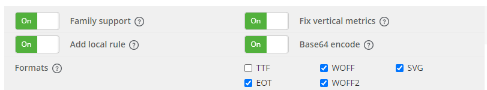

# TIL

## background 그라데이션, fill

html 상에서 .bg를 만들지 않고 css로 반만 칠한 배경을 만드는 방법

```css
#bookclub{background: linear-gradient(to top, rgba(177,177,177,0.5) 50%, #fff 50%);}
```

- 50%를 적지 않으면 그라데이션으로 표현된다. 
- to top은 `to top` `to bottom` `to left` `to rigth` 등도 사용할 수 있다.


## git

### git 일부 자료 받기, octotree

`일부 파일만 다운로드`웹스토어 어플 → 오른쪽 마우스 →다른이름으로 링크저장

`폴더 다운로드` [click, down git](https://minhaskamal.github.io/DownGit/#/home)  /  [click, git zip](https://chrome.google.com/webstore/detail/gitzip-for-github/ffabmkklhbepgcgfonabamgnfafbdlkn?utm_source=chrome-ntp-icon)


# 오늘 진도

## font
<div id="font_use"></div>
### 폰트 불러오기, font-famliy

- font-famliy : 서체를 선택하는 속성

`순서`사용할 영문, 대안, 대중적인, 사용한 한글, 대안, 서체의 종류(고딕, 명조 etc.)

- 한글은 웹폰트로 전환할 때 인식 지원이 약한 경우가 많음

:sparkles: `svg` 이미지로 변환, 벡터 /  `base64` 이미지로 변환, 비트맵


#### link를 활용한 폰트 추가

design.css 적용 전, meta태그 다음에 폰트 링크를 추가해준다.

:sparkles:  [click, 구글 폰트](https://fonts.google.com/) / [click, 눈누 폰트](https://noonnu.cc/)

```css
p{font-family: 'Ephesis', 'Ephesis2', cursive;}
```

- 두개 이상의 서체를 사용할 경우 폰트 패밀리를 두번 언급한다면 `후에 언급한 폰트만 적용`되기 때문에 `, `사용해 한 줄로 작성한다. 
- 기본으로 사용했으면 하는 폰트를 먼저 작성한다.
- 사용 범위가 넓은 폰트는 가장 나중에 작성한다.


#### import를 활용한 방법

```html
<link href="../fonts/IM_Hyemin-Bold.css" rel="stylesheet">
```

```css
@charset "UTF-8";
/* IM_Hyemin-Bold.css */

@font-face {
  font-family: 'IM_Hyemin-Bold';
  src: url('https://cdn.jsdelivr.net/gh/projectnoonnu/noonfonts_2106@1.1/IM_Hyemin-Bold.woff2') format('woff');
  font-weight: normal;
  font-style: normal;
}
```

- 불러오는 방법 (IE8이하부턴 `확장자 :woff2`가 적용이 안 되기 때문에 `확장자:eot`를 사용해야 한다. 그런데 너무 옛날임!)

```css
p{font-family: 'Ephesis', 'IM_Hyemin-Bold', cursive, sans-serif;}
```

- 사용하는 방법
  - cursive, sans-serif 는 불러오는 폰트가 오지 않을 경우 사용할 기본 폰트의 종류


#### ttf를 변환하는 방법

:sparkles:  [click, font converter](https://transfonter.org/)

한글 변환시킬 땐 `base64`, `svg` 체크 / 구형 브라우저 지원 시 `EOT` 체크

ADD fonts → convert → download → fonts/폰트명 폴더 생성 

- base64는 오직 코드로된 폰트이기 때문에 `style.css` 안에 들어가 있다.  → style.css를 폰트명 제목으로 변경 (e.g IBMplex.css)
- `.css` 안에 `src: url('IBMPlexSansKR-ExtraLight.eot') format('eot');` 포맷('eot')을 추가한다.
  - 각자 확장자에 맞는 포맷을 입력해준다. 있다면 패스!
- html문서에 `link rel` 추가
- css문서에 `font-famliy`추가
  - {font-family: 'IBM Plex Sans KR', 'Noto Sans KR', sans-serif; font-weight: 300;}


### font-weight

서체의 굵기를 선택하는 속성

ultra thin < thin < light < regular < `nomal` < bold < bolder < black

100 < 200 < 300 < `400` < 500 < 600 < 700 < 800 < 900


### font-style

namal / italic


### font-height

텍스트 사이의 높이 간격 (사용단위 : px, %, 단위가 없는 수치:`기본 서체크기 기준 scale` etc.)

- <> `leadig`는 첫번째 줄이 움직이지 않는다.


### font-size

폰트의 크기 ( 기본적으로 영문 대문자 X의 크기를 기준으로 하고 있다. )

- 단위에 따라 다를 수 있으며, font-size에 따라 박스의 크기가 변경될 때도 있음!


### text-transform

` uppercase`대문자 / `lowercase`소문자 / `capitalize`첫글자만 대문자로 변경


### letter-spacing

글자 한개당 사이의 간격`0이 기본 수치`


### word-spacing

어간 - 단어와 단어 사이의 간격

띄어쓰기를 없앨 때 사용!

- e.g :  log in으로 작성한 뒤 word-spacing을 이용해 띄어쓰기를 없앤다.
  - 스크린 리더기가 login 이라는 글자를 제대로 인식하지 못하기 때문에 띄어써서 작성한 후 css에서 변경


### white-spacing

`의미없는 공백(엔터)`을 처리할지 말지

 박스안에 넘쳐자는 글씨들을  처리할지, 그대로 쭉 오른쪽으로 넘쳐나게 할지 || 줄바꿈할지


한줄의 문장을  `어쩌구저쩌구 …`  이런식으로 만들기 (두줄 이상은 css로는 불가)

- `nowrap` 엔터를 쳤을 때 생기는 공백들을 제거하기
- `overflow:hidden`
- `text-ocerflow:ellipsis` 끝에 말줄임표가 생긴다.


### text-align

- `jusify` 양쪽 정렬

### word-break

줄 바꿈을 어떻게 할지 ( 단어 위주로할지 박스 사이즈를 고려해서 할지 이런너낌)

- `keep-all` 줄바꿈이 되면서 정리가 됨, 단어 위주로 떨어진다. 
- `break-all` 노멀과 비슷함, 박스를 기준으로 떨어진다.

### text-overflow

글자가 영역을 넘칠 때


### size

일정수치 이하로는 줄일 수 없음(0은 가능)


### font 작성요령

```css
p{
    font:weight style size/line family,family,family …
}
```

- 간편하게 작성할 수 있지만 수정 시 헷갈릴 수 있음!


## unit

`16px === 12pt === 100% ( 최초 기본) ===1em ===1rem`

px ↔ rem 플러그인으로 가능하지만 개념은 알고 있는 것이 좋다.

- 플러그인 단축키 `alt + z`


em, rem은 % 기준으로 보면 안 되고, 16px, 12pt 기준으로 봐야 함

:no_entry: 100% === 1em이라고 해서 백분율로 계산하면 안 됨!


### em

소문자 m의 사이즈를 기준으로 변화한다는 뜻

- 현재 사이즈의 50%, 150% 등의 사이즈 변화를 줄 때 부모 기준으로 생각한다.
- 다만, 폰트와 함께 `em`을 사용할 경우 폰트를 기준으로 사이즈를 계산해야 한다. (그래서 컨트롤하기 매우 어려움!)


### rem, root em

부모가 아닌 하나의 기준을 가지고 사이즈를 지정한 단위

- 16px을 기본으로 따르고 있지만, root에서 font-size에 변화를 준 경우 rem의 사이즈도 변한다.`:root { font-size:16px }`
- 50%, 150% 와 같은 사이즈 변화를 줄 경우에는 부모가 아닌 기본이 되는 16px을 기준으로 생각한다.


### root

기준을 만드는 태그, 전체를 아우르는 범위이며 그 기준

- `font-size:16px 적용하는 이유`부트스트랩 및 다른 css언어 등에서 기본 font-size를 14px or 18px 로 변경하기 때문에 font-size:16px로 지정을 해줘야 한다.

- 루트 후에 선언한 변수들은 루트가 아닌 나중에 선언한 변수로 변경된다.


### var ( --변수명 )

변수 선언의 순서와는 상관이 없이, `범위를 기준`으로 해야 한다.

더 큰범위에 적용했을 때는 나중에 적어도 적용이 되지만, 하위 개념의 자식에게 적용시켰을 때는 부모에게 적용되지 않는다. 

- 문서내 모든 선택자들에게 적용을 시키고자 할 때는 body, html에 적용시키는 것보다는 root 에 적용시키는 것이 좋다.

:+1:사후관리 용이 / 협업에 도움


### em, rem 사용방법

구형브라우저는 em, rem(버전에 따라 다름) 이 적용되지 않기 때문에 px, pt 등과 함께 적어줘야 한다.

- 루트가 변하지 않는 한 rem의 사이즈는 절대적이다. (대신 루트가 변하면 rem의 사이즈도 다시 계산해야 한다.)

- font-family와는 다르게 범위가 넓은 태그를 먼저 선언해야 한다. (코드를 순서대로 읽어 적용시키기 때문)

  - 범위가 넓은 태그는 px, pt와 같은 구형 브라우저에서도 적용이 가능한 단위를 뜻함
  
  

#### 기본

```css
.size_test{
  width: 400px; height: 400px;
  width: 25rem; height: 25rem;
  border: 1px solid #333;
  border: 0.625rem solid #333;
}
```

#### 최신 기술 @supports

```css
.size_test{
  width: 400px; height: 400px; border: 1px solid #333;
}

@supports( width:25rem ){
  .size_test{
    width: 25rem; height: 25rem; border: 0.625rem solid #333;
  }
}
```

-  임의 속성을 달아서 해당 속성의 의미를 인식하면 { } 내부의 기능을 수행 


#### @supports+변수로 작성

<details>
<summary>click, 설명 자세히 보기<summary>


이거 뭔지 알아? ( 이거)
{
선택자{알면 이거 해줘;}
}

```css
@supports( --color:#220){
  .size_test{
    background-color:var(--color);
  }
}
```

- 변수작성은 위와 같이

```css
@supports not( --color:#220 ){  .size_test{  background-color:#220  }}
```

이런 공식도 있다. `--color:#220`을 인식하지 못하면 아래와 같이 수행하라는 뜻! 


</details>


## root에 변수 지정해서 사용하기

```css
:root{
  font-size: 16px;
  /* color */
  --color-white:#fff;
  --color-blick:#333;
  --color-primary:#f06;
  --color-hover:#0af;
  --color-focus:#047;
  /* font */
  --font-h2:40px;
  --font-p3:14px;
  --font-title1:24px;
  /* size  */
  --width-1:1px;
  /* border */
  --border-l1:var(--width-1) sloid var(--color-blick);
  --border-l2:var(--width-1) sloid var(--color-primary);
}
```

```css
@supports(width:1rem){
  :root{
    /* font */
    --font-h2:2.5rem;
    --font-p3:0.875rem;
    --font-title1:1.5rem;
    /* size  */
    --width-1:0.0625rem;
  }
}
```

:warning: 변수, supports를 인지하는 브라우저는 모두 rem을 인식하지만 연습용으로 작성

- common/varicble.css 만들어서 변수를 저장함
- 변수 내 속성명을 변수로 작성하는 것도 가능
- 구형 브라우저를 완전히 배제시킬 수 없기 때문에 변수로 작성하지 않은 구형브라우저용도 작성을 해야함.


