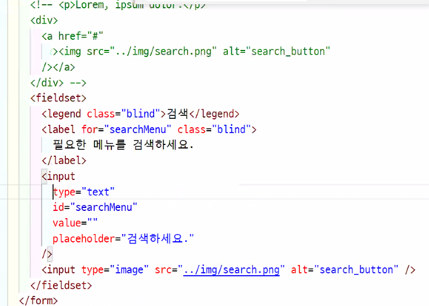

# todo

- [x] common.css 및 magazine, award 정리하기
- [ ] ~~h코드 조금 더 세세하게 수정하기~~
- [x] lr_more_btn 클래스명 수정하기
- [x] gnbBox영역 만들기 : 호버나, 포커스로 하면 될듯 (호버, 포커스 실패!)
  - [x] 만약 여기서 ul>li 태그를 사용했다면 role 속성 추가하기
- [x] searchBox 만들기 : 호버나, 포커스로 하면 될듯 (만들긴 했는데 디자인은 적용 못함 😥)
- [x] 각 영역별로 의미있는 태그 사용했는지 확인
- [ ] 서브페이지 디자인 PC, 타블렛 완성 시키기
- [x] 탭인덱스 이해 안 감 기본적으로 -1을 가진다고..??


- [x] A조 분들 코드 피드백 받은 부분 코드 확인해보기
  - [x] viewBox 코드부분 확인(수민님, 슬아님), 인디케이터와 이미지링크 연결(a태그와 id사용. 채윤님)
  - [x] 마우스 호버 시 박스 내 background-color, text 나타나기 (채윤님 사회공헌)
  - [x] 인라인블럭을 사용해 메뉴사이 간격 띄우기 (은비님, 연우님)
  - [x] float을 자식의 크기에 따라 부모의 크기가 조절된다는 의미로 사용해도 됨(상민님 gnb)

---

# TIL_10.08
<div id="til_1008"></div>

## check

### img

- img 태그 사용할 때는 `width` / `height` 중 하나는 auto; 로 처리해야 이미지 배율이 깨지지 않은 채로 사용할 수 있다.
  - 다만, 이건 html코드 상에서 해결을 할 때이고 css에서 처리하는 것을 추천한다.

```html
<h1>
    <a href="#">
    	<span class="blind">메가커피</span>
        
    </a>
</h1>
```

- 만약 h태그 내에, 혹은 이미지와 문구를 함께 작성할 때에는 위와 같이 작성한다.
  - aria hidden은 span-메가커피 / alt-메가커피가 중복되어 읽히지 않도록 처리하는 속성이다.
- 이미지는 인라인 요소이기 때문에 div나 figure로 감싸서 사용해야 함.
  - figure가 더 의미론적인 코드지만, 구형브라우저에서는 작동하지 않으니 고려해야 함.
    - figure는 내용이 있어야 하며, class/id를 필수로 적어줘야 한다.


### viewBox

- 태그 내용을 비우는 것은 좋지 않으니, 인디 케이터 내에도 문구를 작성해야 하며 이 문구는`<span calss="blind">`로 처리
- 인디케이터, prev, next button, view img의 순서는 사용자의 포커스를 고려해 코드를 작성해야한다.
  - 인디케이터와, 버튼이 이미지보다 먼저 포커스 되어야 한다.
- prev button, next button을 float을 사용해 정리했다면 버튼의 부모 요소는 높이값을 0으로 줘야 부모의 높이값 때문에 cursor:pointer가 풀리는 현상을 막을 수 있다.
  - 하지만 이렇게만 진행하면 버튼과 img 요소(만약 img 전체에 a를 잡았다면) 모두에게 cursor:pointer가 잡히므로 패딩을 줘 커서의 간격을 줘야한다.


### semantic code

각 영역별로, 태그별로 의미가 있는 태그를 사용하는 것이 좋음. (무분별한 div, p 자제!)


- `&nbsp;` → `<br />` / `<class="">` / `<p>` 줄바꿈이나 문단 태그를 사용하거나 클래스를 주어 마진 라이트 한다.
  - 특수기호를 사용할 경우, 스페이스, 스페이스 이런 식으로 읽을 수도 있으며 하나씩 계속 저렇게 적어야 하기 때문에 비합리적임
- `ul role="menu"`   >  `li role="menuitem"` 부모 요소 롤에 menu를 사용했다면 하위요소에는에 menuitem을 작성해줘야 함
- address는 footer 내에서만 사용할 수 있으며, 회사에 대한 정보는 address에 적어줘야 함.
  - copyright는 의견이 분분함으로,  address내에 적거나, 따로 div, p로 적어주면 됨.
- button 클릭 시 button content가 나온다면, button content는 button과 함께 묶은 후 button요소 하단에 작성해야 함.

### tip

- 한 번에 `position:absoute` / `float:left` 를 할 필요는 없으나, `position:static`을 사용할 때에는 posotion 기능이 풀렸을 때를 대비하여 float을 사용해야 한다.
- float을 왼쪽, 오른쪽 정렬로만 생각하지 말고, 자식의 값에 부모의 크기가 조절된다는 것을 활용할 수 있다.
- `h` 태그는 해당하는 구역, 영역의 이름이기 때문에 영역별로 사용해야 하며 제목이 있다면 내용도 함께 적어줘야 함.
- float을 만들면 자동으로 사이즈가 잡히는 블럭으로 변하지만, 완벽하지 않기 때문에 직접적으로 display:block; 처리를 해주는 것이 좋다.
- html 코드 내에 대문자를 사용하는 것은 좋지 못하며, 소문자로 작성한 뒤 css에서 `text-transparm:uppercase`를 사용해줘야 한다.
- `a` 태그 등 포커스를 가지는 요소에는 포지션을 주면 안 된다.
  - 인라인 성격을 띄는 요소에는 포커스를 주지 않는 것이 좋다.
- `position:relative`top:0; left:0; 선택 / `position:absolute, fixed`top:0; left:0;  필수
- 언어는 웹문서 시작 전에 인식되게 처리하는 것이 가장 좋으며, 이 방법이 어렵다면 해더 내에 gnb보다 먼저 작성해야 한다.


### searchBox



- `<button type="submit">` 전송의 뜻
- 슬아님, 수민님 코드 참고


## code

### tabindex

강제로 포커스 처리를 가능, 불가능하게 만드는 기능(:warning: autofocus는 단 한 번만 사용이 가능!)

- -1, 0, 1의 속성값을 가지며 단위는 없다.
  - 나머지 숫자도 가능하지만 사용을 자제하는 것이 좋다.
  - `-1 ` 사용 불가능하게 만들기 `0` 기본 `1` 먼저 사용하게 만들기
- `a`/ `button`/ `unput`/ `select`/ `textarea` etc. 포커스가 잡히는 모든 form요소에서 사용 가능]
- 위에 언급된 요소들 외에는 tabindex값이 기본적으로 -1을 가진다. (가장 기본은 0)

### transform

#### 조건

- block 요소
- 자신의 크기 값을 알아야 한다.

```css
p{transform: 속성 }
```

#### 속성

- `translate( )` 자신의 크기를 기준으로 이동
- `trasnslesX(' ')`, `trasnslesY(' ')` X축, Y축 이동
- `trasnsles(' ')`X축, Y축 이동
- Z축이동도 가능,( 3D 입력하라는데 못 봄)

### inline-block

float을 사용했을 때, 가운데 정렬하기 어렵다면 크기를 가지는 텍스트로 변환한 후(`display:block`) → `text-align:center`


