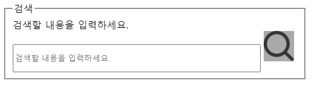
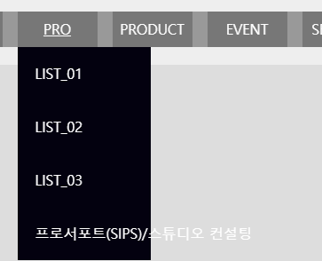
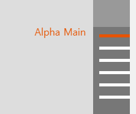

# TIL

A조 분들 코드 피드백 받은 부분 코드 확인해보기

- [x] viewBox 코드부분 확인(수민님, 슬아님), 인디케이터와 이미지링크 연결(a태그와 id사용. 채윤님)
- [x] 마우스 호버 시 박스 내 background-color, text 나타나기 (채윤님 사회공헌)
- [x] 인라인블럭을 사용해 메뉴사이 간격 띄우기 (은비님, 연우님)
- [x] float을 자식의 크기에 따라 부모의 크기가 조절된다는 의미로 사용해도 됨(상민님 gnb)
- [x] aside


## code feedback

### search bar



```html
<form action="#" method="GET" class="searchBox">
    <fieldset>
        <legend class="blind">검색</legend>
        <label for="search_area" class="blind">
            검색할 내용을 입력하세요.
        </label>
        <input
               type="text"
               id="search_area"
               value=""
               placeholder="검색할 내용을 입력하세요."
               />
        <input 
               type="image" 
               class="search_img"
               src="../img/search.png" 
               alt="검색"
               />
    </fieldset>
</form>
```

- 디자인 적용은 따로 알아봐야 할듯!


### background-color && text:hover

```html
<a href="#">
    <em>사회공헌</em>
    <span class="blind">에 관한 오뚜기 기사</span>
    <span class="blind">더보기</span>
    <!--  -->
</a>
```

```css
.link_inner li:first-child a:focus,
.link_inner li:first-child a:hover {
  background-color: #faa;
}
.link_inner li:first-child a:focus span:last-of-type,
.link_inner li:first-child a:hover span:last-of-type {
  display: inline;
}
```

`display:none` → `display:block`

`class="blind"`→ `dispaly:inline`

- span 태그를 사용했기 때문에 `display:block;` 이 아닌 `display:inline;`을 사용했다. (인라인블럭도 안 됨!)
  - 인라인 블럭은 크기를 가질 수 있는, 글자의 박스라고 생각해야 함. 옆으로 나열이 가능한 인라인 요소의 장점과 사이즈를 가질 수 있는 블럭의 장점을 융합.
    - float은 블럭임(인라인블럭X) 
    - 인라인 블럭은 자신만의 공백을 가지고 있기 때문에 미세한 조절이 필요한 작업에는 사용을 자제하는 것이 좋음.
- blind를 사용하든 dp:n; 을 사용하든 같은 결과가 나올 것 같은데, html 작업 중 거슬리니까 blind로 해결하는 게  조금 더 편할 것 같음


### viewBox indicator와 img 연결

```html
<div class="indicator">
    <ul class="blind_wrap">
        <li class="action">
            <a href="#view_01"><span>연결된 광고에 대한 요약 설명</span></a>
        </li>
        <li>
            <a href="#view_02"><span>연결된 광고에 대한 요약 설명</span></a>
        </li>
    </ul>
</div>
<div class="view_area">
    <div id="view_01">
        <p>내용</p>
        <a href="#">자세히보기</a>
    </div>
    <div id="view_02">
        <p>내용</p>
        <a href="#">자세히보기</a>
    </div>
</div>
```

class와 비교되는 id만의 기능 중에는 anker의 기능이 있다.  a태그를 사용해 해당 위치로 이동이 가능하기 때문에 이를 활용해 viewBox의 indicator 요소를 클릭해 해당 메인비주얼 이미지로 이동하게 할 수 있다.


### inline-block을 사용한 nav

```html
<nav class="title_add">
    <ul>
        <li><button type="button">STYLE NANDA</button></li>
        <li><button type="button">NAND MADE</button></li>
        <li><button type="button">KKXX</button></li>
        <li><button type="button">3CE</button></li>
    </ul>
</nav>
```

```css
.title_add li {
  /* float: left; */
  display: inline-block;
  height: 50px;
  /* margin-right: 40px; */
  margin: 0 20px;
  text-align: center;
  font-size: 26px;
  line-height: 50px;
  background-color: #7c7c7c;
}
.title_add li:first-child {
  margin-left: 0;
}
.title_add li:last-child {
  margin-right: 0;
}

.title_add li > button {
  /* width: 100%; */
  width: auto;
  height: 100%;
  padding: 0 10px;
}
```

- ` display: inline-block`을 사용했기 때문에  `float:left`를 사용할 필요가 없다. 
- 편리해 보이지만, 인라인 블럭의 미세한 빈칸들을 없앨 수 없으며, 범위가 큰 요소들은 inline-block으로 처리할 수 없다고 함.
  - gnb nav를 말씀하시는 듯
- margin-right대신 양쪽 마진을 넣은 이유는, 한 번에 처리할 수 있어서이다. 양 옆의 공백을 없애고 싶다면 첫째와 막내 li를 선택해 마진을 없애주면 되는데, 이럴거면 그냥 margin-right 쓸듯^^!
- li>button의 width값을 100%에서 auto;로 바꾼 이유가 뭘까..? 똑같아 보이는데.
  - button이 인라인 블럭이라 w:a; - 글자크기만큼 변하게 (아마 버튼이 dp:b)


### float 활용

```html
<ul role="menu">
    <li>
        <div class="nav_title"><a href="#">post</a></div>
        <ul class="sub_nav">
            <li><a href="#">list_01</a></li>
            <li><a href="#">list_02</a></li>
            <li><a href="#">list_03</a></li>
            <li><a href="#">list_04list_04list_04</a></li>
        </ul>
    </li>
</ul>
```

```css
.sub_nav {
    display: none;
    width: auto; height: auto;
}
.sub_nav li {
    // float: left;
    width: auto; min-width: 150px; height: auto;
    padding: 10px 20px;
    color: var(--color-color0);
    background-color: var(--back-black);
}
.sub_nav li a {
    /* float: left; */
    display: block;
    width: 250px; height: auto;
	text-align: start; text-transform: uppercase;
}
.gnb ul > li:hover .sub_nav {
    display: block;
}
```



- float을 사용하면 부모는 자식의 값을 따르게 되는 것을 이용해 `.sub_nav li`에 float:left를 사용했다.
  - li에 플롯을 줬지만, li의 부모인 .sub_nav는 자손의 값인 `a{width:250px; }`를 따른다.
  - li에 플롯을 주지 않으면 이미지와 같이 a의 값이 적용되지 않는다.
  - a에는 width값을 지정해야 하는데 직접적으로 사이즈를 주지 않고, auto; || 100%;로 할 경우 해당하는 칸만 사이즈가 늘어나서 미관상 좋지 않다.


그런데 어차피 자동이 아닌 a에게 값을 줄거면 li에 직접 주면 바로 되는데 왜 굳이 float을 사용했을까??

- 지금은 할 필요가 없는 작업이었음. 
- 이 기능을 사용했던 게` width:auto;` 는 블럭요소에서는 원래 부모의 값을 따라 100% 적용되어야 하는데 float을 사용했기 때문에 자식의 값을 따를 수 있다.


### 사이드에 고정돼 클릭하면 해당 ID로 이동



```html
<aside id="scroll_nav">
    <ul class="jump_menu">
        <li>
            <a href="#viewBox" class="click_jump"><span>Alpha Main</span></a>
        </li>
    </ul>
</aside>
```

```css
#scroll_nav {
  position: fixed;
  z-index: 900;
  top: 0; right: 0;
  width: 60px;  height: 100%;
  background-color: var(--color-color3);
}
.jump_menu {
  /* position: relative; */
  position: absolute;
  top: 50%; right: 0;
  width: 100%; height: 100%;
  background-color: #777;
}
.jump_menu li {
  width: 100%; height: 20px;
  padding-right: 10px;
}
.click_jump {
  display: inline-block;
  width: 100%; height: 5px;
  margin-top: 10px; margin-left: 10px;
  background-color: var(--color-color0);
}
.click_jump span {
  position: absolute;
  /* display: none; */
  margin-top: -12px;
  right: 120%;
  white-space: nowrap;
}
.click_jump span::after {
  content: "";
  display: block;
  clear: both;
}
.jump_menu li:hover span {
  display: block;
  font-size: 16px;
  color: var(--main-color);
}
.jump_menu li:hover .click_jump {
  background-color: var(--main-color);
}
```

- li>a 를 클릭 버튼으로 두고, 그에 대한 설명을 span으로 묶어 position:absolute로 왼쪽에 위치하게 만들었다.
  - position:relative; 처리되어 있길래 absolute로 바꿔봄! 동일한 처리가 진행되니 relative보다는 absolute가 맞는듯 ..🤔


