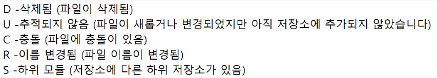
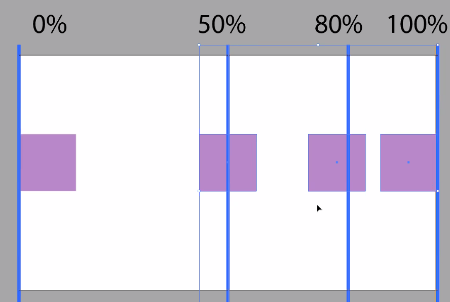
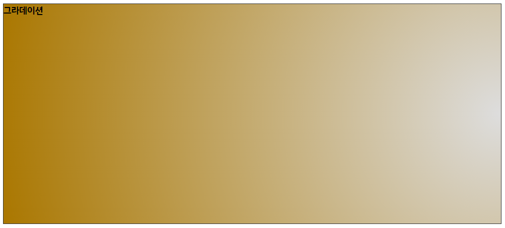
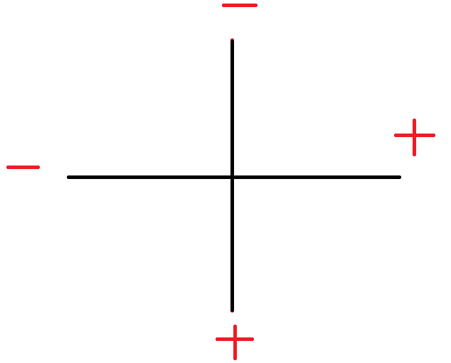
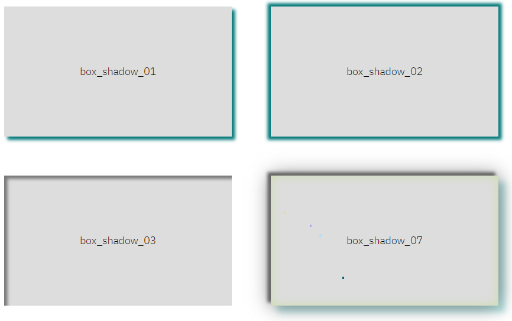
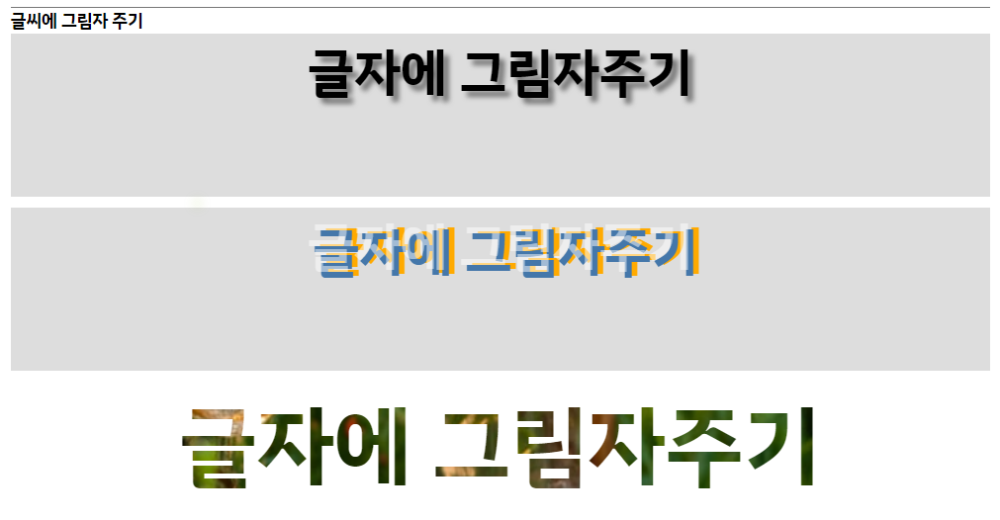
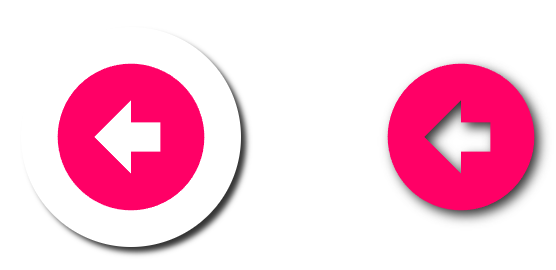

# TIL

- [ ] 검색 호버가 안 됨(부모의 높이값이 지정되지 않음 왜?)
  - [ ] bnb_wrapper에 position이 들어가면서 서치가 뒤로 깔림 버튼들한테 z-index를 주는 등 (지금 눌리는 검색은 박스에 있는 버튼일지도)
- [ ] margin-left:-50vw 때문인지 창 크기를 줄였을 때~~
  - [ ] 현재 inner 박스를 relative로 잡았고, inner에게 margin:auto; 가 들어갔기 때문에  l0, t0을 진행해도 위치가 제대로 잡히지 않는다. 이를 해결하기 위해 left:50%를 준 후, margin-left:-50vw를 통해 왼쪽 벽에 붙였는데 `left:50%` 이게 현재 화면에 반이기 때문!(이너를 기준으로 반으로 움직였으니 반이 맞음), 그리고 그 후 브라우저를 기준으로 50만큼 왼쪽으로 움직였다.
- [ ] 뷰박스 풀로 하고 싶으면, wrap{width:1280px}를 풀거나, 뷰박스를 absolute걸면 되는 건가?
  - [ ] wrap:100% inner:1280px;
- [ ] 독파 dl로 하고 싶었는데 제목과 내용이 아니라 em만 걸었다. 더 할 수 있는 게 있을까?
  - [ ] dl써라
- [ ] 정신사나울까?
  - [ ] 기니까 괜찮ㅇ


### vscode 파일명 옆, 표시



---

## 오늘 진도

html : 글자, 요소, js로 변경하기 쉽다.

css : 배경에 글씨, 내용첨부 가능, js로 변경이 비교적 복잡하다.

`background-image` / `background-repeat` / `background-position` / `background-size`


IR기법 - image replace 글자를 대체하기 위해 이미지를 삽입하고 처리

IS기법 - image sprite 여러개의 이미지를 삽입하여 한 번에 관리


그림자

- `box-shadow`요소에 그림자 주기
- `text-shadow`글자에 그림자 주기
- `filter:drop-shadow()`다양한 효과의 기능 중 filter효과로 처리


transform

- `translate()` 위치이동
- `rotate()` 회전
- `skew()` 기울기
- `scale` 배율
- `perspective` 원근법

perspective :  transform에 들어가는 값과 동일한 기능이지만 범위를 설정할 때 사용


`svg` 코드로 만들어진 이미지 파일로, 코드를 수정하면 이미지를 변경할 수 있다.


### 언스플래쉬 저작권 등록

파일 이름 복사 → 마욱스 오른버튼 → 속성 → 자세히 →설명란에 파일이름 붙여넣기(저자, 사진명)

:heavy_plus_sign: 혹은, 세부정보창으로 확인도 가능


### 파일 이름 한 번에 바꾸기

`powertoys` / `batchNamer`


## background-img:url();

url의 경로의 기준은 작성중인 현재 css문서이다.

### defalte

```css
background-image: url(../../img/icon/arrow.svg);
```

- 기본 속성
- repeat 상태가 된다.

### repeat

```css
background-repeat: repeat;
background-repeat: no-repeat;
background-repeat: repeat-x;
background-repeat: repeat-y;
```

`repeat` 기본값

`no-repeat` 반복하지 않음

`repeat-x` 가로축만 반복

`repeat-y` 세로축만 반복


### position

```css
background-position: right bottom;
```

`0 0` 기본값

`center` 좌우상하의 센터 (하나씩도 가능)

`right bottom etc` ~~css의 position의 위치와 동일~~ (:warning: 사용을 권하지 않음)

`100% 0` / `50% 50%` 등 수치로 사용하는 것을 권장! ( :heavy_plus_sign: 0 0 : 왼쪽 상단 / 100% 100% 오른쪽 하단 / 50% 50% 중앙 )




- position의 방향에 따라 이미지의 기준점이 변화된다.
  - 이미지의 기준점의 축(0, 50%, 100% etc.)이 해당 요소 축의 단위와 동일하게 된다.
  - 50%를 기준으로 한다면 이미지의 50% 축이 (이미지의 기준이 되는) 해당 요소의 50% 축과 동일한 위치로 이동된다.


```css
background-position: 500px 50%;
```

- `%` 가 아닌 `px` / `rem` 등 정확한 수치를 입력할 때에는 왼쪽을 기준으로 이미지의 왼쪽축이 움직인다. ( 마진과 같은 개념 인듯! )


### size

```css
  background-size: contain;
```

`contain` 이미지 전체를 볼 수 있음. (남는 여백 존재)

`cover` 한쪽 축을 기준으로 비율에 맞게 화면에 꽉차게 한다. (여백이 존재하지 않음)

`단위` - width / height 값이 존재한다.

- 100% ( = 100% auto) 가로값이 꽉차고, 세로는 비율에 맞게 조절된다.
- auto 100% 세로값이 꽉차고 가로는 비율에 맞게 조절된다.

`none` / `initial` 원래 크기로 돌아갈 때


### 한 번에 타이핑

```css
background: url(../../img/icon/cat.png) no-repeat 50% 50%;
background-size: initial;
```

- 한줄에 적을 때

```css
  background-image: 
  url("../../img/icon/arrow.svg"),
  url("../../img/icon/chinchilla.png"),
  url("../../img/icon/cat.png");
  background-repeat: no-repeat, repeat-x, repeat-y;
  background-position: 50% 0, 50% 50%, 100% 80%;
  background-size: 20px auto, 100px auto, auto 25px;
```

```css
  background:
  url("../../img/icon/arrow.svg") no-repeat 50% 0,
  url("../../img/icon/chinchilla.png") repeat-x 50% 50%,
  url("../../img/icon/cat.png") repeat-y 100% 80%;
  background-size: 20px auto, 100px auto, auto 25px;
```

- 따로 사용하는 것을 권장 (헷갈리니까)
- 한 번에 적을 때, size는 `따로` /`나중에` 적어줘야 제대로 작동함. 사이즈를 먼저 입력하면 백그라운드에 의해 사이즈가 사라짐.
- `image → repeat → position` → size


### gradient

#### linear-gradient

```css
  background-image: linear-gradient();
  background-image: linear-gradient(45deg, #bbb, #fc0);
```

- linear-gradient(`각도`, `colorA`, `colorB`);
- 2개 이상의 색상도 표현이 가능
- rgba도 가능

```css
background-image: linear-gradient(45deg, #bbb 30%, #fc0 40%, #f50 40%);
```

30% 까지 #bbb로 표현하겠다.

40%까지는 #fc0로 표현하겠다.

- 세번째 색도 40% :  이럴 때는 그라데이션이 아닌 선으로 표현된다.

```css
background-image: linear-gradient(45deg, #bbb 30%, #fc0 40%, rgba(0,0,0,0) 40%);
```

- `활용한 방법` 세번째 색은 투명하게 표현했다!


#### radial-gradient

```css
background-image: radial-gradient(#fa0, #77a);
background-image: radial-gradient(closest-side, #fa0, #77a);
```

- `기본`색이 조금 보이면 상관없이 끝
- `closest-side`넘치지 않게, 중앙에서 시작 -`색의 비율이 일정하게 채워진다, 원은 찌그러진다.`




```css
  background-image: radial-gradient(circle at 100%, #ddd, #a70);
```

`at` 은 기준 위치를 설명해준다. 

`circle at 100%` X축만 입력한 형태라 자동으로 중간값이 입력되었다.

- 축을 컴퍼스처럼 생각하면 이해가 쉽다.


#### ellipse

좌표를 설정할 수 있다.


###  background-attachment

#### fixed

```css
  background-attachment: fixed;
```

화면이 스크롤 되어도(background가 적용된 요소는 움직임) `해당 이미지는 스크롤되지 않고 그 위치에 고정`되어 있는 형태

- fixed를 사용하면, 포지션과 사이즈가 틀어진다.

- 브라우저 기준으로 적용됨


#### scroll

```css
  background-attachment: scroll;
```

- 기본형태
- `Parallax Web` 시간차에 따라 요소들이 각자 스크롤 되는 형태, JS로 동작


### 여러 요소가 있는 이미지를 이용할 때, IS 기법

개별로 정리된 아이콘 파일을 하나의 파일로 만드는 사이트

[click, css sprite generator](https://www.toptal.com/developers/css/sprite-generator/)




```css
.bg_09{
  width:114px; height: 112px;
  background-image: url("../../img/icon/business_icons_title.jpg");
  background-repeat: no-repeat;
  background-position: -110px -24px;
  background-size: initial;
}
```

```css
  background-position: -110px -24px;
```

:sparkles: **기준은 왼쪽 상단**

- 틀 안에 위치한 이미지가 보이게 하기 위해서 `이미지를 움직인다.` 그렇기 때문에 `0, 0` 위치에 오른쪽 하단에 있는 이미지를 보이게 하기 위해 이미지를 왼쪽, 위쪽으로 움직여야 하기 때문에 `-` 값을 적용시킨다.
  - 포지션 위치값을 적용시킬 값을 margin-top, margin-left 로 생각하면 편리하다.
- width, height 는 표현할 이미지(틀)의 크기
- 위치값은 이미지의 전체의 좌측상단과표현할 이미지의 좌측 상단의 차이


**장점**

- 같은 이미지에서 이동하는 방식이기 때문에 이미지가 튀는 현상을 방지할 수 있다.


#### IS 기법을 활용한 hover, active

```html
<div class="part">
    <button type="button" class="test1"><spna class="blind">버튼이름</spna></button>
    <button type="button" class="test2"><spna class="blind">버튼이름</spna></button>
    <button type="button" class="test3"><spna class="blind">버튼이름</spna></button>
</div>
```

```css
button{
  width: 3.125rem; height: 3.125rem;
  margin: 1.875rem;
  background-color: #daa;
  border-radius:4px;
  background-image: url("../../img/icon/istock_icon.jpg");
  background-repeat: no-repeat;
  background-position-x:-20px;
  background-size: initial;
}

.test1 {background-position-y: -19px;}
.test2 {background-position-y: -192px;}
.test3 {background-position-y: -249px;}
button:hover{ background-position-x: -240px;}
button:active{background-position-x: -380px;}
```

- 같은 라인에서 사용해 반복되어 나타나는 값은 한 번에 잡아 표현할 수 있음. 
- `  background-position-x:-20px;` 공통요소에서 x 값만 잡아 적용시켰기 때문에 공통요소에서 달라지는 값만 바꾸면 적용됨.

```css
.test1 {
  background-position-y: -19px;
  transition:all 300ms ease;
}
```

- 0.3초동안 어떠한 효과가 나타난다.


## shadow

### box-shadow



```css
.box_shadow_01{
  box-shadow: 5px 5px 5px #077;
}
.box_shadow_02{
  box-shadow: 0px 0px 5px 5px #077;
}
.box_shadow_03{
  box-shadow:inset 5px 5px 5px #777;
}
.box .box_shadow_04{
  box-shadow:
    0 0 30px #777,
    -5px -5px 5px #555,
    10px 10px 10px #add,
    inset 0 0 15px #cda;
}
```

- `작성 규칙` x / y / blur / offset / color
- `inset`을 사용하면 그림자가 안으로 들어온다.
- `offset` 4번째에 적는 옵셋을 사용하면 패딩을 두르듯 블러의 범위가 커진다.
- `, `를 사용해 복수의 shadow를 사용할 수 있다.


#### keyframe

```css
.box .star{
  width: 3px; height: 3px; background-color: #aae;
  box-shadow: 15px 15px #adf, 50px 80px #067, 140px 300px 10px #7a0, -40px -20px #dda;
  position: fixed;
  animation: star 3000ms alternate 4 ease-in;
}
@keyframes star{
  0% {top:-100px; right: -200px;}
  100% {top: 100%; right: 100%;}
}
```

- 키프레임 기법을 활용한 배경 장식


### text-shadow



```css
.text_shadow_01{
  text-shadow: 5px 5px 5px #777;
}
```

- 일반적인 방법

```css
.text_shadow_02{
  text-shadow: 5px 5px #47a, 10px 4px #fa0;
  color: rgba(255,255,255,0.5);
}
```

- text-shadow는  멀티 셰도우가 가능하다. 
- 폰트에 투명도를 줄 때 표현 살펴보기

```css
.part .text_shadow_03{
  background-image: url("../../img/background/backround_01.jpg");
  background-repeat: no-repeat;
  background-size: cover;
  background-position: 50% 50%;

  color:#fff; font-size: 5rem;
  -webkit-background-clip: text;
  -webkit-text-fill-color:transparent;
  text-fill-color:transparent;
}
```

- 신형 브라우저에서만 지원됨 . 표준이 아님
- 현재는 사용을 하지 않는 것이 좋음


### filter:drop-shadow

[click, fliter more view](https://css-tricks.com/almanac/properties/f/filter/)



```css
.image > div{
  float:left;
  width: 200px; height: 200px;
  margin: 50px;
  border-radius: 100%;
  /* background-color: #ccc; */
  background-image: url("../../img/icon/arrow.svg");
  background-repeat: no-repeat;
  background-size: 80%;
  background-position: 50% 50%;
}

.img_shadow_01{
  box-shadow: 5px 5px 5px #333; 
}
.img_shadow_02{
  filter:drop-shadow(5px 5px 5px #333);
}
```

`  filter:drop-shadow();` 박스의 색이 없다면 이미지 자체에 그림자가 들어간다.

- inset 는 불가능하다.
- 멀티 셰도우도 불가능하다.


#### transition && fliter

```css
.img_shadow_03{
  filter:blur(10px) grayscale(0.8);
  transition: all 200ms linear;
}
.img_shadow_03:hover{
  filter:blur(0) grayscale(0);
}
```

호버 시 애니메이션 효과와 함께 색상이 변한다.


#### hue-rotate

```css
.img_shadow_04{
  filter:hue-rotate(180deg);
}
```

- RYGBP의 오각형을 기준으로 각도를 돌린다는 뜻 `색이 변해용`


## git  branch

`check out` 체크한 것을 전환하겠다.

