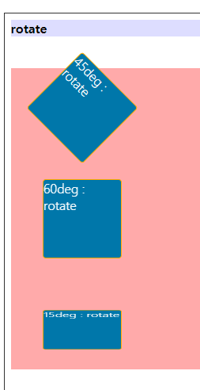

# TIL

쌤이 정리하라고 하신 부분

- [ ] 트랜스 폼
- [ ] 비디오/오디오
- [ ] 아이프레임
- [ ] 접근성


git branch

- git branch -  내용 확인
- git branch [name] - branch 생성
- git checkout [branch name] - 해당하는 branch로 이동


- vidio - mp4, ogg, ogv(음성을 뺸 영상), mebM
- audio - mp3, ogg
- iframe - 외부의 문서를 불러와서 삽입하는 코드


### 작성 순서에 따내가라 적용되는 속성값

**Q.** 작성 순서에 따라 어떤 태그는 나중에 작성한 게 적용되고 어떤 태그는 먼서 작성한 게 적용되는데 이 부분이 헷갈려요. 기준이 있나요?

- `html` 먼저 작성한 것을 수행, 동일한 요소라면 나중 요소를 배제 ( e.g audio> source )

- `css` 

  - 하나의 속성에서 여러 속성값을 작성하는 경우 - 앞의 것 수행, 앞 속성값이 적용되지 않을 시 나중에 작성한 속성값들이 적용됨 ( e.g font-family )
  - 동일 속성 여러개 존재 - 이전 속성 사라지고 뒤에오는 속성 처리 (e.g 반복되어 작성되는 width 값 등)

  

---

## translate

`translate` `scale` `skew` `rotate` `perspective`

- perspective 숫자가 작을 수록 (화면과) 가까운 처리
- transform-origin 기준의 좌표를 지정하는 형태
- backface-visibility:hidden / visible


### translate


```css
.translate li{transition: all 500ms linear;}
.translate:hover li:nth-child(1){transform:translateX(100px);}
.translate:hover li:nth-child(2){transform:translateY(-100px);}
.translate:hover li:nth-child(3){transform:translate(-120px, 50px);}
.translate:hover li:nth-child(4){transform:translateZ(500px);}
.translate:hover li:nth-child(5){transform:translateX(50%);}
```

`transform`은 부모가 아닌, 자신을 기준으로 한다. 50%를 사용하더라도 부모가 아닌 자신의 50%를 적용시킨다.

- Z는 적용이 되었으나 현재 원근법이 적용되지 않아 화면상으로 확인할 수 없다.
- 기본축은 X축이다.


### trans scale


```css
.scale li {margin: 30px; transition:all 400ms ease;}
.scale:hover li:nth-child(1){transform:scale(1.2);}
.scale:hover li:nth-child(2){transform:scaleX(1.5);}
.scale:hover li:nth-child(3){transform:scaleY(0.7);}
.scale:hover li:nth-child(4){transform:scale(0.5, 1.5);}
.scale:hover li:nth-child(5){transform:scaleZ(2);}
```

- 


### skew

한쪽으로 밀어서 뒤틀림을 만든다.


```html
<div class="part">
    <h3>skew(뒤틀림)</h3>
    <ul class="skew">
        <li>01_skew</li>
        <li>02_skew</li>
        <li>03_skew</li>
        <li><span>04_skew</span></li>
    </ul>
```

```css
.skew li {margin: 30px; transition:all 300ms ease-in; font-size: 2rem;}
.skew li:nth-child(1) {transform: skew(30deg);}
.skew li:nth-child(2) {transform: skewY(30deg);}
.skew li:nth-child(3) {transform: skew(30deg, 15deg);}
.skew li:nth-child(4) {transform: skewX(45deg);}
.skew li:nth-child(4) span { display: block; width: 100%; height: 100%; transform: skewX(-45deg);}
```

- skew 내 글자는 뒤틀리지 않게 하고 싶다면 -값을 붙여 적용시킨다.
  - span은 인라인 요소라 skew가 적용되지 않기 때문에 dp:b;를 적용시켰다.


### roatate



- 기준축이 Z축이다. 
- Y값은 좌우로 회전을 한다.
- X값은 상하로 회전을 한다. 
- 두가지값을 적용시킬 때
  - 0과 1 사이의 값을 적은 후 마지막엔 각도를 적어준다.

```css
.rotate:hover li:nth-child(4){transform: rotate3d(1, 1, 1, 60deg);}
```

:heavy_plus_sign: 3d보다는 matrix를 추천!


#### 180deg

- 180, 360도와 같이 딱 떨어지는 값을 적용할 때, float을 사용한 상태라면 적용되지 않을 수 있다. 0.1도라도 더 적어준다면 적용 가능!

#### backface-visibility: hidden;


- 같은 방향으로 돌리기 위하여 0도, 180도로 구성했다.
- 한 번에 각도를 돌리는 것이 아닌, 각자 잡아서 돌려야 한다.


```css
  .part .rotate2 {
    float: left; width: auto; 
  }
  .rotate2 li{
    float:left;
  }
```

- 위에 작성한 `.part ul:width:100%`로 인해 클래스명만 작성하면 선택자 우선순위 법칙으로 먼저 작성한 부모자식요소가 적용된다. 현재 작성한 클래스를 적용시키기 위해 클래스명 뿐만이 아닌 부모자식으로 작성해야 함.
- flaot을 사용하면 높이가 자동으로 잡히는 것을 이용해 높이값을 따로 적지 않았다.


Q. float을 사용했는데 왜 자동으로 높이가 정해지지? 클리어 보스를 사용하지 않았으니까 안 되야 하는 게 아닌가?


#### 원근법이 적용된 회전, perspective

##### ul 전체에 적용

```css
.part .rotate2 {
    perspective: 500px;   <★>
    float: left; width: auto; 
}
.rotate2 li{
    float:left; transition: all 1500ms linear; line-height: 100px;
}
.rotate2:hover li{transform: rotateY(360deg);}
```

- 부모에게 적용시킬 때는 `transporm` 가 아닌 직접적으로 명령한다.


##### li 하나하나에 적용

```css
.part .rotate3{
  float: left; width: auto; margin-top: 40px;
}
.rotate3 li{
  float: left; transition: all 1500ms linear;
  text-align: center; line-height: 100px;
}

.rotate3:hover li {
  transform: perspective(300px);
  transform: rotateY(180deg);
}
```

- 원근법을 전체에 적용할지 개별 요소마다 적용할지를 골라 적용시킨다.
- 자기 자신에게 `perspective`를 적용시킬 때는 `transporm` 내부에 적어줘야 한다.


### 복합 명령어

```css
.multi_tr li{transition: all 2000ms ease;}
.multi_tr:hover li:nth-child(1){
transform:translateX(500px) rotate(360deg);
}
.multi_tr:hover li:nth-child(2){
transform: rotate(360deg) translateX(500px);
}
```

- 순서에 따라 다양한 결과가 나온다.
  - 하지만 순서로 진행되는 것이 아닌 동시로 수행된다. 
- 180deg로 진행했을 때, 회전이 끝난 후 이동을 시킨다면 뒤집힌 상태에서 이동을 한다. (기준이 처음과 달라졌다.)


- `이동 →  회전` / `이동 → 직선` 설명
- 1번은 이동을 먼저 적용시킨다.
- 2번은 회전을 먼저 적용시킨 후 회전이 완료된 곳에서 이동을 한다.


#### transform-origin

```css
.multi_tr li:nth-child(3){transform-origin: 0 0;}
.multi_tr:hover li:nth-child(3){transform: rotate(360deg);}
```

기준을 적용시키지 않고, 


---

## multi

- `webM` 구글에서 제작 -  구글 크롬 / fire fox / opera / vivaldi / whwel [ :x: IE, safari ]
- `mp3` / `mp4` 모든 브라우저 (mp4가 영상은 ms에서만든 H.264, 소리는 애플에서 만든 AAC로 구성됨)
- `ogg` 크롬 / fire fox


### multi media 에서 display:none;

- screen reader에서 동작하지 않도록 처리 && 존재하지 않도록 처리하는 속성
- audio, video 요소의 기능은 소리가 담겨져 있거나 재생이 되는 요소이나, 접근성에 의거하여 소리가 자동으로 재생되면 안 된다.

:sparkles:해결책  :  video/audio가 나타지 않아야 하는 상황, 나타자더라도 `muted` 속성을 추가

- `<video volume="0" mutde autoplay ></video>`
  - `volume` 소리0 / `mutde` 소리끄기 / `autoplay` 자동재생


### audio

#### 방법1

```html
<div class="sound">
    <audio src="../multi/audio/cinematic.mp3" controls>
        <p>현재 사용하고 있는 브라우저는  audio파일이 지원하지 않습니다. <br /> <a href="http://google.com/chrome">최신 브라우저</a>를 사용하세요.</p>
    </audio>
</div>
```

- `p` 태그에 들어간 문구는 audio 태그가 적용되는 브라우저에선 표시되지 않는다.


####  방법2

```html
<div class="sound">
    <audio controls>
        <source src="../multi/audio/epic_hollywood.mp3" />
    </audio>
</div>
```

- 권장

```html
<div class="sound">
    <audio controls>
        <source src="../multi/audio/epic_hollywood.ogg" type="audio/ogg"/>
        <source src="../multi/audio/epic_hollywood.mp3" type="audio/mp3"/>
        <a href="http://google.com/chrome">현재 사용하고 있는 브라우저는  audio파일이 지원하지 않습니다. <br />최신 브라우저를 사용하세요.</a></p>
    </audio>
```

- 위 .ogg 확장자 파일을 먼저 사용하고, 그 후 ogg가 안 되는 브라우저에겐 mp3가 재생되게 하는 코드


#### 추가 속성

```html
<audio src="../multi/audio/cinematic.mp3" controls autopaly></audio>
```

- `autopaly` 를 사용하지 않는 이유
  - 접근성 원칙에 의거하여 3초가 넘는 오디오가 플레이될 시 제어가 가능해야 한다.
- `preload`로딩을 먼저 시작해 로딩시간을 줄여주는 기능
- `loop` 반복재생
- `muted` 사운드 끄기


### video

준수해야할 규칙

- 자동으로 음성이 재생되면 안 된다.
- 초당 3~50회 주기로 번쩍거리는 영상 금지


### full video (img도 같은 원리)


```css
.movie{
  position: relative;
  width: 100%; height: 450px;
}
.video_area{
  position: absolute;
  top: 50%; left: 50%;
  width: auto; height: auto;
  min-width:100%; min-height: 100%;
  transform:translate(-50%, -50%);
}
```

- 동영상 사이즈를 브라우저 화면에 꽉 차게 만드는 방법
  - 영상의 원본 사이즈와 꽉 채우고 싶은 사이즈의 비율이 다를 때
  - 영상 사이즈가 해당 틀보다 작을 때는 `min`을 적용
  - 영상 사이즈가 해당 틀보다 클 때는 `max` 를 적용


1. width:auto; height:auto;
2. min-width:100%; height:100%;
   1. :heavy_plus_sign:
3. 영상과 틀에게 position 적용
4. absolute 를 가운데 정렬 `top:50%; left:50%; transform:translate(-50%, -50%);`
5. 넘치는 부분은 `overflow:hidden` 처리


### thumbnail img

```html
<video 
       class="video_area" 
       poster="../multi/vidio/flowers-g31e13aa5f_1920.jpg">
</video>
```

- 영상이 준비되지 않으면 포스터조차 보이지 않는다. 
- 영상이 지원되는 경우에 표시되는 영상에 대한 썸네일의 개념

```css
.movie{
  background-image: url(../../multi/vidio/hohenschwangau-g6f1164028_1920.jpg);
  background-repeat: no-repeat;
  background-position: 50% 50%;
  background-size: cover;
}
```

- 영상이 준비가 되지 않더라도 배경에 적용된다.
- 인터넷이 굉장히 느릴 때, poster 조차 뜨지 않을 때를 위하여 작성하는 코드


