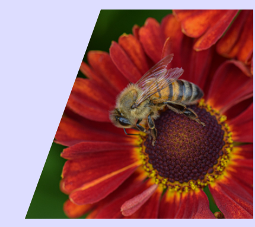
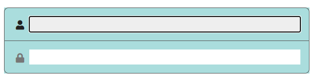
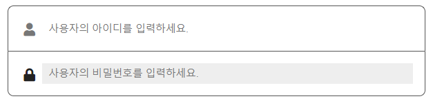

# TIL

**form**

- form : action - 자료를 전송하고 검증 받을 주소, method -  처리방식
- fiedset(영역) / legend(form영역 제목)
- input(자료 입력 버튼), label(input과 연동되는 가이드 기능)
- textarea, select, button


## 오늘진도

### skew

```css
.part li{
  position: relative;
  width: 12.5rem; height: 100%;
  border-radius: 0.5rem;
  background-color: #7fc;
}
.one div{
/*선택사항 1 */
position: absolute;
top: 0; left: 0; width: 100%; height: 100%;

/* 선택사항 2 */
text-align: center; line-height: 18.75rem;
}

.one:hover{ transform: skew(-15deg);}
.one:hover div{  transform: skew(15deg);}
```

```css
position: absolute;
top: 0; left: 0; width: 100%; height: 100%; */
```

-  선택사항 1

```css
text-align: center; line-height: 18.75rem;
```

### hover효과


```css
.three > div{
  width: 100%; height: 100%;
  border-radius: inherit;
  padding: 1rem; box-sizing: border-box;
  color:#fff; font-size: 2rem;
  background-color: rgba(21,50, 159, 0.7);
}
.three:hover > div{
  transform: translate(-0.3rem, -0.3rem) scale(1.1) skew(-5deg, 5deg);
  box-shadow: 0.5rem 0.5rem 0.5rem rgba(0,0,0,0.3);
}
```


```css
.two > div{
  width: 100%; height: 100%;
  border-radius: inherit;
  padding: 1rem; box-sizing: border-box;
  background-color: #faa;
}
.two:hover div{
  transform:translate(-0.5rem, -0.5rem);
```

### 이미지 크롭

- 형제요소로 만들어 로테이트를 진행해 
- clip
- html - canvas, svg
- overflow:hidden 활용 <:sparkles: 추천! >



```html
<li class="four">
    <div>
        <div class="oirigin"></div>
    </div>
</li>
```

- `.four`오버 플로우 히든용, 묶어놓기용
- `div` 이미지 크롭용 (틀 자체를 뒤틀기함)
- `.origin` 이미지 원래 방향대로 되돌려 놓기 위해 (-뒤틀기) 추가한 div 

```css
.part .four{
    width: 350px;
    border-radius: 0; overflow:hidden;
    background-color: transparent;}
.four>div{
    width: 100%; height: 100%;
    background-color: #ccc;
    transform-origin: 0 100%;
    transform: skew(-20deg);
    overflow: hidden;
}
.oirigin{
    width: 100%; height: 100%;
    transform-origin:0 100%;
    transform:skew(20deg);
    background-image: url("../../multi/vidio/flowers-g31e13aa5f_1920.jpg");
    background-repeat: no-repeat;
    background-size: cover;
    background-position: 70% 50%;
}
```


### overflow

`visible` : 기본상태

`auto` : 넘치면 스크롤이 생기고, 넘치지 않으면 기본 상태

`scroll` : 넘치지 않아도 스크롤이 생긴다.

`hidden` : 숨긴다.

#### overflow를 활용한 스크롤 감추기


```html
<div class="over_02">
    <div class="con_wrap">
        <h3>해당하는 영역의 제목</h3>
        <p>내용에 대한 설명을 담는 영역</p>
        <dl>
            <dt>목차 제목</dt>
            <dd>
                <ul>
                    <li>다양한 리스트 처리_01</li>
                    <li>다양한 리스트 처리_02</li>
                    <li>다양한 리스트 처리_03</li>
                    <li>다양한 리스트 처리_04</li>
                    <li>다양한 리스트 처리_05</li>
                </ul>
            </dd>
        </dl>
    </div>
</div>
```

```css
.over_02{
  width: 100%; height: 200px;
  margin-top: 4rem;
  padding: 1rem;
  border-radius: 0.2rem;
  background-color: #50f;
  overflow: hidden;
}
.con_wrap{
  width: 100%; height: 100%;
  padding-right: 15rem;
  box-sizing: content-box;
  border:2px solid #f06;
  overflow-x: hidden;
  overflow-y: auto;
}
```

- `.over_02`에 overflow:hidden을 준 이유는 스크롤 바를 가리기 위해서 이다.
- `con_wrap`은 X(가로축)은 가리고, Y(세로축)은 넘치면 스크롤 되게하는 auto를 사용했다.
  - con_wrap에 패딩라이트를 줘 스크롤 바를 올느쪽 끝으로 밀어버려 화면에 안 나오게 했다(부모가 overflow:hidden; 됐다)


:heavy_plus_sign:

브라우저마다 스크롤의 디자인이 다르기 때문에 하나하나 설정하는 것은 어렵다. 그래서 사용하는 방법은 브라우저의 기본 스크롤은 overflow:hidden으로 숨기고, 따로 `.scroll_box>.scroll_bar ` 의 html 태그를 생성해 js에서 동작하도록 수정하는 방법이 있다.


### visibilty

화면에서 나타나지 않게 만들 때 사용하는 방법

- `display:none;`  : 아예 없앤다. 부모가 auto라면 부모의 사이즈도 줄어든다.
- `opacity:0 ;` : 화면에 표시되지는 않지만 사라진 것은 아니다. 부모의 사이즈가 줄어들지도 않지만, 태그는 존재하기 때문에 스크린리더기에서 읽을 수 있음.
-  ` visibility:hidden;` : 화면에 표시되지 않고, 부모의 사이즈도 그대로 유지된다. 
  - `visible` 기본 형태


### flex

```css
.part ul{
  display: flex; flex-wrap:wrap;
  width: 100%; height: auto;
  margin-top: 1rem;
}
.part li{
  width: 100px; height: 100px;
  margin: 1rem;
  background-color: #aca;
  text-align: center; line-height: 100px; font-size: 1.2rem;
}
```


### border-radius

- `px`반지름 이상의 사이즈는 진행되지 않는다.
  - 직사각형도 마찬가지다. 4개의 선 중 맞닿는 각이 존재했을 때 그 이상의 높은 각으로 변환되지 않는다.
- `% `수치도 이용 가능하다
  - 직사각형을 `%` 수치로 진행 시 최종 결과는 타원이 진행된다. (정사각형은 원!)
  - %로 진행 시 각 하나가 맞닿는다고해서 끝나지 않는다. 


#### 두개의 각

```css
.part li:nth-child(6){  border-radius:0 100px; }
```

- 하나씩 적으면 : 왼쪽상단 →  오른쪽상단 → 오른쪽하단 → 왼쪽하단
- 두개를 적으면 : `왼쪽상단+오른쪽하단`   →  `오른쪽상단+왼쪽하단` 
- 세개를 적으면 : `왼쪽상단`  →  `오른쪽상단+왼쪽하단`  →  `오른쪽하단`


#### 한개의 각

```css
.part li:nth-child(10){  border-top-left-radius:30px; }
.part li:nth-child(10){  border-bottom-left-radius:30px; }
```

- `border-(상하)-(좌우)-radius:` 로 입력해야 한다.
- 만약`border-bottom-left-radius:10px 70px;`을 입력했다면, x축은 10px y축은 70px 만큼 변화한다.


### form

#### form 속성

- `action` **전송위치** 데이터를 어디로 전송할 것인지
  - PHP etc. 백엔드와의 연결되는 곳

- `method` **처리방법** 데이터를 공개할지, 비공개로 처리할지를 묻는 속성 (속성값을 대문자로 많이들 작성하신다고 함 ^^~)
  - `GET` 공개
  - `POST` 보안처리


#### form 내부 태그

form 안에는 div, ul등 폼 태그가 아닌 태그가 들어가도 된다. class, id를 적용시킬 수 있다.

`a`, `form` 내부에 있는 입력, 체크, 버튼 역할을 하는 요소들은 **포커스를 가질 수 있다.**


- `fieldset` 영역별로 구분하는 기능 (div로 묶듯이 영역, 기능별로 따로 fieldset으로 묶어서 사용한다.)
- `legend` fieldset 내 H태그와 같은 기능, 영역의 기능에 대한 설명, 제목을 담는 곳
- `input`  입력, 전송 등의 기능

```html
<input type="text" value="" name="userName"/>
<input type="text" value="" name="userGender"/>
<input type="text" value="" name="userOld"/>
---
userName : value에 입력한 값
userGender :  value에 입력한 값
userOld :  value에 입력한 값
```

#### input

:sparkles:	 `input type=" "`

`입력` **text**(글자 입력, 한줄입력만 가능)   /   **password**(비밀번호)  : 둘은 글씨의 노출여부에 대한 차이가 있다.

 `체크` **radio**(단일선택, 선택이후 수정 불가능)   /   **checkbox**(다중선택, 수정 가능) 

`버튼` **submit**(최종 확인 및 전송, 페이지 이동이 기본값)   /   **reset**(작성한 내용 초기화)   /   **button**(전송X, 초기화 외 나머지 버튼)   /   ~~**image**(그림이 들어간 버튼, submit : 현재 쓰는 곳 없음)~~   /   **file**(전송할 file data를 담아서 보냄) 

:sparkles: input 형식이 아닌 개별의 요소명

`멀티형식` **textarea**(text를 여러줄 작성 가능하게 만드는 기능)   /   **select**(목록 형식으로 나타난 요소 중 하나를 선택)   /   **button**(`<button>`) : 멀티형식은 폼 외부에서도 사용을 하기도 함

`특수` **hidden** 자료는 같이 가지고 있으며, 보내야 하지만 노출은 되지 않아야 하는 내용


- `<input type="text" value="" name="content"/>` 
  - `text` : 입력 하는 곳
  - `value` : 텍스트 박스 안에 적은 문구가 들어가는 저장소. 안에 내용은 적지 않아도 된다.
  - `name` 후에 전송버튼을 누르면 `name:value` 의 형태로 정보가 전달된다.
    - contnet:hi!
    - 컨텐트 안에 hi라는 내용이 들어왔다고 알림. 
- `<input type="submit" value="확인" />`
  - `submit` : 전송하는 버튼 (최종승인의 뜻을 가지고 있다.) <u>:heavy_plus_sign: 하단 button type 참고</u>
  - `value` : 내가 보낼 값 (문구 대체가 아닌 값이란 뜻), 인풋에 작성한 테이터를 action 주소로 보냄.

- `hidden` 특수속성 히든, 숨겨놓는 기능.  (백엔드 처리를 위해 숨겨놓는다는데 잘 모르겠음..)

`<button type="button"> ` : 버튼의  타입은 세 종류가 있다.

submit :  최종 승인의 버튼 (e.g 회원가입 시 완료 버튼과 같이 한 페이지에서 submit은 한 번만 가능하다.) (하지만 모든 완료 버튼이 submit을 사용하는 것은 아니다.)

reset : 리셋

button : submit, reset 외에 나머지 기능들은 button type를 사용한다.

```html
<label for="userName">사용자 이름</label>
<input type="text" id="userName" value="" name="userName"/>
```

- `label` 해당 input에 대한 설명, input과 연계되서 사용한다.
  - id로 인풋과 라벨을 연결시킨다.
  - 입력 박스를 클릭해도 해당 `>사용자 이름<` 이 부분을 읽어준다.
  - `>사용자 이름<` 이 글자를 클릭하면 입력 박스가 활성화된다.


### form: 네이버 로그인




```html
<div class="member member_id">
    <input type="text" id="userId">
    <label for="userId"><i class="fas fa-user"></i><span class="blind">사용자의 아이디를 입력하세요.</span></label>
</div>
```

```css
.member > input {
  float: right;
  width: calc(100% - 30px); height: 100%;
  border:0; padding: 0;
}
.member > label {
  float: left;
  width: 26px; height: 100%;
  text-align: center; font-size: 1.1rem; color:#777; line-height: 2;
}
.member input:focus + label{
  color:#222;
}
.member input:focus{background-color: #eee;}
```




`.member input::placeholder{color:#66a}` 

- 플레이스 홀더 폰트 컬러 변경하는 방법


`input[type="submit"]`

-  type:submit을 가지고 있는 input 태그를 선택하는 방법