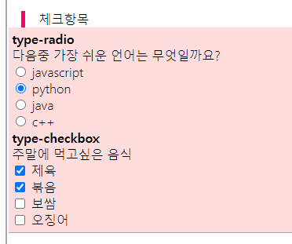
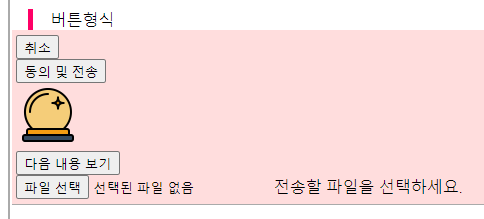
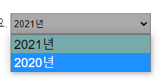

# TIL


- `sign up`  다른 사이트와 연동 회원가입

- `join` 해당 사이트 단독 회원가입


`    <hr />`눈에 보이든 안 보이든, 위아래 내용을 구분할 때 사용


## form

`value`

- 입력(text, textarea etc.) 에는 vlaue의 속성값을 입력하면 안 된다.
- 선택(radio, checkbox)에는 vlaue의 속성값을 입력해야 한다.


### fieldset 꾸미기

```html
<fieldset>
    <legend>입력형태, 특수형</legend>
</fieldset>
```

```css
fieldset{
  position: relative;
  width: 100%; height: auto;
  margin-bottom: 4rem;
  padding: 0.3rem; background-color: #fdd;
  border:0; border-bottom:1px solid #aaa;
}
legend{
  position: absolute; top: 0; left: 1rem;
  border-left: 5px solid #f06;
  text-indent:1rem;
  transform:translateY(-100%);
}
```

- fieldset도 꾸미기가 가능하다.


### hidden

- 임의의 난독화 과정을 거친다.(백엔드)

`    <input type="hidden" name="sendName" value="advw" />`

- 사용자의 관점이 아닌, 


### input

- `label`과 `input`은 id로 연결되어 하나를 클릭해도 상대방과 연결된다.
- text에는 palceholder를 사용하여 사용에 도움을 줄 수 있다.
  - 스크린 리더기에서 읽어주지 않는다. 오직 디자인 적 요소이다.
- password는 숨겨지는 글자를 작성한다.
- `maxlength` 최대글자 제한
  - minlength 는 표준이 아니다.
  - size는 여기서 줄 필요가 없다


### check



#### radio

```html
<ul>
    <li>
        <input type="radio" id="radio_01" name="radio__select" value="javascript" />
        <label for="radio_01">javascript</label>
    </li>
</ul>
<ul>
    <li>
        <input type="radio" id="radio_02" name="radio__select" value="python" />
        <label for="radio_02">python</label>
    </li>
</ul>
<ul>
    <li>
        <input type="radio" id="radio_03" name="radio__select" value="java" />
        <label for="radio_03">java</label>
    </li>
</ul>
<ul>
    <li>
        <input type="radio" id="radio_04" name="radio__select" value="c++" />
        <label for="radio_04">c++</label>
    </li>
</ul>
```

- radio 에는 `value` 값을 적어줘야 한다. : 내가 서버에 전송할 값! 
- 각 radio가 오지선다와 같은, 하나의 질문이라면 네임을 동일하게 작성해야 한다.
- 기본 디자인은 원형


#### checkbox

```html
<div>
    <h3>type-checkbox</h3>
    <p>주말에 먹고싶은 음식</p>
    <ul>
        <li>
            <input type="checkbox" id="check_01" name="check__selet" value="제육" />
            <label for="check_01">제육</label>
        </li>
        <li>
            <input type="checkbox" id="check_02" name="check__selet" value="볶음" />
            <label for="check_02">볶음</label>
        </li>
        <li>
            <input type="checkbox" id="check_03" name="check__selet" value="보쌈" />
            <label for="check_03">보쌈</label>
        </li>
        <li>
            <input type="checkbox" id="check_04" name="check__selet" value="오징어" />
            <label for="check_04">오징어</label>
        </li>
    </ul>
</div>
```

- `value` 값이 영어일 필요는 없다.
- 다중선택이 가능하다.
- 기본 디자인은 사각형


#### checked

```html
<input type="radio" id="radio_01" name="radio__select" value="javascript" checked />
<input type="checkbox" id="check_01" name="check__selet" value="제육" checked/>
```

- `checked="checked"` 기본 작성법, 그러나 html5 부터 속성과 속성값이 같으면 속성명만 적는 규칙을 따라 속석명만 적었다.
- `radio`는 단일 선택이기 때문에 checked를 여러번 적어도 마지막에 적은 단 하나의 input만 적용된다.
- `checkbox`는 중복선택이 가능하기 때문에 하나 이상의 checked를 사용할 수 있다.


### button

[click, html 속성 더 보기](https://html.spec.whatwg.org/multipage/input.html#the-input-element)

:sparkles: **button 사용 시 지켜야 할 부분**

- 버튼에서 내용이 구분되는 항목은 시각적으로도 구분이 가게 제작되어야 한다.

- 제출/전송/동의 항목이 존재할 경우에는 그에 반대하는 버튼(취소버튼)을 만들며, 이것을 우선순위로 제작해야 한다.



```html
<input type="reset" value="취소"><br />
<input type="submit" value="동의 및 전송"><br />
<del><input type="image" src="../img/001.png" alt="동의 및 전송"></del><br />
<input type="button" value="다음 내용 보기" /><br/>
<input type="file" name="" value="" id="fileSelect"/>
<label for="fileSelect">전송할 파일을 선택하세요.</label>
```

- 버튼은 레이블을 거의 사용하지 않는다. ( 굳이 필요 없음)
  - 하지만 `label`에는 사용하는 것을 권장함.
- neme 필요 X
- vlaue값을 비우면
  - 쿼리전송, 제출 등 다른 이름으로 작성된다.


`input type="image"`

- 

`type="button"`

- 

`<input type="file"`

- 


### multi

- 추가 옵션이 매우 다양함

```html
<fieldset>
    <legend>멀티형식</legend>
    <label for="multiLine">여러줄 작성 가능한 요소 설명</label>
    <textarea name="multi__line" id="multiLine" cols="10" rows="20"></textarea>
</fieldset>
```

```html
<textarea name="" id="" cols="10" rows="20"></textarea>
```

-  textarea를 사용하면 나타나는 기본 에밋

```css
textarea{
  width: 400px; height: 100px;
  resize: none;
  background-color: #ada;
}
```

` cols="10" rows="20"` 이건 선택사항, 빼도 무방함

- 마우스로 잡고 수정이 가능하며, css에서 수정이 가능하다.
- 사용자가 사이즈를 수정하지 못하게 만드는 것은 css에서 `resize:none;` 을 추가한다.


```html
<textarea name="multi__line" id="multiLine">여기는 작성하는 곳이 아님</textarea>
```

`textarea` 태그 내부에 글을 입력하면, 해당 홈페이지에도 같이 올라가기 때문에 html 에서 작성하면 안 된다.

- 사용자가 글을 입력하는 곳임!

#### select

```html
<label for="selectProduct">구매할 제품을 선택하세요.</label>
<select name="select__Product" id="selectProduct">
    <option selected>선택하세요</option>
    <option value="a">a</option>
    <option value="b">b</option>
    <option value="c">c</option>
    <option value="d">d</option>
</select>
```

**:sparkles: sedign : css에서 적용되는 것** 

- `window`background-color, color, selcet에 적용시킨 size
- `mac`에서는 select태그의 배경색상은 변경되지만, 그 외에 다른 디자인은 적용되지 않는다. option은 아예 안 됨!


```html
<!-- <label for="mySelect">선택한 내용을</label> -->
<input type="hidden" id="mySelect" name="my__Select" value="" />
<dl>
    <dt>상품을 선택하세요.</dt>
    <dd>
        <ul>
            <li data-select="마우스">마우스</li>
            <li data-select="키보드">키보드</li>
            <li data-select="스마트폰">스마트폰</li>
            <li data-select="태블릿">태블릿</li>
            <li data-select="노트북">노트북</li>
        </ul>
    </dd>
</dl>
```

:+1:  대처방안 : JS에서 처리되도록 진행

data-select라는 임의의 사용자 속성을 추가하여, li 의 내용을 선택한다면 (button 등 다른 태그를 추가해야 함) 그에 해당하는 data 속성의 속성값이 input에 저장되도록 처리한다. 

- `data-` : data라는 이름이 들어간 속성은 의미 없는 사용자 속성 (사용자가 임의로 만든 속성)


- text를 사용한다면 label을 사용해야 한다.
- 이 경우에는 input 태그를 숨기고, dl로 디자인을 작업하기 때문에 input 타입을 hidden으로 처리했다.


#### js를 이용한 selet 예시

- 생성부터, 내용 처리, 생성부터 전송 이렇게 진행된다고 함.
- 자동이 없음

```html
<div class="other">
  <label for="year">태어난 연도를 선택하세요.</label>
  <select name="select" id="year"></select>
</div>
```

```js
var yearSelector = document.querySelector('#year');
var yearSel = document.getElementById('year');
```

- 위와 아래는 같다.
- `var yearSel = document.getElementById('year');` 이게 더 옛날에 나와 인식하는 브라우저가 더 많다.
- 그런데 위를 씀

```js
var yearSelector = document.querySelector('#year');

- option 요소 생성 ()
var creatOption = document.createElement('option');

- 기본 변수 y 생성
var y = 2021;

- option요소에 담을 text, 속성(value)을 첨부
creatOption.innerText = y+'년';
creatOption.value = y; 

- option 요소를 select요소에 담기
yearSelector.append( creatOption );
```

- 이렇게 작성하면 이 여러줄을 계속 반복해야 다른 내용을 추가할 수 있다.


`creatOption.setAttribute('value', '2021');`  = `creatOption.value = 2021; `

- 이건 같은 말이다.

`y+'년';`

- 숫자, 함수는 `''` 를 붙이지 않고, 문자에는 `''`를 붙여야 하기 때문에 함수와 문자를 연결하기 위해 +를 사용했다.
  - 그냥 '2021년'; 을 사용해도 좋다. 그런데 지금은 함수 사용해서 안 될듯
- 

`  yearSelector.append( creatOption )'`

- append는 첨부 하겠다는 뜻


`input type="button"` ` button type="button"`은 동일한 기능이다. 그래서 요즘은 form 외부에서도 사용이 가능한 `button type="button"`을 많이 사용한다.

- default : `<button>` == `type="submit"`


##### 하나의 행동 처리를 위한 틀 잡기 



```js
// 틀 제작
var yearSelector = document.querySelector('#year');
var y = 2021;
var creatOption;
var makeFn = function(){
    createOption = document.createElement('option');
    createOption.innerText = y + '년';
    createOption.value = y;
    yearSelector.append(createOption)
};

// 틀 수행
makeFn()
y = y -1;
makeFn()
y = y -1;
```

`function` : 로직


##### 반복수행

```js
for(최초값; 조건비교; 증감;){
    ~수행~ ^^ ~
}
```

```js
for(; y > 1870; y = y -1){
    makeFn()
}
```

최초의 y 값(위에 선언을 했기 때문에 수를 적지 않고 `;` 만 적음 )에서 1870보다 크면 기능을 수행하는데 이 수행을 최초의 변수에서 -1을