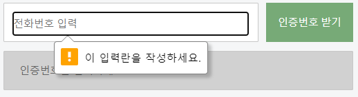
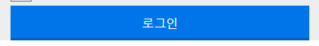
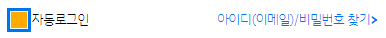

# TIL

## 네이버 회원가입 from

### 전체 배경색 채우기

```css
html, body{  width: 100%; height: 100%; }
#wrap{
  width: 100%; height: auto; min-height: 100%;
  padding-top: 40px;
  background-color: #F5F6F7;
}
```

- 방법 1 -  영역인 #wrap에 `height:auto; min-height:100%`를 진행한 후 배경색을 깐다.

```css
html, body{  width: 100%; height: 100%; background-color: #F5F6F7;}
#wrap{
  width: 100%; height: 100%;
  padding-top: 40px;
}
```

- 방법 2 - 전체 브라우저 크기인 html, body에 사이즈와 함께 <u>배경색을 깐다.</u>


- label은 인라인 요소이기 때문에 사이즈를 적용시킬 때, dp:b;


### outline

```css
fieldset li.action .input_part{
  outline:2px solid #7a7; border-color: transparent;
  background-color: #dfd;}
```

- border 를 기존과 다른 사이즈로 잡으면 내용이 조금씩 밀리기 때문에 이를 방지하기 위해 outline을 사용!
  - 선은 있지만, 보이지 않게 처리하기 위해 `transparent`로 처리


### selected

```html
<select name="user__Tel" id="userTel"class="full">
    <option value="82"><small>+82</small> 대한민국</option>
    <option selected value="83"><small>+83</small> 대한민국</option>
    <option value="84"><small>+84</small> 대한민국</option>
</select>
```

`selected` 기본으로 선택됨

- 원래 ip를 추적해 js로 본다고 생각하렴


### 속성선택자

```css
input[type="button"], input[type="submit"]
```

- `요소[속성명="값"]` || `[속성명="값"]` :  가장 기본적인 속성 선택자
  - 두가지 모두 사용이 가능하다.
  - 찾으려는 값의 모든 글자를 입력해야 한다.

- `요소[속성명^="값"]{}`  :  ^는 시작을 의미한다. `a[href^="http"]{}` http로 시작하는 모든 속성을 선택하세요.
- `요소[속성명$="값"]{} `: $는 끝을 의미한다. `a[href%="com"]{} com`으로 끝나는 모든 속성을 선택한다.
- `요소[속성명~="값"]{} `: ~는 속성값이 여러가지여도(e.g class 명이 여러개) 해당하는 속성값을 가진 요소를 선택
- `요소[속성명|="값"]{} ` : |는 전체의 모든 글자중 동일한 단어가 하나라도 해당이 된다면 `a[class|="full"]{} `전체 글자중 full이 있는 요소를 선택 
  - 뜻, 개수와 상관이 없다. class="a_b"가 있을 때 요소a를 값으로 잡는다면 `~` 는 선택할 수 없고 `|` 는 선택이 가능하다.
- `요소[속성명*="값"]{} `: *는 전체의 모든 글자 중 동일한 글자가 하나라도 해당이 된다면,  `a[class*="f"]{}` 전체 글자중 f가 있는 요소를 선택
- `요소[속성명]` : 해당 속성을 가진 모든 태그를 선택 `[class]{}` class라는 속성을 가진 모든 요소를 선택


### 조건이 성립하지 않으면 선택할 수 없게 설정 (::before)

```html
<label for="cirtifyCheck" class="blind">인증번호확인</label>
<div class="input_part disable">
    <input class="full" type="text" name="cirtify__Check" id="cirtifyCheck" value="" placeholder="인증번호를 입력하세요." tabindex="-1"/>
</div>
```

```css
.disable{position: relative; z-index: 100;}
.disable::before{
    position: absolute; top: 0; left: 0; z-index: 10;
    content: ""; 
    display: block; top: 0; left: 0;
    width: 100%; height: 100%;
    background-color: #171717; opacity: 0.2;
}
```

**:sparkles: `after`가 아닌 `before`를 사용한 이유** 

코드의 진행 순서가 입력창(input)을 가린 상황에서


### html 5, input

:heavy_check_mark:  **입력**

- text
- password
- search :  검색의 용도
- email : 이메일 주소 입력 용도
- url : 웹주소를 입력 용도
- tel : 모바일용 - 숫자키가 나타난다.


:heavy_check_mark:**체크**

- radio
- checkbox
- color : 색상
  - 색상을 바로 선택이 가능하게 만든다. color picker (e.g VScode)

- 날짜(와 관련된) : 구형 브라우저 및 일부 브라우저는 제대로 동작하지 않음
  - date
  - dateweek
  - datetime


**:heavy_check_mark:입력 + 체크**

- number : 숫자 입력 / 버튼을 클릭 → 카운트 업,다운
- range : gage bar 형태로 만드는 표현 방법 (직접 조절)


**:heavy_check_mark:멀티형식**

- textarea
- select
- button
- datalist : 구형 브라우저 및 일부 브라우저는 제대로 동작하지 않음
  -  `<select>`+`<input type="text">`


**:heavy_check_mark:인풋 기능을 결과로 처리**

- output : 구형 브라우저 및 일부 브라우저는 제대로 동작하지 않음


### required, 필수로 입력해야 할 때



```html
<input class="full" type="tel" name="tel__number" id="telNumber" vlaue="" placeholder="전화번호 입력" required/>
```

- 꼭 써야하는 인풋은 `required` 를 작성한다.
  - 속성명과 값이 같기 때문에 하나만 적는다.


### text, line-height

```css
link{
  width: 100%; height: 54px; box-sizing: content-box;
  text-align: center; line-height: 54px; font-size: 1.12rem;
  color:#0073e9; font-weight: 700;
}
.link >a {
  display: block; width: 100%; height: 100%;
  color:inherit;
  border:1px solid #777; border-bottom-width: 2px;
  border-radius: 0.1rem;
  background-color: #fff;
}
```

- `line-height`는 자식이 아닌 부모에게 들어가야한다.
  - 원래 `text-align: center; font-size: 1.12rem;`<u>는 a에 적지만</u>, line-heigth를 적으면서 같이 적으셨다 함!


### shadow를 활용한 밑선



```css
.btn > button{
border: 0.1rem;
color:#fff; font-size: 1.2rem; font-size: 700px;
word-spacing: -7px;
box-shadow: inset 0 -0.2rem 0 rgba(0,0,0,0.2);
background-color: #0074e9;
}
```

- `inset` 내부 그림자
- `x`0 `y`-0.2 `bulr`0  로 진행함


### label > input 

- :+1: for을 쓰지 않아도 된다.
- :-1: 안 되는 것은 아니지만 현 시점에서 권하는 방법은 아니다.


### 위치를 왼쪽, 오른쪽으로 이동시키는 방법

- 포지션
  - 
- float
  - 플롯을 준다면 가로값을 하나하나 계산해서 calc(100% - px); 등


### checkbox, dispaly:none한 후 css로 디자인

[click, transition 속성값 이해](https://cubic-bezier.com/#.17,.67,.83,.67)

#### 가상선택자로 처리



- `input` : \#autoLogin

```html
<fieldset class="check">
    <legend class="blind">자동 로그인 체크 및 찾기</legend>
    <input class="blind" type="checkbox" name="auto__Login" id="autoLogin" value="">
    <label for="autoLogin"><i></i>자동로그인</label>
    
    <a href="#">아이디(이메일)&sol;비밀번호 찾기<i>&gt;</i></a>
</fieldset>
```

- `input type="checkbox"` 의 디자인을 가리기 위하여 blind 처리 하였다.
- `label`에 따로 처리할 박스 icon`<i>` && 문구를 적었다.
- 그리고 페이지 이동을 위한 `<a>` 태그 

```css
.check {width: 100%; height:50px; padding-top: 0.5rem;}
.check label { float:left; cursor: pointer;}
.check label i { 
  float: left;
  width:20px; height: 20px;
  margin-right: 0.3rem; margin-top:0.35rem;
  border:1px solid #777; 
}
#autoLogin:checked + label > i { 
  /* position: relative;  */
  outline:4px solid #0074e9; 
  background-color: #dff;
  border-color:transparent;}

#autoLogin + label > i {position: relative; overflow: hidden;}
#autoLogin + label > i::before{
    position: absolute; top:110%; left: 0;
    content:""; display: block; width: 100%; height: 100%; background-color: #fa0; 
    transition: all 300ms ease;}
#autoLogin:checked + label > i::before { top: 0; }
```

- `label` 을 왼쪽으로 보내고, 접근성을 위해 `cursor: pointer`를 사용했다.
- `<i>` 는 새로 디자인하는 박스의 틀이다.
- input인 `#autoLogin` 를 `checked`하면 그의 형제인 label > i 에게 css 디자인을 적용시킨다.
- `<i>` 에게 position:relative를 적용시키고 overflow:hidden을 줬다.
- i에게 가상선택자를 잡아서, i의 사이즈를 벗어나게 한다. `top:110%;`
  - 가상요소 `::before` `::after` 두가지 모두 사용이 가능하다. (내 생각에는 after가 맞는 것 같으니 이걸로 사용!)
- `#autoLogin`가 체크되면 그의 형제인 label>i::after의 top이 0이 된다.
  - overflow:hidden으로 보이지 않았던 가상선택자가, 보이는 영역 안으로 들어온다.


#### background-img로 처리

`background-image`, `background-position: 0 25px;` 를 활용한 방법

```css
.check label i { 
  float: left;
  width:20px; height: 20px;
  margin-right: 0.3rem; margin-top:0.35rem;
  border:1px solid #777; 
  background-image: url("../../img/check.png");
  background-position: 0 25px;
  background-size: contain;
  background-repeat: no-repeat;
  transition: all 500ms ease;
}
#autoLogin:checked + label > i { 
background-position: 0 0;
}
.check a { float:right; color:#0074e9;} 
.check a i { font-weight: 700; }
```

- 가상선택자에서는 박스 디자인 만을 만들었던 `<i>` 태그에 backgound-img를 적용한다.
- 가상선택자와는 다르게, backgound-img는 해당 사이즈를 벗어나면 보이지 않기 때문에 overflow:hidden; 을 하지 않아도 된다.
- img이기 때문에 `%`를 적용시키려고 한다면 200% 이런 식으로 진행해야 함
- 그 후 `#autoLogin:checked` input이 체크되면 해당 backgound-img 가 적용된 `<i>`의 포지션이 0이 되도록 한다.


### position, float

좌우 배치를 할 때 float을 사용하지 않고 position을 사용하는 방법이 있다.

:+1: 장점

- 완성이 된 디자인에 새로운 요소가 추가될 때 다른 요소들에게 영향을 주지 않은 채로 제작이 가능
- 가로값을 따로 계산하지 않아도 된다. (100% 이런식으로 사용이 가능함)
  - position은 패딩에 영향을 받는다.
- float을 사용할 때에는 calc를 사용해 계산해야 하는데 이러면 구형 브라우저에서는 사용이 어려우니, 그 때를 위해...?